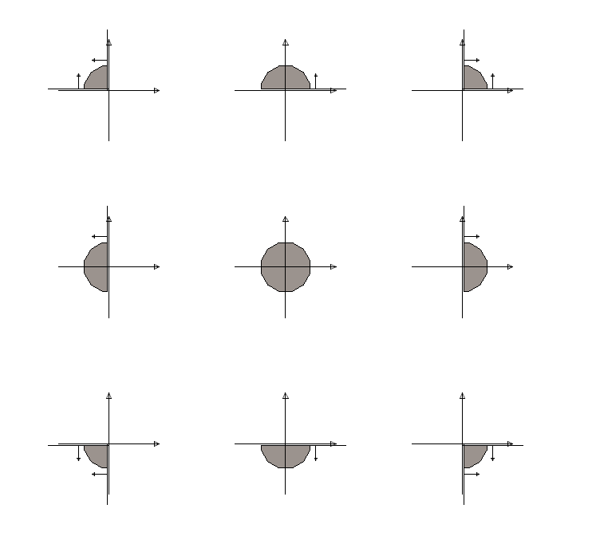

# Clipping with Planes:  `ClipPlane`, `ConvexClipPlaneSet`, `UnionOfConvexClipPlaneSets`, `ClipPrimitive`, `ClipVector`

These `ClipXXX` types use combinations of infinite 3d planes to execute complex geometry clipping.

These types support methods that classify whether single point is inside some space region, and to split curves, polygons, and meshes into "inside" and "outside" parts.

The following table summarizes the progression of complexity of the successively more complex classes:

|  |  |
|---|---|
| Class  | Represents  |
| `ClipPlane`  | One half of all space as split by a single plane. This is always unbounded. |
| `ConvexClipPlaneSet` | Intersection of many `ClipPlane` clips, hence a convex polygon, possibly unbounded |
| `UnionOfConvexClipPlaneSets` | Union of many `ConvexClipPlaneSets`, hence able to assemble convex polygons to a non-convex overall shape |
| `ClipVector` | Intersection of multiple `UnionOfConvexClipPlaneSets`, with each one optionally inverted so its outer part is considered "inside" the `ClipVector` result.  In common use, one `UnionOfConvexClipPlaneSets` is a (swept) outer boundary and the others are (with inversion flag set) holes whose outside (due to the inversion flag) is inside the outer polygon. |

## `ClipPlane`

A `ClipPlane` is a single plane.  All xyz is split into two parts by the plane.

The plane is defined by an (inward) normal vector and a distance from origin.   Various construction methods (`ClipPlane.createXXX...`) compute the normal and distance from other data.

A `ClipPlane` is intrinsically a full 3D plane.  It splits infinite xyz space into an "inside" part and an "outside" part.   Its property data has a (inward) normal vector and distance from origin, but no bounds or preferred vector directions within its plane.

The `ClipPlane` class is used as the leaf-level node of successively larger clipping tree structures `ConvexClipPlaneSet`, `UnionOfConvexClipPlaneSets`.

THe key operation in clipping is to classify a single point as "above" , "on", or "below" a single `ClipPlane`.  This is done based on the (signed) distance from the plane to a point.  The methods to evaluate this are
  * `clipPlane.altitudeXYZ(x,y,z)` returns altitude at coordinate x,y,z
  * `clipPlane.altitude(point: Point3d)` is equivalent to `clipPlane.altitude(point.x, point.y, point.z)`

The ``ClipPlane`` considers its normal vector to be pointing _inward_.

See the ``ClipPlane`` class documentation for how altitude is computed using the input x,y,z coordinates and the plane's normal vector and distance from the origin.

Note that there are two other classes for planes with different defining data:
  * `Plane3dByOriginAndUnitNormal` carries (a) a specific point on the plane as origin and (b) a unit normal.
    * This provides immediate definition of above and below but does not indicate preferred directions for coordinates within the plane.
    * Convert this to a ClipPlane with `ClipPlane.createPlane (planeByOriginAndUnitNormal...)`
  * `Plane3dByOriginAndVectors` carries an (a) an origin and (b) two vectors that are within the plane.
    * The two in-plane vectors define directions define "local" uv coordinates.
    * The plane normal for "above" and "below" classification is the cross product of the two vectors.
    * Convert this to a ClipPlane with `ClipPlane.createNormalAndPoint(planeByVectors.unitNormal (), planeByVectors.origin);

## `ConvexClipPlaneSet`

  * A `ConvexClipPlaneSet` is an collection (array) of `ClipPlane`.
  * The inside of the set is the *intersection*  of the insides of all the planes.
  * That is, a point in space is considered "inside" the convex set if it is to the inside direction from *all* of the individual planes.
  * The inside of a rectangle in the xy plane is defined by 4 `ClipPlane`s.
    * Note that those 4 planes perpendicular to the xy plane extend to infinity in the z direction, so this `ConvexClipPlaneSet` that we discuss for a rectangle is actually a rectangular prism extending to infinity in both z directions.
    * Adding additional planes with normals in the positive and negative z direction restricts that infinite prism.
  * A `ConvexClipPlaneSet` can be unbounded.   For example, if  `ConvexClipPlaneSet` has two plane which are the xz and yz planes, the interior of the set is (depending on direction of the normals) one of the unbounded 4 quadrants:
  * A `ConvexClipPlaneSet` can be *empty* if the normals are aligned to cancel.  This is not commonly useful.   If it occurs it is probably an error in directions of normals.

|  |  |
|---|---|
| A grid of points, with 3 example planes showing points classified as inside (plus) and outside (-)   |   |
| The same grid, clipped to the convex set inside one, then two and then all three of the planes |  |

Hence three clip planes can give a complete boundary for a triangle.

### `ConvexClipPlaneSet` can be unbounded

Observe that (in planar examples0)
  * The inside region for a *single* clip plane is always unbounded
  * The inside region for *two intersecting* clip planes is always unbounded
  * The inside region for *three* clip planes can be bounded or unbounded depending on where they intersect.  The example below shows 3 planes with an unbounded "inside" region.

  

  ### Visualizing it

  Because of the potentially unbounded interior of things bounded by `ClipPlane` or combinations of them, it is not possible to produce a typical piece of geometry that "is" the entire interior.   The best that can be done is to create something bounded, clip it to the clip set.

  The central snip of the 3x3 grid below shows xy axes and an octagon ().  Each of the other 8 have the octagon clipped by a clip plane set with 1 or 2 planes, using the method
  ```
      const work = new GrowableXYZArray();
     clipper.clipConvexPolygonInPlace(polygonToClip, work);
```
The left column clips all have a "negative Y" half space.  Right column has "positive Y".  Lower and upper have (respectively) "negative X" and "positive X" half spaces in their ConvexClipPlaneSet
  

### `UnionOfConvexClipPlaneSets`
If a polygon is non-convex, no single ConvexClipPlaneSet can exactly cover its interior.   It has to be broken into convex pieces, and those in turn bundled into a `UnionOfConvexClipPlaneSets`.

The snip below shows
 * (left) a non-convex polygon
 * (middle) 6 ConvexClipPlaneSets, each clipping a triangle from the interior.
 * (right) 3 ConvexClipPlaneSets, each clipping a quad from the interior.

 

 ### Display-Time Clip Usage

  

  The display subsystem uses clipping that is a somewhat restricted tree of boolean operations:

  * The overall clipper (root of boolean tree) is a `ClipVector` instance.
  * The root `ClipVector` is an array of `ClipPrimitive`.
    * The boolean in the root `ClipVector` is an _intersection_ among the `ClipPrimitives` in the array
  * Each `ClipPrimitive` is (just) one `UnionOfConvexClipPlaneSets`.
    * The clipping abilities of each `ClipPrimitive` are thus no more complex than its `UnionOfComplexClipPlaneSets`.
      * Some `ClipPrimitives` are "nothing but"
    * However, a `ClipPrimitive` is t

(As noted in a previous paragraph, the ConvexClipPlaneSets cannot be directly "drawn".   The displayed shapes are the result of using the clipper to clip a larger polygon.)

## Interfaces for clip methods

Interfaces `Clipper` and `PolygonClipper` define methods for clip operations.   Note that these are fairly low-level.  The are expected to be called by intermediate API methods that fit their detail operations into larger scale API.

| Interface | method | Remarks |
|---|---|---|
| Clipper |  `isPointOnOrInside(point: Point3d, tolerance?: number): boolean;` | Test if _point_ is inside or on |
| Clipper |   `announceClippedSegmentIntervals(f0: number, f1: number, pointA: Point3d, pointB: Point3d, announce?: AnnounceNumberNumber): boolean;` | compare a line segment to the clipper.  Issue function calls with fractional intervals that are "in" |
| Clipper |   `announceClippedArcIntervals(arc: Arc3d, announce?: AnnounceNumberNumberCurvePrimitive): boolean;` | compare an arc to the clipper.  Announce intervals that are in. |
| PolygonClipper |   `appendPolygonClip(xyz: GrowableXYZArray,  insideFragments: GrowableXYZArray[], outsideFragments: GrowableXYZArray[],  arrayCache: GrowableXYZArrayCache): void;` | Clip a single polygon, emitting inside and outside pieces into indicated arrays. |

