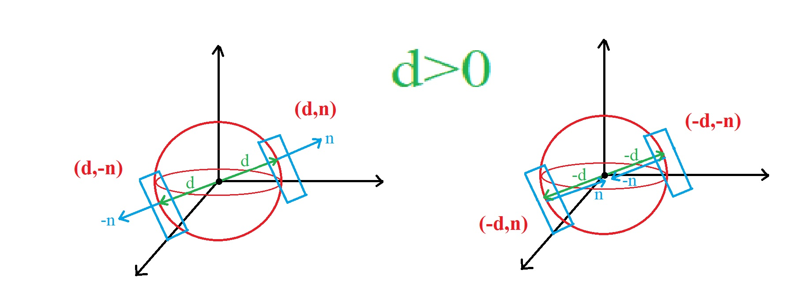
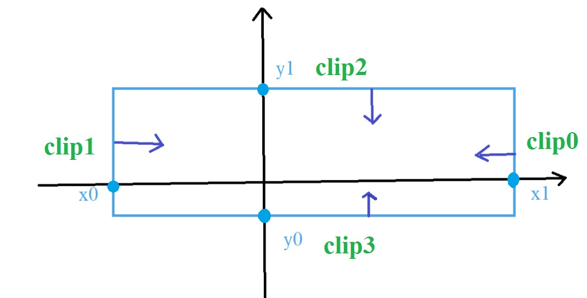

# ClipPlane

A ClipPlane is a single plane represented by a signed distance "d" from the origin and an inward normal "n".

A positive distance is measured from origin to the plane in the direction of the plane normal. A negative distance is measured from origin to the plane in the opposite direction of the plane normal. Also Inward normals means pointing into the clip volume.

# createXYBox

The function "createXYBox" creates a clip using 4 numbers: x0 < x1 and y0 < y1:

    const clip0 = ClipPlane.createNormalAndDistance(Vector3d.create(-1, 0, 0), -x1, false, true);
    const clip1 = ClipPlane.createNormalAndDistance(Vector3d.create(1, 0, 0), x0, false, true);
    const clip2 = ClipPlane.createNormalAndDistance(Vector3d.create(0, -1, 0), -y1, false, true);
    const clip3 = ClipPlane.createNormalAndDistance(Vector3d.create(0, 1, 0), y0, false, true);

The clip is visualized here:

As you can see the normals are inward.