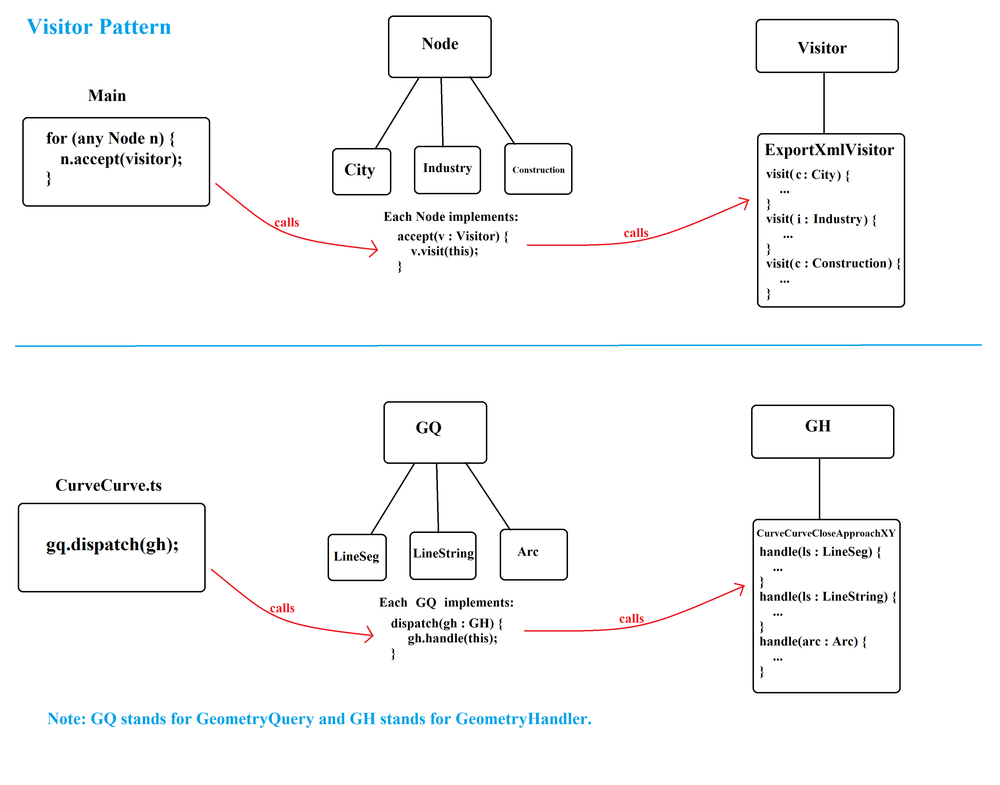

# `CurveCurve`

`CurveCurve` is a class with static methods for various computations that work on a pair of curves or curve collections. This class utilizes `GeometryHandlers` to do the computations on curves (special type of `GeometryQueries`). `GeometryHandler` defines the base abstract methods for `double-dispatch` object oriented pattern. This pattern is similar to the `visitor` pattern.

# `Visitor Pattern`

Suppose you have a map application. Each node on the map represents things like city, industry, construction, etc. Now suppose we were told to export some data of each node as xml. One solution is to change every node class and add an "exportXml" function for each node. However, this is not a good idea as adding export xml behavior seems alien to the node classes. A better approach is to use the `visitor pattern`. This pattern decouples the operations from the object structure.

In the visitor pattern, we create a `visitor class` which visits each node and runs appropriate methods on its data to export xml:
```
class ExportXmlVisitor implements Visitor
{
    public void visit(City city) { ... }
    public void visit(Industry industry) { ... }
    public void visit(Construction construction) { ... }
}
```
Now how to call these methods? One way is:
```
for (Node node : Map)
  if (node instanceof City)
    exportXmlVisitor.visit((City) node)
  if (node instanceof Industry)
    exportXmlVisitor.visit((Industry) node)
  if (node instanceof Construction)
    exportXmlVisitor.visit((Construction) node)
}
```
This is not a good idea. A better way is to create a method called `accept` in each node class which calls the visit method:
```
class City implements Node {
  public void accept(Visitor v) {
    v.visit(this)
  }
}

class Industry implements Node {
  public void accept(Visitor v) {
    v.visit(this)
  }
}

class Construction implements Node {
  public void accept(Visitor v) {
    v.visit(this)
  }
}
```
and now you can easily call by:
```
for(Node node : Map)
  node.accept(exportXmlVisitor)
```
Here is the comparison between the visitor pattern and the double dispatch pattern we see in the Geometry library.  `GeometryHandler` is the `Visitor` and `GeometryQuery` is the `Node`:



What makes `GeometryHandler` a `double-dispatch` pattern is how it addresses dispatch to a pair of `GeometryQueries`, one in the instance, and the other passed into various dispatch methods.
