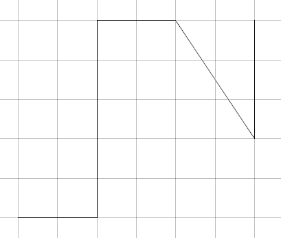
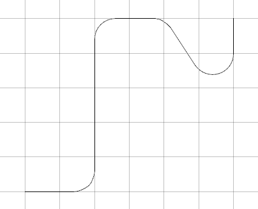
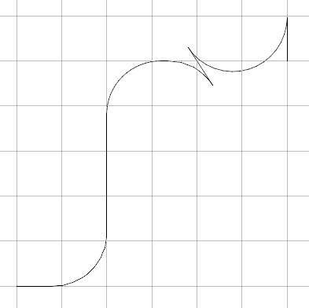
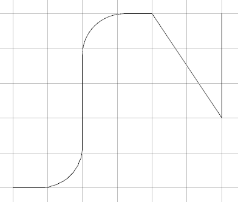
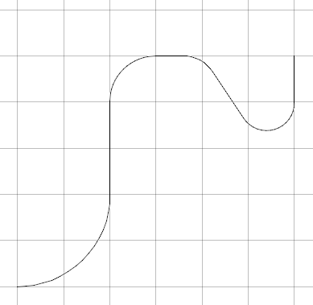
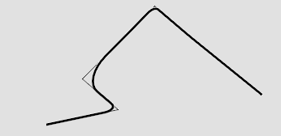
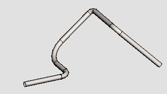

# `CurveFactory`

`CurveFactory` is a class with static methods for curve constructions that are too complex to be `create` methods in curve classes themselves.

## `CurveFactory.createFilletsInLineString`

Given a linestring and fillet radius, this constructs fillet arcs at each interior vertex of the linestring.

Radius may be given as a single value or as an array of radius per point of the linestring.

A parameter `allowBackupAlongEdge` indicates how to handle edges where the incoming and outgoing fillets overlap.

- if `false` the edge can be output full length, without the arcs.
- if `true` the arcs are constructed and the output edge moves in reverse to connect the overlapped arcs.

The arc constructions are full 3D -- each arc is in the plane of its two line segments.
(In the figures below, the linestring is slightly out-of-plane, and the visible fillets appear slightly elliptic because of being viewed at an angle.)

| | |
|-----|-----|
| original linestring |   |
| small fillets (0.5 of grid block) |  |
| large fillet, backup allowed |   |
| large fillet, no backup |   |
| varying size fillets |   |

Unit Test

- source: imodeljs/core/geometry/src/test/curve/CurveFactory.test.ts
- test name: "FilletsInLinestring"
- output: imodeljs/core/geometry/src/test/output/CurveFactory/FilletsInLineString.imjs

## `CurveFactory.createPipeSegments(centerline, radius)`

Given a centerline (segments and arcs) and radius, construct pipe segments of given radius.

This is usually used with centerline created by `CurveFactory.createFilletsInLineString`

The `centerline` parameter can be either a single curve primitive or a chain in a `Path` or `Loop`.

The pipe creation according to centerline segment is

- `LineSegment3d`: simple cylinder (`Cone` object with constant radius) with axis from the line segment start to end.
- `Arc3d`: `TorusPipe` primitive with the arc as its major arc.

| | |
|-----|-----|
| thin lines: original linestring to elbows   thick lines and arcs: Filleted path (centerline) |    |
| output of createPipeSegments | 

Unit Test

- source: imodeljs/core/geometry/src/test/curve/PipePath.test.ts
- test name: "KeyPointPath"
- output: imodeljs/core/geometry/src/test/output/PipePath/KeyPointPath.imjs
