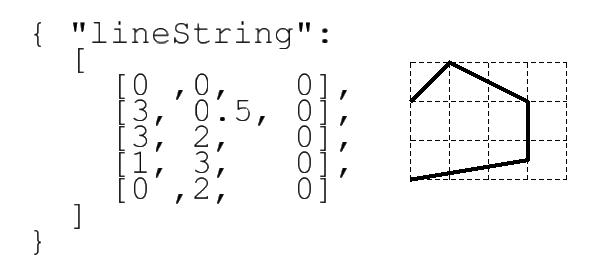
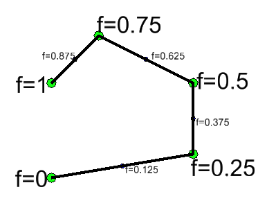
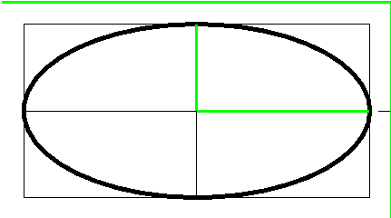
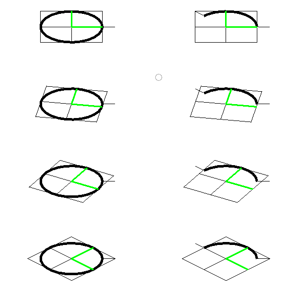
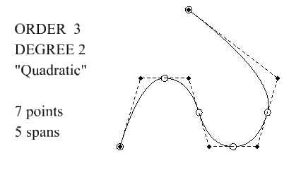

# Curve Primitives

- A CurvePrimitive is a bounded continuous curve.
- All curves implement methods (e.g. `fractionToPoint` to refer to "fraction" position along the curve.
  - `fraction=0` is the start of the primitive
  - `fraction=1` is the end of the primitive
  - increasing fractions always move forward along the primitive.
  - curves implement their equations with the fraction representing the parameter in their most natural equations.
- All curves also support methods to deal with _true distance_ along the curve. These include
  - `curve.curveLengthBetweenFractions (startFraction, endFraction)`
  - `curve.moveByDistanceFromFraction (startFraction, distance)`
  - Fraction position along the curve is strictly proportional to true distance along the curve only for a limited number of curve types:
    - LineSegment3d
    - Arc3d
    - TransitionSpiral
- Other curve types that have more complicated (non-proportional) fraction-to-distance relations are
  - elliptic arcs
  - bspline curves
  - linestrings
- When movement "by distance" along a chain of curves (of varying types) is required, the `CurveChainWithDistanceIndex` will act like a single curve (starting and ending at fractions 0 and 1), with the fraction mapped to true distance along the chain.

## lineSegment

- A line segment is a portion of an infinite line.
- Json Fragment: `[{"lineSegment":[[0,0,0], [3,0,0]]}`
- typescript object:

```
const myLineSegment = LineSegment.create (Point3d.create (1,2,3), Point3d.create(6,4,2));
```


- Fractional Parameterization:

```
    A = start point
    B = end point
    f = fraction varying from 0 to 1
    Point X(f) at fractional position f along the lineSegment is
        X(f) = (1-f) * A + f * B
```

## lineString

- A LineString is an array of points that are to be connected by straight lines.
- Json Fragment:

- Typescript object:

```
const myLineString = LineString.create ([point0, point1, point2 ....]);
```

- Fractional Parameterization

Having both individual line segments and the composite linestring complicates parameterization.

- As with all CurvePrimitives, the fractional parameterization for the complete linestring must have `fraction=0` at the start and `fraction=1` at the end.
- The fractional positions of each interior vertex are then defined at _equal intervals in the fraction space_.
- 
- Hence in the example, with 4 segments the vertex fractions increment by one quarter.
- Within each segment, the fraction interval is mapped as if it were a line segment.
- Note that having uniform vertex-to-vertex fraction means that the distance-along-the-linestring is _not proportional to fraction-along-entire-linestring_.   Fraction and distance changes are only proportional within individual segments.

## arcs (circular and elliptic)

An arc primitive is a portion of a circular or elliptical arc.   The equations for a complete elliptic arc require a center point and two vectors.   The start and end of a partial arc are controlled by two angles.

The equational forms for circular and elliptic cases are identical.  Telling whether a given arc is true circular requires examination of the vector coordinates.

The stroking equation that maps  an angle to a coordinates to points around a (full) elliptic (or circular) arc is

```
C = center point
U = vector from center point to 0-degree point
V = vector from center point to 90-degree point.
theta = angle
X(theta) = C + cos (theta * U + sin(theta) * V
```

### True Circles

- If the `U` and `V` vectors are (both) _perpendicular_ and _the same length_, this is a true circle.
- In the both circles below, the `U` and `V`  are identical length and perpendicular to each other.
- For the left circle, `U` and `V` happen to be in the global x and y directions.
- For the right circle, `U` and `V` are still identical length and perpendicular, but are both rotated away from global x and y.  This still traces a circle, but the "0 degree" point is moved around the circle.
- When the circular arc conditions are true, the angle used _in the equations_ is an the actual physical angle between the `U` vector and the vector from the center to `X(theta)`.


### Ellipse

If the `U` and `V` vectors either (a) have different lengths or (b) are not perpendicular, the ellipse is non-circular.

If `U` and `V` are perpendicular, their lengths correspond to the common usage of "major" and "minor" axis lengths.   But the perpendicular condition is not required -- non-perpendicular vectors occur due to transformation and construction history.

### Angular limits

To draw an arc that is not the complete circle or ellipse, simply limit the theta range to something other than 0 to 360 degrees.

```
theta0 = angular start point
theta1 = angular and point
f = fraction varying from 0 to 1
theta(f) = (1-f) * theta0 + f * theta1
    Point X(f) at fractional position f along the arc is

X(f) = C + cos (theta(f)) * U + sin(theta(f)) * V
```

- Angles theta0 and theta1 can be negative and can be outside of 360 degrees.
- Angle theta1 can be less than theta0

Examples of arc sweep

| start and end angles | CCW signed sweep angle | image |
|----|----|---|
| (0 to 360) | 360 |  |
| (0 to 135) | 135 |  |
| (270 to 495) | 225 |  |
| (90 to 270) | 180 |  |
| (90 to 405) | 315 |  |

Examples with json fragments




# bspline curves

A BSplineCurve3d (or BSplineCurve3dH) is a curve that (loosely) follows a sequence of control points.

Internally, the curve is a is a sequence of polynomial curves that join together smoothly.  Call each of those separate pieces a _span_.

The "control point" structure has remarkable properties for computation:

- The curve never leaves the overall xyz range of the control points.
- This bounding property applies "from any viewpoint", not just in the coordinate system where they are given.
- Even tighter, the curve is contained within the convex hull of the control points.
- No plane can intersect the curve more often than it intersects the control polygon.
  - that is, the polygon may overestimate the number of intersections, (i.e. suggest false intersections), but it never underestimates.
- Inspection of the control polygon gives similar "never underestimate" statements about other properties such as
  - the number of inflections.
  - the number of minima and maxima of the curve and its derivatives.
- The use of "weights" on the control points allows a bspline curve to exactly trace circular and elliptic arcs without use of trig functions.

## References

There are innumerable books and web pages explaining splines.  There is a high level of consistency of the concepts -- control points, basis functions, knots, and order.  But be very careful about subtle details of indexing.   Correct presentations may superficially appear to differ depending on whether the writer has considers `n` indices to run

- C-style, `0 <= i < n` (with index `n` _not_ part of the sequence)
- Fortran style , `1<=i<n`
- (rare) `0<=i<=n`

Some typical descriptions are:

- <https://en.wikipedia.org/wiki/B-spline>
- <http://web.mit.edu/hyperbook/Patrikalakis-Maekawa-Cho/node17.html>
- <https://www.cs.unc.edu/~dm/UNC/COMP258/LECTURES/B-spline.pdf>

Be especially careful about the number of knot counts, which can differ by 2 as described in the "over-clamping" section.

The `order` of the bspline is the number of control points that are "in effect" over an individual span.

- The first span is controlled by the first `order` control points, i.e. those indexed `0, 1, .. (order-1)`.
- The next span is controlled by control points indexed `1,2,..order`.
  - That is, there is a "moving window" of `order` points that control successive spans.
  - When moving from one cluster of `order` control points to the next, the first (left) point of the first cluster is dropped and a new one is added at the right.
- The sharing of control points provide the critical properties for the curve:
  - No matter how many control points there are (think dozens to hundreds), each individual span is controlled by only `order` points.
  - this "local control" prevents changes "far away" in the control points from causing unexpected global changes in the curve.
  - The sharing of `order-1` points works into the formulas to guarantee smoothness of the curve.
  - Specifically, for a bspline of given `order`:
    - If the knots are strictly increasing (no duplicates) the curve has `order-2` (i.e. `degree-1`) continuous derivatives.
    - Introducing repeated knots reduces the continuity.  In particular, with `order-1` repeated knots there is a cusp (abrupt slope change) at that knot.

## Summary

The required data for a bspline curve is:

| name | type | remarks |
|-----|-----|------|
| control points | array of N points | |
| order | number | the most common orders are 2 through 4;  higher order gives smoother curves, but with performance cost. |
|  | | Order higher than 10 is discouraged |
| | |  3 (quadratic curve, degree 2)
|  | |or 4 (cubic curve, degree 3) |
| knots    | array of `(N + order - 2)` numbers | See knot paragraph |

## order

- The `order` is the number of control points that affect each span of the curve.
- Bspline equations hypothetically allow any integer `order`.
- For practical use the common orders are quite low - 2,3,4, with occasional 5 through 8
  - `order=2` - the Bspline is a collection of straight lines (degree 1)
  - `order=3`  - the Bspline is a collection of quadratic curves. (degree = 2)   (Quadratic curves with weights can exactly trace circular and elliptic arcs)
  - `order=4` - the Bspline is a collection of cubic spans. These can have inflections within a span.
  - many graphics systems focus on cubic (`order=4, degree=3` bsplines.   These are a good balance of curve flexibility and computational cost.
- Conversationally, if one is thinking of "quadratic" cubic "curves", it is common to refer to the `degree`, which is one less than the order
  - the `degree` is the highest power appearing in the polynomial
  - A conventional polynomial form would have coefficients of terms with power 1,2, through `degree`.
  - That polynomial would also include a constant term that does not multiply a power of x.
  - Hence there is _one more coefficient_ than the degree.
  - textbook algebra discussions prefer reference to the highest power (`degree`) because that is short indicator of complexity
  - Bspline discussion prefers reference to `order` rather than `degree` because all of the internal matrix manipulations must account for that many coefficients.

## knots

- The knots are an array of sorted numbers.
- If there are K knots:
  - Each cluster of `2*order-2` knots (i.e. `2*degree` knots affects a single span
  - The knots index at `knots[i]` through `knots[i+2*order-3]` (inclusive) affect span `i`.
  - That knot values for that span are from `knots[i+order-2]` through `knots[i+2*order-2]`.
- Within the knots sequence, the values must never go down.

### Clamping

- If knot values are strictly increasing -- e.g. 1,2,3,4,5, -- all the way to the end, the curve does _not_ pass through the first and last control points.
- Having the right number of identical knot values "at the ends" makes the curve (a) pass through the end control points and (b) have tangent direction towards the immediate neighbor.
- Specifically, for a curve of given `degree`, exactly that number of repeated knots creates the usual "clamped" effects.
  - For instance, for a cubic curve, the knots `[0,0,0,0.25,0.5,0.75,1.1.1]` will
    - Pass through both end points, with tangent along the end segment of the polygon
    - have interior knot breaks at 0.25, 0.5 and 0.75.

#### OverClamping

- An important point for exchanging knots with legacy graphics systems (including Microstation and Parasolid) is that there is a long-established (an unnecessary) practice of having _one extra (unused) knot at each end_.
- That is, the _overclamped_ cubic knot sequence with breaks at 0.25, 0.5, and 0.75 would be  `[0,0,0,0,0.25,0.5,0.75,1.1.1,1]`.
- The equations for the bspline will never reference the extra knots at the beginning and end.
- In the overClamping convention, the relation of counts of control points (N) and (overClamped) knots is
...
            numberOfKnotsWithOverClamping = N + order = numberOfControlPoints + order
...

In `imodeljs`

- the spline classes (`BsplineCurve3d`, `BSplineCurve3dH` and surface partners) _internally_ do _not_ over-clamp.
- The API for constructing splines accepts both styles of input.  The order, knot count, and control point counts distinguish which style is being used.
  - If `numberOfControlPoints === numberOfKnots + order` the curve is overclamped, so the first and last knot values are not saved in the bspline curve object
  - If `numberOfControlPoints === numberOfKnots + order - 2` the knots are all used.
- The curve objects have method
...
    curve.copyKnots(includeExtraEndKnot: boolean)
...
to extract knots.  The caller can indicate if they prefer overclamped knots by passing `true` for the `includeExtraEndKnot` parameter.
- When knots are written in `iModelJson` objects, they are written with overclamp.

## Example: Order 2 (linear) bspline curve

- An order 2 bspline curve has degree 1, i.e. is straight lines
- The circles in the figure for order 2 bspline are both control points and span breaks.
  - This is the only order for which the span breaks occur at the control points.
- The direction (first derivative) changes at control point
- Hence there are sharp corners exactly at the control points.


## Example: Order 3 (quadratic) bspline curve

- An order 3 bspline curve has degree 2, i.e. is piecewise quadratic
- The curve does _not_ pass through the control points (dark)
- There are (for uniform interior knots) span breaks (circles) at midpoints of interior edges.
- Span changes (circles) are exactly at the midpoints of polygon edges.
- Direction (slope, first derivative) is continuous at each span change (circles)
- The concavity (second derivative) changes abruptly at each span change (circles)
  - This concavity change is not always visually obvious.
  - These curves are not as smooth as your eye thinks.
- There are no concavity changes within any single span.
- Clamping (2 identical knots at start, 2 identical knots at end) makes the curve pass through the end control points and point at neighbors.



## Example: Order 4 (cubic) bspline curve

- An order 4 bspline curve has degree 3, i.e. is piecewise cubic
- The curve does _not_ pass through the control points (dark).
- The curve does _not_ pass through particular points of the polygon edges.
- Span changes (circles) are generally "off the polygon"
- Direction and concavity are both continuous at span changes.
- There can be one concavity change within a span.
- Clamping (3 identical knots at start, 3 identical knots at end) makes the curve pass through the end control points and point at neighbors.


## Example: Order 5 (quartic) bspline curve

- An order 5 bspline curve has degree 4, i.e. is piecewise quartic
- The curve does _not_ pass through the control points (dark).
- The curve does _not_ pass through particular points of the polygon edges.
- Span changes (circles) are generally "off the polygon"
- Direction, concavity, and one more derivative are all continuous at span changes.
- There can be two concavity change within a span.
- Clamping (4 identical knots at start, 4 identical knots at end) makes the curve pass  the end control points and point at neighbors.


