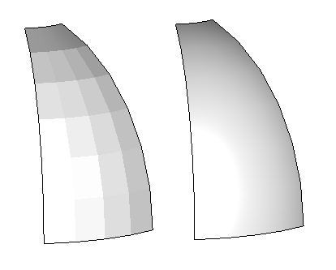
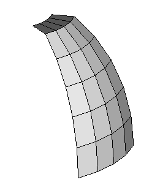

# Using Surface normals to make coarse facets looks smooth.

## Coarse facets on a smooth surface

Here is a patch of a smooth surface, represented as a 4x6 grid of facets, with all the facet edges drawn:

Here are two shaded images of the same facets, with the edges _not_ displayed.   Note that on the left, the edges are still clearly visible because of shading differences.  The blockyness of facets is very clear.  But on the right the surface appears much smoother.   Looking closely at the blocky version, each facet has a single gray scale shade throughout.  The edges are clearly visible because of jump from one blocks grayscale to the next. But in the smooth version, the gray scale various smoothly _within_ each block, and does not change at the edge.

The difference is due to careful use of facet normals -- vectors pointing "out of" the facets.

Here is a closeup showing (a) the entire lower left facet and (b) small parts of neighbors to the right and above.  Also appearing are short yellow lines pointing away from the facets in the corner near the vertices.   Look carefully at the complete lower left facet -- you can see that all 4 of these yellow lines are exactly perpendicular to the plane of the facet.  But the very nearby lines from corners of the neighbor facets are tilted at a slightly different angle because the neighbor facet is in a different plane.

Here is closeup of the same corner for the smoother image.   In this case yellow lines "near each vertex" are parallel _with their neighbors at the same vertex_, rather than with others far away on the same facet.   This direction is ideally taken from the true analytic original surface (a circular arc rotated around an line).   If the original surface equations are not known, using the average of the 2 or 4 facets also works well.  In either case, graphics software and hardware uses these normals to estimate a smooth variation of light reflecting off the entire facet, producing the vastly improved image quality.

## Introducing sharp interior edges

Here is the same number of facets, with the same grid structure, but with the upper 4 facets folded down onto a plane that is distinctly different from the rest of the smooth surface.   When the edges are not being drawn, we expect to see the lower part -- the curved part -- appear smoothly as before.   The interior of the flat part is all in a plane, and it should appear flat with a distinct edge at the sharp turn edge where it joins the curved portion.

Here are three images without the edges drawn.  From left to right they have:

 * (left) blocky display, with clearly visible breaks between facets
 * (middle) smooth display throughout.
    * This is good in the portions where the original surface was curved
    * This is _not_ good in at the sharp fold edge.  It appears to be a roll rather than a crisp edge, and the roll seems to continue into the 4 coplanar facets beyond the fold.
 * (right) correct display that is smooth in the curved section, a crisp fold, and then flat within the coplanar facets.

Once again, the display variation is due to how surface normal is presented at each corner of each facet.
 * On the left, each facet's corners get the normal of that facets own plane, which of course has a significant angle from those other facets at that vertex.
 * In the middle, all the corners near each vertex get a single average normal from all of the (2 or 4) incident facets.   Within the smooth part this is good.  But at the fold edge, the single normal is not really right for either side.
 * On the right, the normals are correctly pulled from either the fold plane or the curved surface.   Hence there are multiple distinct normal values _at each vertex along the fold_.

This mixing of smooth patches sharing common edges is pervasive in realistic mechanical models.

