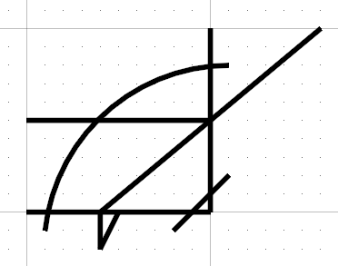
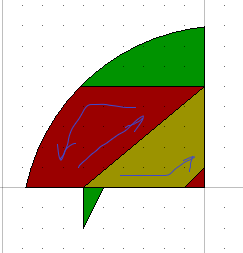
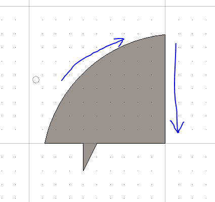
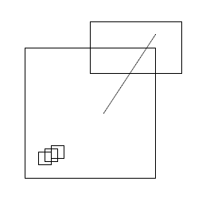
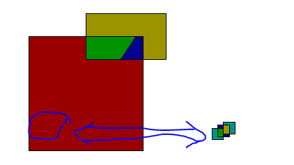
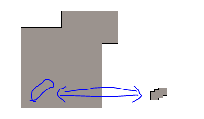
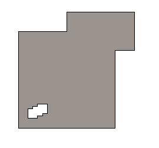

# PlanarSubdivisions

## `RegionOps.constructAllXYRegionLoops(candidates: BagOfCurves | AnyCurve[]): SignedLoops`

In the input

- there can be many curves
- the curves can be present as (a mixture of) (a) isolated curve primitives, (b) structured paths, loops, etc.
- no assumptions are made about the about structure of the curves.  The analysis considers on the leaf level primitives.
The method will
- Find all intersections among (planar xy) curve primitives in the `candidates`.
- From the fragments of curves as split by the intersections, constructs loops.
- Return as 3 sets of `Loops`: positive area loops, negative area loops
  - Among these loops, the positive area loops collectively cover the entire interior
  - Among these loops, the negative area loops traverse the outer boundary if each connected component of curves.

 The region is a `SignedLoops` object containing various loops identified by constructAllXYRegionLoops:

```ts
export interface SignedLoops {
  /** Array of loops that have positive area sign.  (i.e. counterclockwise loops) */
  positiveAreaLoops: Loop[];
  /** Array of loops that have negative area sign. (i.e. clockwise loops. */
  negativeAreaLoops: Loop[];
  /** slivers where there are coincident sections of input curves. */
  slivers: Loop[];
}
```

|  |  |
|---|---|
| Input: various lines and arcs that crisscross.<br> Note that the various intersections among curves are NOT endpoints in the input |  |
| Output: `positiveAreaLoops` geometry for the various separated regions |  |
| Output: `negativeAreaLoops` geometry for the various separated regions |  |

Unit Test

- source: imodeljs\core\geometry\src\test\curve\Region.test.ts

|  |  |  |  |
|---|---|---|---|
| `describe()`  |  `it()` | comments | output file (in imodeljs/core/geometry/src/test/output/) |
| "RegionBoolean" | "SimpleSplits" | lines, arc with various intersections | SimpleSplits.imjs |
| "RegionBoolean" | "Overlaps" | boxes with overlapping edges | Overlaps.imjs |

## Composite XYRegionLoops and Parity

This illustrates using `RegionOps.constructAllXYRegionLoops` to unscramble intersecting linework and construct a composite parity region, followed by `RegionOps.sortOuterAndHoleLoopsXY` to construct a parity region.

|  |  |
|---|---|
| Input: various lines and arcs that crisscross.<br> Note that although much of the input is rectangles, there is also an isolated line, so there is no "boolean" logic directly applicable to the inputs. |  |
| Output: `positiveAreaLoops` geometry for the various separated regions.  (The interior cluster is shifted to the right to emphasize that its interior faces) |  |
| Output: 2 `negativeAreaLoops` around the overall exterior and the interior cluster. |  |
| Output: `ParityRegion` using the outermost (negative) areas of the two components |  |

Unit Test

- source: imodeljs\core\geometry\src\test\curve\Region.test.ts
- test name: "RegionBoolean.Holes
- output file:  imodeljs/core/geometry/src/test/output/Holes.imjs
