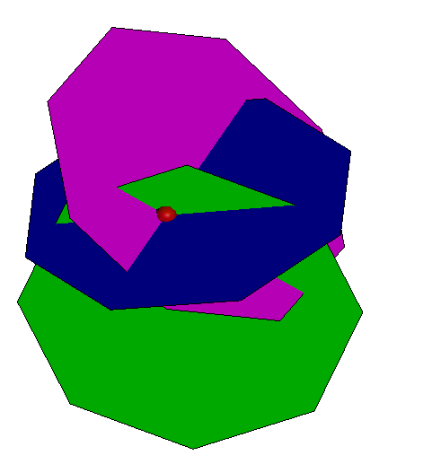
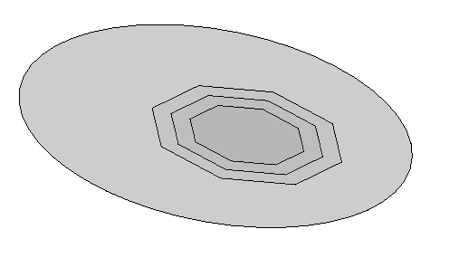
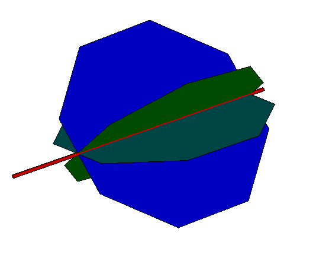
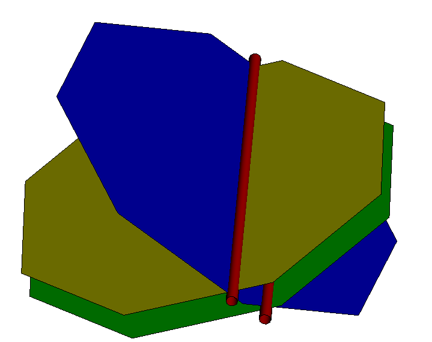
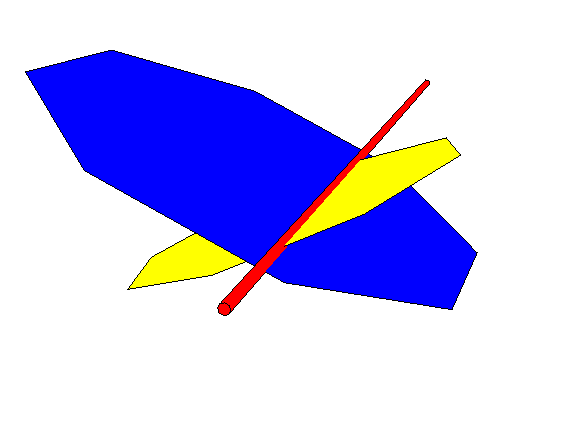
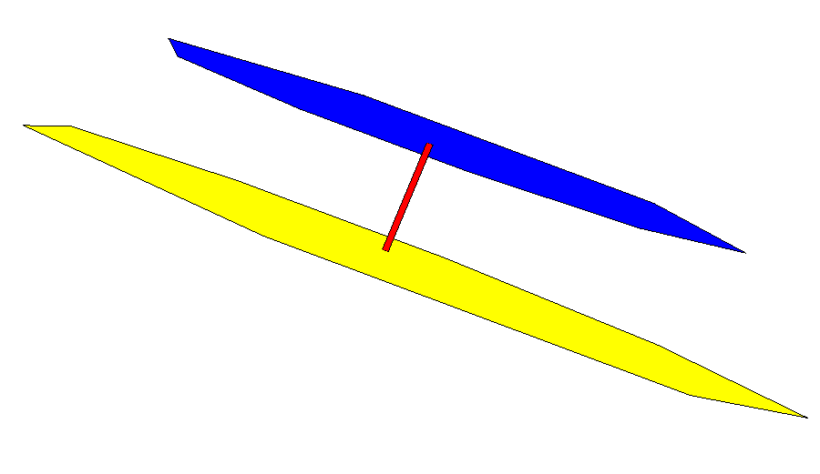

# The `PlaneOps` class: static methods for queries involving planes

Prior methods for intersection among 3 planes returned the single point if it existed, and left it up to the caller to distinguish among cases where there are parallel or coincident planes and planes the 3 coincident normals.

The PlaneOps class contains static methods that provide that extended level of detailed output.
PlaneOps is in the core3d/geometry/src/geometry3d3d directory as a peer of other "Ops" classes for services that span multiple classes, e.g. PolygonOps, PolylineOps, PointHelpers, UVSurfaceOps.

There are multiple concrete implementations of a "plane" -- e.g. ClipPlane and Plane3dByOriginAndUnitNormal.  In order to service them uniformly, methods in PlaneOps class take inputs typed only to the interface PlaneAltitudeEvaluator, which is implemented by the concrete classes.   PlaneOps is also a natural (and neutral) place to implement simple queries on PlaneAltitudeEvaluator.  These statics are:

* PlaneOps.projectPointToPlane(plane):Point3d -- project a space point to the plane.
* PlaneOps.planeNormal(plane): Vector3d -- return the plane normal as a vector
* PlaneOps.closestPointToOrigin (plane): Point3d -- return the point that is on the plane and closest to the origin.
* PlaneOps.classifyIfParallelPlanes(planeA, planeB): -2 | -1 | 0 | 1 | 2 -- provide a concise indicator of whether two planes are:
  * 0: intersecting (i.e. non-parallel)
  * 1: coincident with normals in the same direction
  * -1: coincident with normals in opposing normals
  * : 2: parallel non-coincident with normals in the same direction.
  * -2: parallel non-coincident with opposing normals
* PlaneOps.intersect2Planes(planeA, planeB): PlanePlaneIntersectionCases -- return complete details of plane-plane intersection
* PlaneOps.intersect3Planes(planeA, planeB, planeC): PlanePlanePlaneIntersectionCases -- return complete details of plane-plane intersection.
* PlaneOps.intersectRayPlane (ray, plane):Ray3dPlane3dIntersectionCases -- return complete details of ray-plane intersection.                     gd

 In order to support convenient decision logic in callers, the return value of intersecting either 2 or 3 planes is an interface class with optional members for various cases.

## PlaneOps.intersectRayPlane(plane, ray): Ray3dPlane3dIntersectionCases

```typescript
/**
 * Plane3dRay3dIntersectionCases is has members to fully describe the relationship of a plane and ray.
 * * The return from [[PlaneOps.intersectRayPlane]] will have one and only one if the three members
 *     {point,ray, separatorSegment} present.
 * @public
 */
export interface Ray3dPlane3dIntersectionCases {
  /** For the case where the ray cuts cleanly through the plane, single point of intersection */
  point?: Point3d;
  /** For the case where the ray is completely within the plane, a clone of the input ray. */
  ray?: Ray3d;
  /** For the case of the ray parallel and non-intersecting, pair of (distinct) points,
   *   * pointA on the ray
   *   * pointB on the plane
   *   * projection of pointA to the plane is pointB, and projection of pointB to the ray is pointA. */
  separatorSegment?: Point3dPoint3d;
}
```

This returns the relationship of a ray and plane.   The cases are elaborated by a Ray3dPlane3dIntersectionCases object.

| Relationship | member in return struct | Return type |
|---|---|---|
| single point intersection | point | Point3d |
| ray completely within plane | ray | Ray3d |
| ray parallel to but not in plane | separatorSegment | `{pointA,pointB}` object with pointA on the ray, pointB on the plane |

# PlaneOps.projectPointToPlane(plane, spacePoint): Point3d

This returns a point _on_ the plane and closest to the space point.  That is, the vector from plane point to space point is perpendicular to the plane.

# PlaneOps.public static planeNormal(plane: PlaneAltitudeEvaluator): Vector3d

This returns a vector perpendicular to the plane.

# PlaneOps.closestPointToOrigin(plane): Point3d

This returns the plane point closest to the coordinate system origin.

# PlaneOps.PlaneOps.classifyIfParallelPlanes(planeA, planeB): -2 | -1 | 0 | 1 | 2

This returns a concise single-number indicator of relationship of parallel planes.  (Use PlaneOps.intersect2Planes for geometric line-of-intersection data.)

| Relationship | value |
|---|---|
| Not parallel (i.e. intersect in an infinite line) | 0 | |
| Coincident with normals in same direction | 1 |
| Coincident with opposing normals | -1 |
| Parallel but not coincident with normals in same direction | 2 |
| Parallel but not coincident with opposing normals | -2 |

# PlaneOps:intersect3Planes (planeA, planeB):Plane3dPlane3dPlane3dIntersectionCases

Computes the intersection of 3 planes.  Results are returned in an object with named member.

```typescript
/**
 * Plane3dPlane3dPlane3dIntersectionCases has optional member for each possible configuration of 3 planes.
 * * The return value of [[PlaneOps.intersect3Planes]] will have at most one of {point, ray, plane} defined.
 * * In cases other than the single point, the pairwiseDetail member is present and contains the 3 pairwise relations among planes
 * @public
 */
export interface Plane3dPlane3dPlane3dIntersectionCases {
  /** Single point of intersection.
   * * When this is defined, no other members are defined.
   */
  point?: Point3d;
  /** The planes have simple intersection in a Ray */
  ray?: Ray3d;
  /** The planes are coincident. */
  plane?: Plane3dByOriginAndUnitNormal;
  /** The planes are parallel.  The separatorSegment has one point on each of the two planes.  */
  separatorSegment?: Point3dPoint3d;
  /** If the intersection is anything other than either (a) single point or (b) fully coincident planes, the details array will contain the 3 pairwise configurations
   * among planeA, planeB, planeC:
   *   * pairwiseDetail[0] is the intersection of planeA and planeB
   *   * pairwiseDetail[1] is the intersection of planeB and planeC
   *   * pairwiseDetail[2] is the intersection of planeC and planeA
   * * Some specific configurations to note are:
   *   * When the three planes are parallel but not a single plane, each of the three pairwiseDetail members will be a Point3dPoint3d pair.  Note that in
   *         this case there are no points common to all three planes and the point, ray, and plane members are all undefined.
   *   * When two planes are coincident and the third intersects, the entry for the coincident pair is the coincident plane, and the other two are
   *      the intersection ray.
   *   * When all three intersect in a ray but with no pairwise coincident plane, the ray is repeated 3 times.
   *   * When the pairwise intersections are all rays that are parallel, all three rays are present.
   */
  pairwiseDetail?: Plane3dPlane3dIntersectionCases[];
  }
  ```

| Relationship | primary member in return struct | primary member type | Remarks |
|---|---|---|---|
| single point intersection | point | Point3d | [ray], [plane], and [pairwiseDetail] are undefined |
| coincident planes | plane | Plane3dByOriginAndUnitNormal |  (point) and [ray] are undefined. |
| | pairwiseDetail | Plane3dPlane3dIntersectionCases | undefined |
| unbounded line of intersection | ray | Ray3d | |
| | pairwiseDetail | Plane3dPlane3dIntersectionDetails[3] | Array of 3 pairwise plane intersections: |
| | pairwiseDetail[0] | Plane3dPlane3dIntersectionDetail | computed by  PlaneOps.intersect2Planes(planeA, planeB) |
| | pairwiseDetail[1] | Plane3dPlane3dIntersectionDetail | computed by  PlaneOps.intersect2Planes(planeB, planeC) |
| | pairwiseDetail[2] | Plane3dPlane3dIntersectionDetail | computed by  PlaneOps.intersect2Planes(planeC, planeA) |
| | | | Note that a single ray intersection has 2 cases, indicated by interrogating the pairwiseDetailArray: |
| | | |  (1) 2 planes are coincident and the third cuts them both (in the same line for each)
| | | |  (2) the 3 planes pass through the single intersection line distinctly -- like 3 radial planes from a common axis |
| 3 parallel planes | | |  [point], [ray] and [plane] are all undefined. |
| | pairwiseDetail | Plane3dPlane3dIntersection[3] | each of the three entries gives a segment joining the respective plane pair. |
| 2 distinct parallel planes  and a transverse plane | | |  (point), [ray] and [plane] are all undefined. |
| | pairwiseDetail | Plane3dPlane3dIntersection[3] | 2 of the pairwiseDetails indicate ray of intersection; 1 is joining segment for the parallel pair. |

# PlaneOps:intersect2Planes (planeA, planeB, planeC):Plane3dPlane3dIntersectionCases

Computes the intersection of 3 planes.  Results are returned in an object with named member.

```typescript
/**
* Plane3dPlane3dIntersectionCases has one optional member
* for each possible configuration of 2 planes.
* The return value of [[PlaneOps.intersect2Planes]] will have at most one of these defined.
* @public
 */
export interface Plane3dPlane3dIntersectionCases {
  /** The planes have simple intersection in a Ray */
  ray?: Ray3d;
  /** The planes are coincident. */
  plane?: Plane3dByOriginAndUnitNormal;
  /** The planes are parallel.  The separatorSegment has one point on each of the two planes.  */
  separatorSegment?: Point3dPoint3d;
}
```

| Relationship | member in return struct | Return type | Remarks |
|---|---|---|---|
| unbounded line of intersection | ray | Ray3d |  |
| coincident planes | plane | Plane3dByOriginAndUnitVector |  [plane] and [ray] are undefined. |
| 2 parallel distinct planes | separatorSegment | Point3dPoint3d|  [ray] and [plane] are all undefined. |
