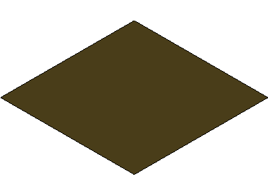

# Polyface Analytical Data Visualization

The [PolyfaceAuxData]($geometry) structure contains one or more analytical data channels for each vertex of a [Polyface]($geometry).  Typically a [Polyface]($geometry) will contain only vertex data required for its basic display, the vertex position, normal and possibly texture parameter.  The [PolyfaceAuxData]($geometry) structure contains supplemental data that is generally computed in an analysis program or extracted from an external data source.  This can be scalar data used to overide the vertex colors through *Thematic Colorization* or XYZ data used to deform the mesh by adjusting the vertex postions. The figure below represents a cantilever beam under a single point load.  The stress is represented through thematic colorization and the deflection is also displayed (exaggerated 100X by applying [AnalysisStyle]($common) with displacementScale: 100.


## Analytical Data Channels

The [PolyfaceAuxData]($geometry) structure contains an array of [AuxChannel]($geometry) structures that may each represent a separate quantity (temperature, stress, displacement etc.).  A channel will include one or more input values and a set of vertex values for each input value.  If more than one input value is included then it is possible to animate the visualization as the input changes.  The input would typically be either elapsed time or an external input such as load.  Each input channel is independent and only a single channel of a type (scalar, displacement or normal) may be displayed at a time.

## Thematic Colorization

Visualization of scalar vertex data is achieved by using the values to map into a color gradient. The gradients can be controlled through the [ThematicGradientSettings]($common) member of [AnalysisStyle]($common).

Display Styles and Analysis Style.

In iTwin.js [DisplayStyleSettings]($common) contains a group of display settings.  A single [DisplayStyleSettings]($common) can be shared by on or more views.  The [AnalysisStyle]($common) member of [DisplayStyleSettings]($common) contains settings that control the display of [PolyfaceAuxData]($geometry).  An [AnalysisStyle]($common) may include:

- A single displacement channel. A displacementScale may be included to exaggerate or attenuate the displacement.
- A single scalar channel, the scalar channel range and the thematic gradient to display the scalar data (`ThematicGradientSettings`).  In the images below the same mesh is displayed with two different [AnalysisStyle]($common)s.

___

     Scalar Height with Sea-Mountain Gradient                   Scalar Slope with Blue-Red Gradient

 

Example
----

An example creating a fictitious analytical mesh is included in the "analysis-importer" test application.  The application begins by creating the flat rectangular [Polyface]($geometry) with 100 rows and columns...

```ts
const options = StrokeOptions.createForFacets();
options.shouldTriangulate = true;
const builder = PolyfaceBuilder.create(options);
const nDimensions = 100;
const spacing = 1.0;

/** Create a simple flat mesh with 10,000 points (100x100) */
for (let iRow = 0; iRow < nDimensions - 1; iRow++) {
    for (let iColumn = 0; iColumn < nDimensions - 1; iColumn++) {
        const quad = [Point3d.create(iRow * spacing, iColumn * spacing, 0.0),
        Point3d.create((iRow + 1) * spacing, iColumn * spacing, 0.0),
        Point3d.create((iRow + 1) * spacing, (iColumn + 1) * spacing, 0.0),
        Point3d.create(iRow * spacing, (iColumn + 1) * spacing)];
        builder.addQuadFacet(quad);
    }
}
```

Once the mesh is created the scalar and displacement data is created as number arrays.  For the purpose of this example we create a zero channel so that the initial state of the mesh has no displacement and zero scalar values and then produce a scalar channels representing the displacement with a radial wave super imposed on the mesh as well as scalar channels that represent the height and slope of the mesh.  Note that a single value is pushed for scalar channel data, while the displacement requires 3 values.

```ts
const zeroScalarData = [],
    zeroDisplacementData = [],
    radialHeightData = [],
    radialSlopeData = [],
const radius = nDimensions * spacing / 2.0;
const center = new Point3d(radius, radius, 0.0);
const maxHeight = radius / 4.0;
const auxChannels = [];

/** Create a radial wave - start and return to zero  */
for (let i = 0; i < polyface.data.point.length; i++) {
    const angle = Angle.pi2Radians * polyface.data.point.distanceIndexToPoint(i, center) / radius;
    const height = maxHeight * Math.sin(angle);
    const slope = Math.abs(Math.cos(angle));

    zeroScalarData.push(0.0);
    zeroDisplacementData.push(0.0);
    zeroDisplacementData.push(0.0);
    zeroDisplacementData.push(0.0);

    radialHeightData.push(height);
    radialSlopeData.push(slope);
    radialDisplacementData.push(0.0);
    radialDisplacementData.push(0.0);
    radialDisplacementData.push(height);
}
```

Next we take the channel data and create an array [AuxChannelData]($geometry) entries for aach channel.   The first argument of the [AuxChannelData]($geometry) constructor is the "input" value.  This represents the external input value that produces this data.  This may be a quantity such as force in a stress analysis application or time in a simple animation.

```ts
const radialDisplacementDataVector =
    [new AuxChannelData(0.0, zeroDisplacementData),
    new AuxChannelData(1.0, radialDisplacementData),
    new AuxChannelData(2.0, zeroDisplacementData)];
const radialHeightDataVector =
    [new AuxChannelData(0.0, zeroScalarData),
    new AuxChannelData(1.0, radialHeightData),
    new AuxChannelData(2.0, zeroScalarData)];
const radialSlopeDataVector =
    [new AuxChannelData(0.0, zeroScalarData),
    new AuxChannelData(1.0, radialSlopeData),
    new AuxChannelData(2.0, zeroScalarData)];
```

We next create the AuxChannels.  The channel names provideed in the [AuxChannel]($geometry) constructor are used to present the channel to the user as well as keys to select the channel from [AnalysisStyle]($common)s.

```ts
auxChannels.push(new AuxChannel(radialDisplacementDataVector, AuxChannelDataType.Vector, "Radial Displacement", "Radial: Time"));
auxChannels.push(new AuxChannel(radialHeightDataVector, AuxChannelDataType.Distance, "Radial Height", "Radial: Time"));
auxChannels.push(new AuxChannel(radialSlopeDataVector, AuxChannelDataType.Scalar, "Radial Slope", "Radial: Time"));
```

The final step is to create [PolyfaceAuxData]($geometry) and associate it to our base `Polyface'.  A set of indices is required to map the channel data values into the facets.  In our case, we have produced the channel data in parallel with the mesh points so that we can simply use point indices "polyface.data.pointIndex", but this is not required and alternate indexing could also be used.  Not e that only a single index structure is supplied and shared by all channels and their data, therefore all channels data arrays must have same number of values and indexing.

```ts
polyface.data.auxData = new PolyfaceAuxData(auxChannels, polyface.data.pointIndex);
```

Run the example by entering "node test-apps/analysis-importer/lib/Main.js" in a command shell with CWD set to repository root.  The output is "test-apps/analysis-importer/lib/output/AnalysisExample.bim".
