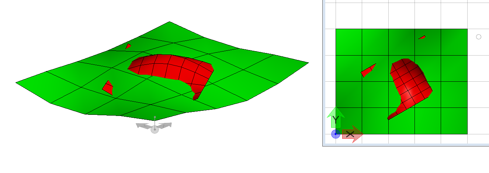
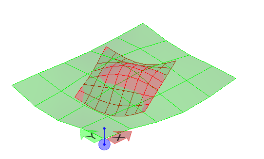
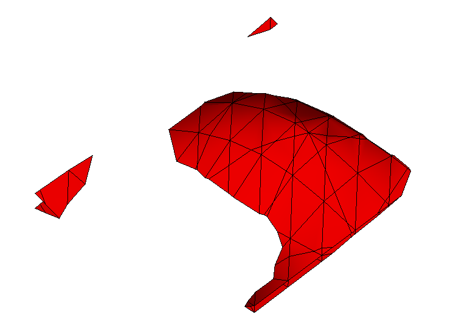
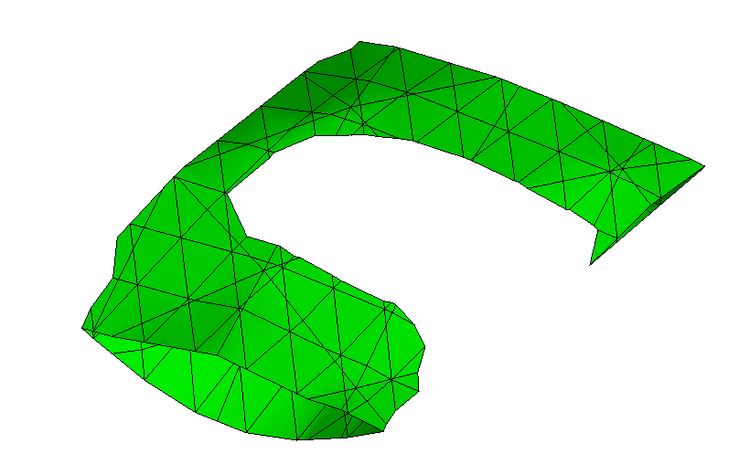

# Examples of `PolyfaceClip` methods

## Cut Fill

|  |  |
|---|---|
| red and green meshes  |      |
| Compute "over and under" mesh parts   (red is meshA, green is meshB) | `const cutFill = PolyfaceClip.computeCutFill(meshA, meshB);` |
| `cutFill.meshAOverB` | ` |
| `cutFill.meshBOverA` | ` |

Unit Test
  * source: imodeljs\core\geometry\src\test\clipping\PolyfaceClip.test.ts
  * test name: "CutFill"
  * output: imodeljs\core\geometry\src\test\output\PolyfaceClip\CutFill.imjs

## Section Cut

|  |  |
|---|---|
| grey: closed volume mesh   green: section plane  |  |
| extract linework of section cut | `  const section = PolyfaceClip.sectionPolyfaceClipPlane(facets, clipPlane);` |
| This produces an array of `LineString3d` |  |
| Clip the facet set and produce facets on the cut plane  
 `insideClip` is a boolean controlling which side of the cut is kept. |`  const clippedPolyface = PolyfaceClip.clipPolyfaceClipPlaneWithClosureFace(facets, clipPlane, insideClip, true);' |
 | Lower and upper parts | 

Unit Test:
  * source: imodeljs\core\geometry\src\test\clipping\PolyfaceClip.test.ts
  * test name: "ClosedSection"
  * output: imodeljs\core\geometry\src\test\output\PolyfaceClip\ClosedSection.imjs

