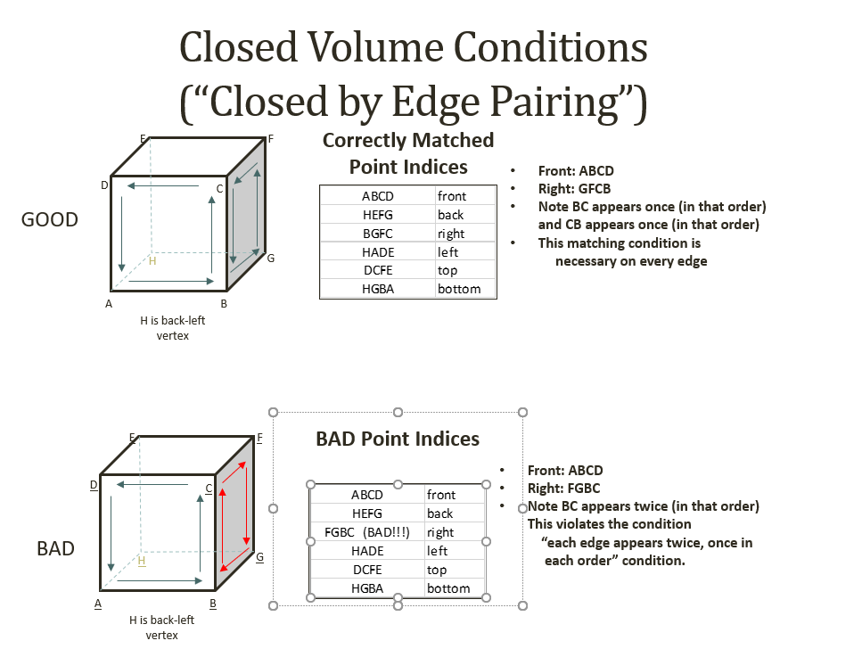
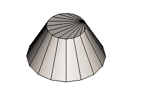
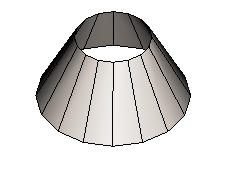
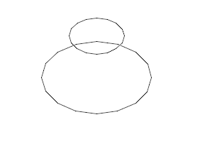

# Indexed Polyface Orientation Rules

In order to act as a closed volume, facet indices must be oriented so all faces are "counterclockwise as viewed from outside"

When this visual condition is met, a _necessary_ (but not complete) condition each edge must be part of exactly two facets, and the order of the edge's vertex indices must be opposite.

That is, for an edge with vertices X and Y

- There must be two facets that "use" that edge
- One of the facets must have its vertices indices with "X immediately followed by Y"
- One of the facets must have its vertices indices with "Y immediately followed by X"

If some index pair XY appears only _once_, it is a boundary edge, with a "hole" on the other side.

If an index pair XY appears more than twice, there is a "non-manifold" condition with too many facets.

If the faces close physically but have incorrect orientation, edges "between" the mismatched orientation will have XY appear in the same order in each.

In the cube below:

- In the upper row, the indices are correct
  - All facets are counterclockwise from the outside.
- In the lower row, the BGFC "right" facet has its order reversed to FGBC
  - this is clockwise from the outside.
  - Index inspection will show that BC appears (with BC order) in both front and right facets.
  - The other three edges FC, FG, and GB will have the same issue.

## Testing for closure, Extracting boundary edges

The (static) method `PolyfaceQuery.isPolyfaceClosedByEdgePairing(polyface)

- Examines all facets
- tests if every facet edge has exactly one properly paired partner
- Returns true if all partners are found
- Returns false if any facet edges have either (a) not partner, (b) more than one partner with the same indices or (c) a partner with indices that are not reversed.

|  |  | |
---|---|---|
| Geometry  |  | |
| return from `PolyfaceQuery.isPolyfaceClosedByEdgePairing` | `true` | `false` |
| return from `PolyfaceQuery.boundaryEdges ()` | (none !!) | |
