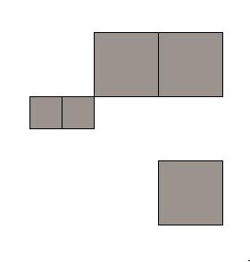
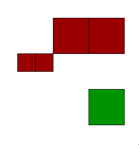
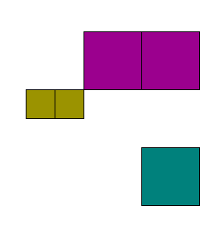
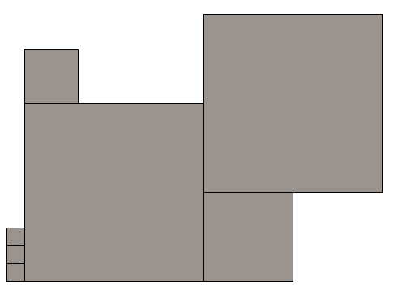
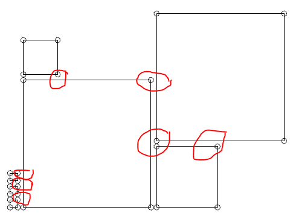
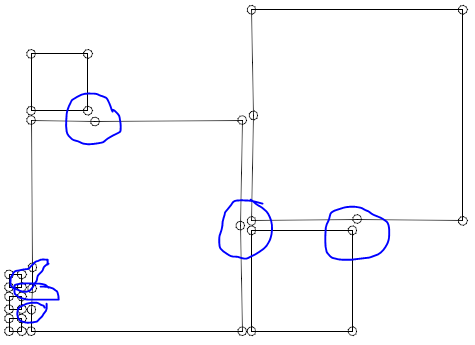
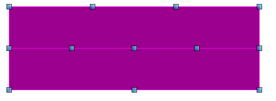
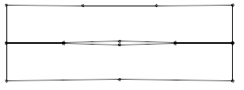
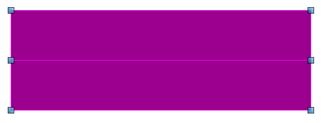
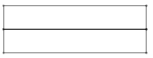

# Examples of `PolyfaceQuery` methods

## Partitioning by vertex and edge connectivity

|  |  |
---|---|
| A single mesh with 5 facets  |  |
| create arrays of facet indices that share any vertex contact  | const facetIndexArraysWithVertexConnectivity = PolyfaceQuery.partitionFacetIndicesByEdgeConnectedComponent(polyface) |
| extract as separate meshes |  const fragmentPolyfaces = PolyfaceQuery.clonePartitions(polyface, facetIndexArraysWithVertexConnectivity);|
| 2 separate Polyface meshes (red, green), each with at least vertex-to-vertex connectivity | |
| create arrays of facet indices that share an entire edge  | const facetIndexArraysWithEdgeConnectivity = PolyfaceQuery.partitionFacetIndicesByEdgeConnectedComponent(polyface) |
| extract as separate meshes |  const fragmentPolyfaces = PolyfaceQuery.clonePartitions(polyface, facetIndexArraysWithEdgeConnectivity);|
| 3 separate Polyface objects (blue, drab, magenta), each with at least edge-to-edge connectivity | |

Unit Test

- source: core/geometry/src/test/clipping/PolyfaceQuery.test.ts
- test name: "PartitionFacetIndicesByConnectivity"
- output: core/geometry/src/test/output/PolyfaceQuery/PartitionFacetsByConnectivity.imjs

## Fixup TVertices

|  |  |
---|---|
| A mesh with 7 square facets.   Note that vertices from adjacent squares appear "within" some long edges. |  |
| Skeletal display with circles near each vertex of each facet    The circles indicate that each facet references only its actual corners   Red highlight shows "TVertex" situations |  |
| After calling `PolyfaceQuery.cloneWithTVertexFixup` the long edges that passed through the T-Vertex   have vertices inserted   The two larger "squares" now reference (left of center) 9 and (upper right) 6 vertices |  |

Unit Test

- source: core/geometry/src/test/clipping/PolyfaceQuery.test.ts
- test name: "cloneWithTVertexFixup"
- output: core/geometry/src/test/output/PolyfaceQuery/cloneWithTVertexFixup.imjs

## Fixup Colinear Edges

|  |  |
---|---|
| A mesh with 2 rectangular facets.   Note that along the long edges there are multiple interior vertices. |  |
| Skeletal display with circles indicating interior vertices within the facets. |  |
| After `PolyfaceQuery.cloneWithColinearEdgeFixup`   each rectangle only has 4 vertices |  |
| Skeletal display with circles indicating interior vertices within the facets. |  |

Note that colinearEdgeFixup and TVertexFixup have tricky interactions.  If colinearEdgeFixup is applied to the final figure (blue markup) of the TVertexFixup section (above), the locally colinear edges within the large rectangles are _not_ removed.  This the colinear edge logic will notice that those vertices are incident to other facets where the vertex is a true corner, and hence should not be removed.

Unit Test

- source: core/geometry/src/test/clipping/PolyfaceQuery.test.ts
- test name: "cloneWithColinearEdgeFixup"
- output: core/geometry/src/test/output/PolyfaceQuery/cloneWithColinearEdgeFixup.imjs

## Mark Edge Visibility

Each edge of each facet in a polyface has a visibility indicator.  This tells display engines whether that edge should be highlighted with a drawn line as the facet it displayed.
(Some display engines may choose to ignore this an always display just the shaded facet body.)

During default construction by a `PolyfaceBuilder` all edges are marked visible by default.

|  |  |
---|---|
| A (partial, capped) TorusPope with all edges visible |  |
| Apply `PolyfaceQuery.markAllEdgeVisibility (mesh, false);`   this hides all edges.    (The display engine has added some linework by silhouette rules) |  |
| Apply `PolyfaceQuery.markPairedEdgesInvisible(mesh, Angle.createDegrees (0.1)));`   this hides edges with adjacent facet angle less than 0.1 degrees.    (Hence only the edges within the flat caps are hidden) |  |
| Apply `PolyfaceQuery.markPairedEdgesInvisible(mesh, Angle.createDegrees (15)));`   this hides edges with adjacent facet angle less than 15 degrees.    (Edges within the flat caps are hidden.   Visibility in the torus body varies.) |  |
| Apply `PolyfaceQuery.markPairedEdgesInvisible(mesh, Angle.createDegrees (30)));`   this hides edges with adjacent facet angle less than 30 degrees.    (Edges within the flat caps are hidden.   Visibility in the torus body varies.) |  |
| Apply `PolyfaceQuery.markPairedEdgesInvisible(mesh, Angle.createDegrees (50)));`   this hides edges with adjacent facet angle less than 50 degrees.    (Edges within the flat caps are hidden.   The only visible edges are at the 90 degree angles around the caps) |  |

Unit Test

- source: core/geometry/src/test/clipping/Polyface.test.ts
- test name: "SolidPrimitiveBoundary"
- output: core/geometry/src/test/output/Polyface\SolidPrimitiveBoundary.imjs
