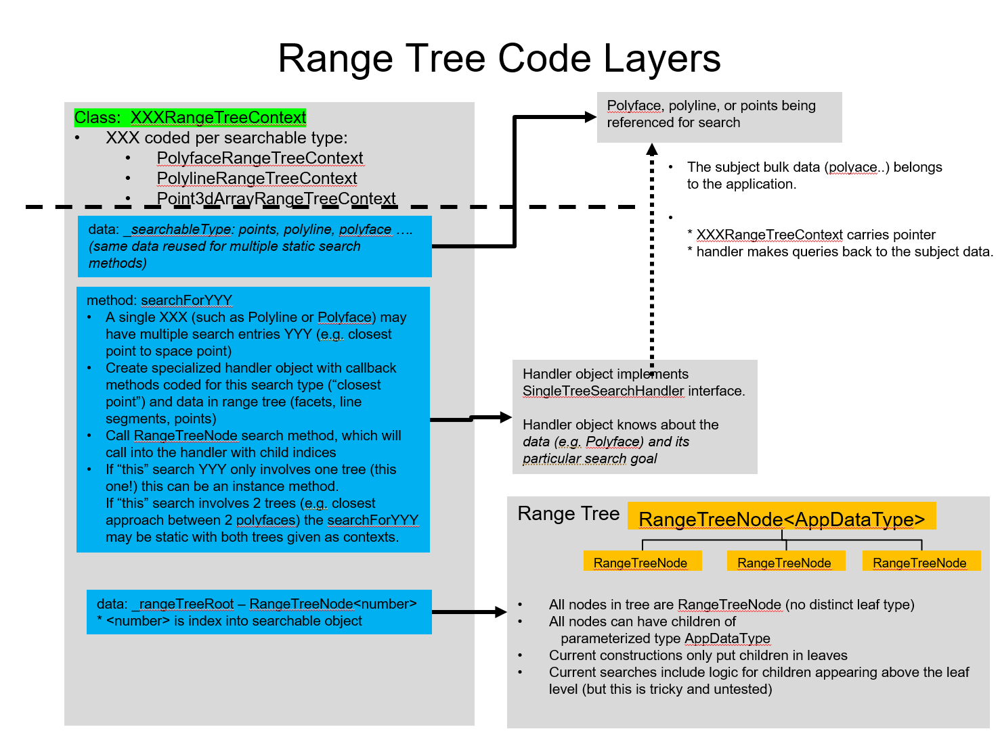

# Range Tree Structures

A Range Tree is:
* A set of `RangeTreeNode` objects forming a tree structure:
  * From any of the range tree nodes, one can move to other child nodes.
  * The "node to children" references form an acyclic graph structure.
  * The root node has no parent.
  * Each non-root node has a single parent.
* Each node (leaf level or internal) can have zero, one, or many application data items.
  * The application items are not part of the tree structure.
* Each node has a `Range3d`:
  * In a leaf node, this is the range of its application data items.
  * In an interior node, this is the range containing:
    * the range of the node's application data items, and
    * the ranges of its child nodes.

Conventions:
* It is expected that a range tree will contain _many_ children among its nodes.
* Current constructors put application data only in leaf nodes.

# Class structure

The overall class structure for a specialized range tree object is as in this figure.
* Note that PolylineRangeTreeContext is now called `LineString3dRangeTreeContext`.

## RangeTreeNode

* The class type for a node of the range tree is `RangeTreeNode`.
* The RangeTreeNode is an internal type.
* The RangeTreeNode class is parameterized with `AppDataType`.

## AppDataType

* This type parameter is the type of application-specific data carried by each RangeTreeNode.
* All nodes have the same AppDataType.
* This type is typically known only to the context and RangeTreeNodes.

## Context Classes

A range tree context:
  * Is a single master object for a category of searches.
  * Has a reference to a single root RangeTreeNode.
  * Is the only public class among the classes within a range tree implementation.

There are two typical patterns:
  * Indexed children
    * AppDataType is `number`, representing indices into another structure.
    * The context has a reference to the structure.
    * Current examples:
      * `Point3dArrayRangeTreeContext`:
        * Tree searches aim to identify individual points in a `Point3d` array.
        * The context holds a pointer to the Point3d[].
        * Leaf node application data are array indices.
        * Searches return a `CurveLocationDetail` object specifying the point.
      * `LineString3dRangeTreeContext`:
        * Tree searches aim to identify individual edges (line segments) within a `LineString3d`.
        * The context holds a pointer to the LineString3d.
        * Leaf node application data are segment indices.
        * Searches return a `CurveLocationDetail` object specifying a segment location.
      * `PolyfaceRangeTreeContext`:
        * Tree searches aim to identify particular facets within a `Polyface`
        * The context holds a pointer to a `PolyfaceVisitor` for the Polyface.
        * Leaf node application data are facet indices (readIndex).
        * Searches return a `FacetLocationDetail` object specifying a facet location.
  * Independent children
    * AppDataType is some standalone type (e.g. `CurvePrimitive`).
    * Searches may return a (pointer to an) AppDataType object.
    * Current examples: none.

## Handler Classes

In order for the same range tree (in some range tree context) to be searchable multiple times and with varying search goals, the detail search logic (e.g., distance between leaf node to space point, or between leaf nodes of two range trees) exists in specialized handler objects that are aware of the type of search, the AppDataType, and any parent data (e.g., Polyface) carried by the context.

A single search will involve multiple calls to its handler, but due to the range logic in the tree, this is typically a significant factor (10 to 20 times) smaller than the number of AppDataType items in the tree.

There are two abstract classes for handlers, both parameterized by AppDataType.
* Methods:
  * a method for processing application data (e.g., `processAppData`)
  * a method to determine if application data with a given range should be processed (e.g., `isRangeActive`)
  * a method to abort processing (e.g., `isAborted`)
* Current examples:
  * `SingleTreeSearchHandler`:
    * Called during a search that involves only one range tree.
    * The parameter to each process call is an AppDataType item.
    * The handler carries a reference to the context and search-specific data, such as a space point from which to compute minimum distance.
  * `TwoTreeSearchHandler`
    * Called during a search that involves two range trees.
    * The parameter to each process call is a pair of AppDataType items, one from each tree.
    * The handler carries references to both contexts.

In the common case of searching a single tree for an AppDataItem "closest to spacePoint":
* The handler remembers "best item so far" and its minimum distance from spacePoint.
* Search logic in the RangeTreeNode offers a range (from a tree node) to the handler's `isRangeActive` method.
  * If the range is clearly too far away from spacePoint to contain a "better" AppDataType item, isRangeActive returns false and the children of that RangeTreeNode are not explored.
  * If some or all of the range is closer to the spacePoint, then the search continues:
    * Each AppDatType item directly in the node is offered to `processAppData`:
      * As ever-closer AppDataType items are detected, the "best item so far" and its minimum distance are updated.
      * The decreased value of the minimum distance increases the chance of rejecting uninteresting nodes later in the search.
    * The search recurses into the child nodes of the RangeTreeNode.
* See e.g., `PolyfaceRangeTreeContext.searchForClosestPoint`, which constructs and utilizes a handler of type `SingleTreeSearchHandlerForClosestPointOnPolyface`.
