# Examples of `RegionOps`

## RegionOps.splitPathsByRegionInOnOutXY

This splits any curve into parts in, on, and outside an xy region.

|  |  |
|---|---|
| 25 points |  |
| split the black path into parts inside and outside the grey area | `const splitParts = RegionOps.splitPathsByRegionInOnOutXY(path, loop);`|
| (red) Path parts "inside" the region <br>  `splitParts.insideParts`| 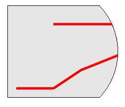 |
| (green) Path parts "outside" the region  <br>  `splitParts.outsideParts`| 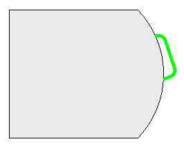 |

### Remarks

Using a closed region as the cutter is a specialized high level operation, just one of the many ways that splitting may be needed.  It is a combination of

|  |  |
|---|---|
| a _split_ step uses the region boundary curves but not the interior/exterior properties. |`const splitPaths = RegionOps.splitToPathsBetweenFlagBreaks ((pathWithIntersectionMarkup, true);` |
| a _classification_ step tests one point from each fragment of the `splitPaths`: | |
| (a) obtain one point on a fragment being tested |`const pointOnChild = CurveCollection.createCurveLocationDetailOnAnyCurvePrimiitive(splitPaths);` |
| (b) determine if that single point is inside or outside. <br> since the fragments have no interior crossings, that point classifies the whole fragment | `const inOnOut = RegionOps.testPointInOnOutRegionXY(region, pointOnChild.point.x, pointOnChild.point.y);` |

Unit Test

- source: imodeljs\core\geometry\src\test\topology\RegionOps.test.ts
- test name: "InOutSplits"
- output: imodeljs\core\geometry\src\test\output\RegionOps\InOutSplits.imjs

## RegionOps.testPointInOnOutRegionXY

This tests whether single points are in, out, or on an xy region.

|  |  |
|---|---|
| Parity region with various test points <br> circle is "on" <br> diamond is "in" <br> plus is "out" | 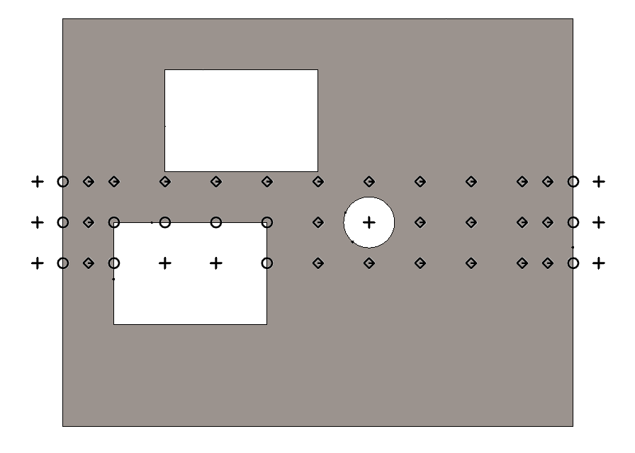 |

Unit Test

- source: imodeljs\core\geometry\src\test\topology\RegionOps.test.ts
- test name: "MixedInOut"
- output: imodeljs\core\geometry\src\test\output\RegionOps\MixedInOut.imjs

## RegionOps.regionBooleanXY

Compute union, intersection, and difference among area regions.

The call form is
`RegionOps.regionBooleanXY(regionA, regionB, opcode)`
where

- Each of regionA and regionB may be
  - a single Loop
  - a single ParityRegion
  - an array of Loop and ParityRegion
    - all the loops and parity regions within each array are considered as a union.
- The operation between regionA and regionB is one of
  - RegionBinaryOpType.Union
  - RegionBinaryOpType.Intersection
  - RegionBinaryOpType.AMinusB
  - RegionBinaryOpType.BMinusA

For a first example, each of regionA and regionB is a single Loop:

|  |  |
|---|---|
| filletedRectangle = CurveFactory.createRectangleXY(0, 0, 5, 4, 0, 1); | 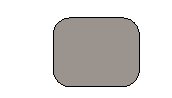 |
| splitter = CurveFactory.createRectangleXY(1, -1, 6, 2); |  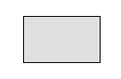 |
| Both regions, placed for operations |  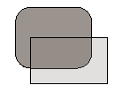 |
| union = RegionOps.regionBooleanXY(filletedRectangle, splitter, RegionBinaryOpType.Union); | 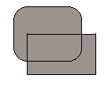|
| intersection = RegionOps.regionBooleanXY(filletedRectangle, splitter, RegionBinaryOpType.Intersection); |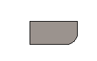|
| diff = RegionOps.regionBooleanXY(filletedRectangle, splitter, RegionBinaryOpType.AMinusB); |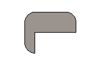|

For a second example, each of regionA and regionB is an array of regions to be treated as a union:

- region A is constructed by

    ```ts
    const manyRoundedRectangles = [];
    for (let a = 0; a < 5; a += 1) {
      manyRoundedRectangles.push(CurveFactory.createRectangleXY(a, a, a + 4, a + 1.75, 0, 0.5));
    }
    ```

    and region B by

    ```ts
      const splitterB0 = CurveFactory.createRectangleXY(0.5, 0.4, 6, 2.1, 0, 0);
      const splitterB1 = splitterB0.cloneTransformed(Transform.createFixedPointAndMatrix({ x: 1, y: 2, z: 0 }, Matrix3d.createRotationAroundAxisIndex(2, Angle.createDegrees(40)))) as Loop;
      const splitterB = [splitterB0, splitterB1];
    ```

|  |  |
|---|---|
| region A | 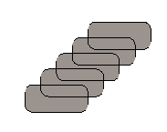 |
| region B | 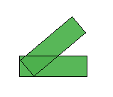 |
| Both regions, placed for operations |  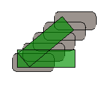 |
| unionB = RegionOps.regionBooleanXY(manyRoundedRectangles, splitterB, RegionBinaryOpType.Union); | 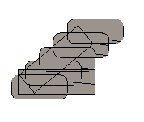|
| intersectionB = RegionOps.regionBooleanXY(manyRoundedRectangles, splitterB, RegionBinaryOpType.Intersection); |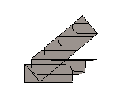|
| diffB = RegionOps.regionBooleanXY(manyRoundedRectangles, splitterB, RegionBinaryOpType.AMinusB); ||

Unit Test

- source: imodeljs\core\geometry\src\test\topology\RegionBoolean.test.ts
- test name: "DocDemo"
- output: imodeljs\core\geometry\src\test\output\sweepBooleans\DocDemo.imjs
