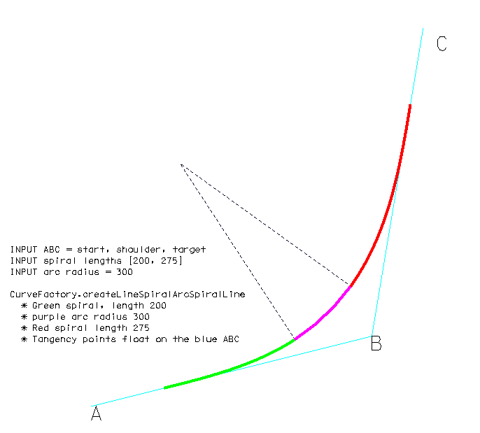
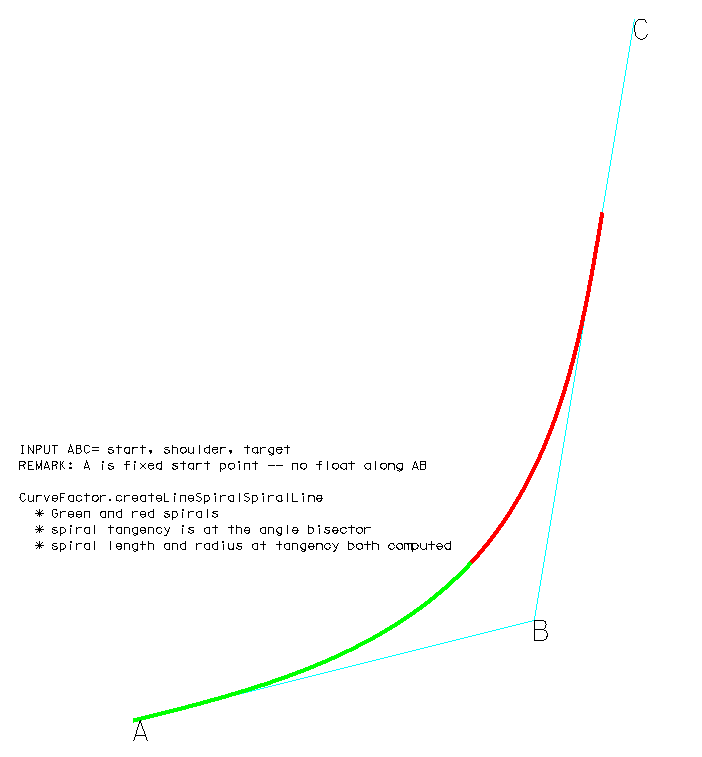
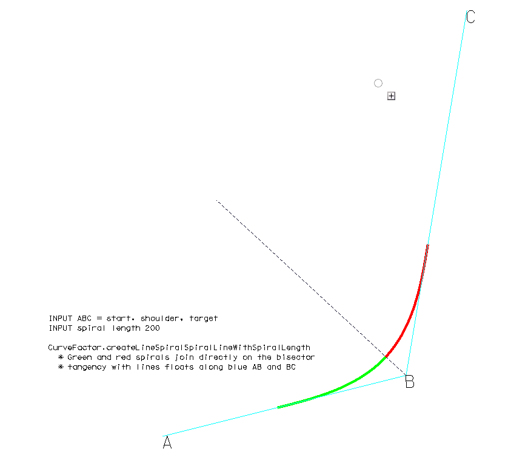

# Spiral Constructions (CurveFactory)

## Line-to-Line transition with 2 spirals

These methods take three points ABC and construct various combinations of geometry to transition from line AB to line BC.

- Method:(static) CurveFactory.createLineSpiralArcSpiralLine (A,B,C, lengthA, lengthC, radius)

- Method:(static) CurveFactory.createLineSpiralSpiralLine (A,B,C)

- Method:(static) CurveFactory.createLineSpiralSpiralLineWithSpiralLength (A,B,C, spiralLength)

