# Spirals

"Spirals" are a class of curve that are used to provide smooth transition from one turning radius to another.

| Description | Geometry |
|---|---|
| Blue line joints directly to green arc.   Curvature changes instantaneously from 0 to the arc radius | 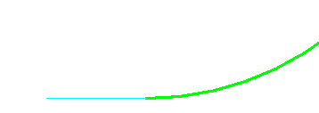 |
| With the red spiral added, ><r> curvature changes smoothly from 0 to the arc radius.  | 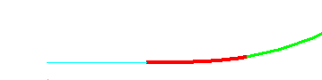 |
| components  |  |

The geometry of a spiral is more difficult than for lines, arcs, and ellipses.  There are a menagerie of spiral types with varying smoothness and equational complexity.

## "Integrated" spirals

The "best" spirals are those that controlled by controlling curvature -- _not xy position_ -- as a function of distance along the transition.   Getting from the curvature to position requires integrals.   The integrations are highly reliable to nearly full 16-digit machine precision.   These spiral types are objects of type `IntegratedSpiral3d`.

Aside from the smoothness, integrated spirals have the very special property that they are "parameterized" strictly by distance along the transition.  They are a true "arc length' parameterization.  This property is true for lines and circular arcs, but _not_ true for elliptic arcs and bsplines found elsewhere in typical CAD geometry.

Each type of `IntegratedSpiral3d` has a "snap function" (implemented by a `NormalizedTransition` object) describing how curvature transitions from 0 to 1.

The table below shows curvature transitions and derivatives for the various integrated spiral types.
The horizontal axis is "distance along the curve" and the y axis is "curvature".

- In the "curvature" column the incoming blue horizontal is the zero curvature of the incoming line in the two figures above. The outgoing green is the nonzero curvature of the outgoing arc.  The red is the spiral transition. We want the thick red curvature value to move smoothly from the lower level to the upper level.
- In the "derivative" column, the incoming and outgoing green lines are both at the _zero_  level.  The incoming line obviously has no changes in curvature happening.  The outgoing arc has changing _direction_ but is at constant curvature, so its _derivative_ of curvature is back down at the lower level.
- The zoom column shows a closeup of the derivative at the line-to-spiral transition.  (The step change clothoid is omitted -- it is clear in the derivative column.)
- The derivative plots reveal subtle differences that are extremely hard to see in the curvature plots themselves.

(Curvature gets a numeric value as 1 divided by the radius of turning.   Plotting radius itself is not helpful because it goes to infinity in straight sections.)

The "clothoid" spiral is the simplest of the transitions.   Along the length of the spiral, the curvature simply moves on a straight line from start to end curvature.  Within that linear part, this is a very smooth transition.  But at its ends, it _jumps_ suddenly from the low level to the high constant, and back down at the end.   This is not significant for auto paths, but becomes interesting for rail.  The clothoid hides the start and end of the transition one derivative down from the actual curvature.

A "biquadratic" spiral starts with a quadratic that has its minimum at the start, and rises to the midpoint.  At the midpoint, a second quadratic takes over to continue rising to be flat at the end.  The derivative a quadratic is linear; hence the straight line derivative of the first half transitions suddenly to a straight line downward.   So the biquadratic has curvature derivative changes at start, middle and end.

A "bloss" spiral is a single cubic function that is flat at both both ends of the interval.  Its derivative is smooth throughout but not flat at the ends.

A "cosine" spiral uses maps half of a cosine wave to the interval. Its smooth derivative is similar to the biquadratic.

All three of those -- biquadratic, bloss, and cosine -- achieve slope continuity at the start and end.  All three do have a jump in the next derivative at that point;  the biquadratic also has a sudden derivative change at its midpoint.

The "sine" spiral a full sine wave varying first below and then above the clothoid line, and achieves slope continuity _in the derivative plot_, hence has _second_ derivative at the start and end of the curvature transition.

Note that in the "zoomed derivative" column, there the biquadratic, bloss, and cosine cases all have sudden change in direction. The downward concavity of the bloss and cosine are only barely visible up close, and the 3 are visually almost indistinguishable from one another.  The sine form is visually different -- it has transitions smoothly from horizontal into the rise.

| Spiral type | Curvature | Derivative | Zoom on line-to-spiral |
|---|---|---|---|
| clothoid  | 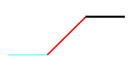 | 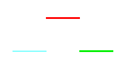 | |
| biquadratic  | 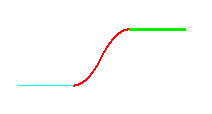 | 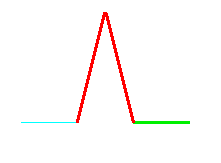 | 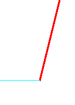
| bloss  | 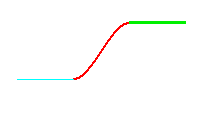 | 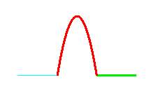 | 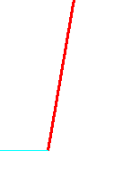 |
| cosine  | 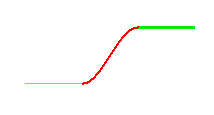 | 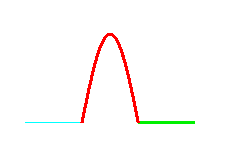 | 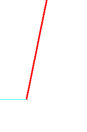 |
| sine  |  | 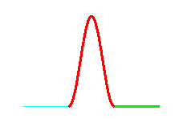 | 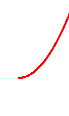 |

## "Direct" Spirals

A "Direct" spiral is one for which xy position can be computed "directly" in some equation, with no recourse to integrals of the snap functions above.   The good side of this is that the code complexity to _draw_ the curve is similar to that of that of a bspline curve or elliptic arc.    The bad side of this it that they only approximately match entry and exit radius conditions.
