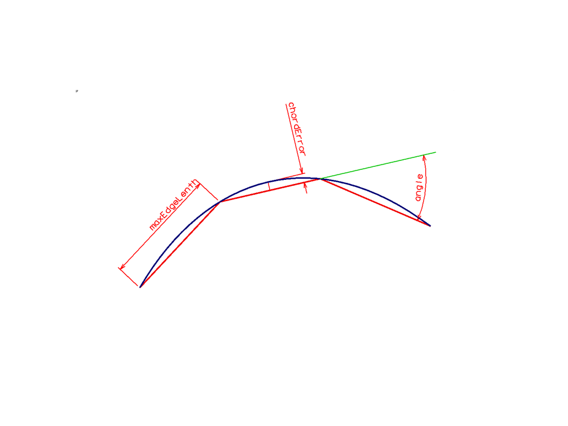

# StrokeOptions

A StrokeOptions structure carries various tolerances applied during (a) curve stroking and (b) surface faceting.

The three tolerances that are of most interest are:

- chordError is an distance measured from a curve or facet to its approximating stroke or facet.
- angle is the angle between two contiguous strokes or across a facet edge.
- maxEdgeLength is the length of a stroke or a edge of a facet.

It is rare for all three to be active at once.

 Facet tolerances are guidelines, not absolute rules.   Facet and stroke code may ignore tolerances in awkward situations.

- An angle tolerance is nearly always useful to ensure that circular geometry is recognizable.
  - For curves, 15 degrees is typical (24 strokes on a full circle)
  - For facets, 22.5 degrees is typical (16 facets around a full cylinder)
  - Halving the angle tolerance will (roughly) make curves get twice as many strokes, and surfaces get 4 times as many facets.
  - Angle tolerance creates predictable
  - The angle tolerance has the useful property that its effect is independent of the size of geometry.    If data is suddenly scaled into millimeters rather than meters, the stroke or facet counts will remain the same.
  - For extremely large radius curves, angle tolerance alone will produce large chord errors.
- A chordError tolerance forces large radius curves to have more strokes, hence look smoother.
- For graphics display, a typical combination is an angle tolerance of around 15 degrees and an chord tolerance which is the size of several pixels.
- Analysis meshes (e.g. Finite Elements) commonly need to apply maxEdgeLength to facets closer to squares and well formed triangles.
  - Using maxEdgeLength for graphics probably produces too many facets.   For example, it causes long cylinders to get many nearly-square facets instead of the small number of long quads usually used for graphics.
- If multiple tolerances are in effect, the actual count will usually be based on the one that demands the most strokes or facets, unless it is so high that it violates some upper limit on the number of facets on an arc or a section of a curve.
