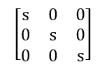
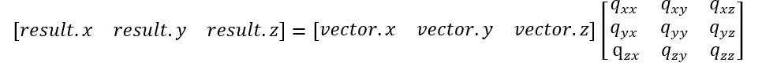
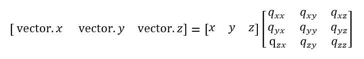
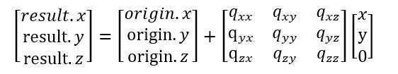

# Transform and Matrix3d operations

## Types

- A `Matrix3d` is a 3x3 matrix. It can be used for 3D rotation and scaling.
  - A matrix _alone_ acts on xyz data, but always leaves the origin in place.
  - A matrix must be bundled into a transform (which carries an additional origin/translation term) to cause scaling and rotation around a point other than the origin.
- A `Transform` is a 3x3 matrix with an additional point which is variously called "origin" or "translation".

## Notation

|  |  |
|---|---|
| Indexing for entries in 3x3 matrix | |
| Indexing for matrix, translation parts of transform ||
| Typical (column) vector names | `U,V,W` |
| Typical (row) vector names.  (`T` denotes transpose, which changes the named column to a row) | `UT, VT, WT` |
| Typical point names | `A,B,C`|

## Remarks on the entries in a Matrix3d

- Some common uses of Matrix3d are for:
  - Pure rotation: the matrix "picks something up" and spins it.   In the final position, there is not change of distance between any two points marked on the original geometry.
    - the relation of the 9 numbers in the matrix with  intuitive description of the rotation is tricky.
    - You cannot pull just a few numbers from the matrix and directly map them to what rotation happened.
  - Uniform scaling: the matrix expands or contracts everything uniformly about the origin.
    - This matrix structure is simple:  the scale factor appears on the diagonal.
     

## Constructor and full update methods

| category | Matrix3d | |Transform | |
|---|---|---|---|---|
| create identity | newMatrix = Matrix3d.createIdentity () | | newTransform = Transform.createIdentity () |
|  | matrix.setIdentity () | | transform.setIdentity () |
| all zero | newMatrix = Matrix3d.createZero () | | | |
| | matrix.setZero () | | | |
| create new with entries copied from another | newMatrix = other.clone () | | newTransform = other.clone () | |
| copy values from another existing | matrix.setFrom(other) | | transform.setFrom (other) | |
|
| create by direct list of numeric entries | newMatrix = Matrix3d.createRowValues (qxx, qxy, qxz, qyx, qyy, qyz, qzx, qxy, qzz) ||newMatrix = Transform.createRowValues (qxx, qxy, qxz, ax, qyx, qyy, qyz, ay, qzx, qxy, qzz, az) ||
| Create by rows | newMatrix = Matrix3d.createRows (U, V, W) || | |
| Create by columns | newMatrix = Matrix3d.createColumns (U, V, W) || newTransform = Transform.createOriginAndMatrixColumns(A,U,V,W)| |
| Create with columns ordered by an `AxisOrder` enumeration | newMatrix = Matrix3d.createColumnsInAxisOrder (axisOrder, U, V, W) |Sample `AxisOrder.ZXY` places U,V,W as | | |
| set columns | matrix.setColumns (U, V, W) || transform.setOriginAndMatrixColumns(A,U,V,W)| |
| | matrix.setColumn (columnIndex, U) || | |
| copy xyz parts from Point4d to columns.| matrix.setColumnsPoint4dXYZ (U,V,W) | |
| set row | matrix.setRow (rowIndex, U) || | |
| create by origin and matrix. | | | newTransform = Transform.createOriginAndMatrix (A, Q) |  |
| create by origin and fixed point. | | | newTransform = Transform.createFixedPointAndMatrix (A, Q) | |
| uniform scaling in all directions | newMatrix = Matrix3d.createUniformScale (s) | | Transform.createScaleAboutPoint (fixedPoint, s) | |
| scaling along a single direction | newMatrix = Matrix3d.createDirectionalScale (directionVector, scale) | | | |
| scaling with different factors along each of the 3 axes | newMatrix = Matrix3d.createScale (sx, sy, sz) | |  | |
| rotation around a principal axis |newMatrix = Matrix3d.createRotationAxis (axisIndex:AxisIndex, angle) | | | |
| 90 degree rotation around a principal axis |newMatrix = Matrix3d.create90DegreeRotationAroundAxis (axisIndex:AxisIndex) | | | |
| rotation around any vector | newMatrix = Matrix3d.createRotationAroundVector (axisVector, angle) | | | |
| most direct rotation that moves vectorA to vectorB | newMatrix = Matrix3d.createRotationVectorToVector (vectorA, vectorB) | | | |
| rotation that moves vectorA a fraction of the shortest rotation towards vectorB | newMatrix = Matrix3d.createPartialRotationVectorToVector (vectorA, fraction, vectorB) | | | |

# Simple Queries with matrix rows and columns

| category | Matrix3d |
|---|---|
| clone individual columns | vector = matrix.columnX () |
|                          | vector = matrix.columnY () |
|                          | vector = matrix.columnZ () |
| individual column magnitude | a : number = matrix.columnXMagnitude () |
|                          | a : number = matrix.columnYMagnitude () |
|                          | vector = matrix.columnXMagnitude () |
| individual column magnitude squared | a : number = matrix.columnXMagnitudeSquared () |
|                          | a : number = matrix.columnYMagnitudeSquared () |
|                          | a : number = matrix.columnXMagnitudeSquared () |
| dot a vector with a specific column | a : number = matrix.dotColumnX (vector) |
|                          | a : number = matrix.dotColumnY (vector) |
|                          | a : number = matrix.dotColumnZ (vector) |
| cross a vector with a specific column | vector = matrix.columnzZCrossVector(vector) |
| clone individual rows | vector = matrix.rowX () |
|                          | vector = matrix.rowY () |
|                          | vector = matrix.rowZ () |
| individual row magnitude | a : number = matrix.rowXMagnitude () |
|                          | a : number = matrix.rowYMagnitude () |
|                          | a : number = matrix.rowXMagnitude () |
| individual row magnitude squared | a : number = matrix.rowXMagnitudeSquared () |
|                          | a : number = matrix.rowYMagnitudeSquared () |
|                          | a : number = matrix.rowXMagnitudeSquared () |
| dot a vector with a specific row | a : number = matrix.dotRowX (vector) |
|                          | a : number = matrix.dotRowY (vector) |
|                          | a : number = matrix.dotRowZ (vector) |
| dot product within the matrix | a: number = matrix.columnXDotColumnY () |
| get row or column | vector = matrix.getColumn (columnIndex, result?) |
| | vector= matrix.getRow (columnIndex, result) |

# Rigid Matrix constructions

These methods return individual vectors with special perpendicular conditions related to the input vector and the global axes.  These constructions are central to constructing a rigid axis matrix that has a "heads up" sense.

| category | Matrix3d | |
|---|---|---|
| return vector perpendicular to input.  If input is _not_ near z, the returned vector is in the xy plane | newVector = RotMatrix.createPerpendicularVectorFavorXYPlane (zVector) |
| return a vector which is (a) perpendicular to the input and (b) close to the z axis. | newVector = RotMatrix.createHeadsUpPerpendicularNearZ (zVector) |

# Complex queries

| query | Input requirements | Method | |
|---|---|---|---|
| extract axis of rotation | Rigit axis matrix | rigidMatrix->getAxisAndAngleOfRotation () : {axis: Vector3d, angle: Angle, ok: boolean} | |

# Multiplying points and vectors

| method | remarks |
|---|---|
| matrix.mutliplyVector(vector, result)?:Vector3d |
| matrix.multiplyVectorArrayInPlace (dta: XYZ[]) |
| Matrix3d.XYZMinusMatrixTimesXYZ (origin: XYZ, matrix, vector: XYZ) : Point3d|  |
| Matrix3d.XYZPlusMatrixTimesXYZ (origin: XYZ, matrix, vector: XYZ) : Point3d|  |
| Matrix3d.XYZPlusMatrixTimesCoordinates (origin: XYZ, matrix, x,y,z) : Point3d |  |
| Matrix3d.XYPlusMatrixTimesXY (origin: XAndY, matrix, vector: XAndyY): Point2d | |
|Matrix3d.XYZPlusMatrixTimesWeightedCoordinates (origin: XAndY, matrix, x,y,z,w): Point4d | |
|matrix.multiplyTransposeVector (vector): Vector3d | |
|matrix.multiplyTransposeXYZ (vector): Vector3d | |
|matrix.multiplyTransposeVectorInPlace (vector): Vector3d | |
|matrix.multiplyXYZ (x,y,z): Vector3d | |
|matrix.multiplyVectorInPlace (vector): Vector3d | |
| multiplyXYZtoXYZ (xyz, result) || (required output, caller can force type to Point3d)|
|matrix.multiplyXY (x,y): Vector3d | |
|matrix.originPlusMatrixTimesXY (x,y): Vector3d | |
