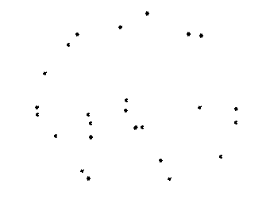
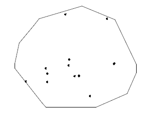
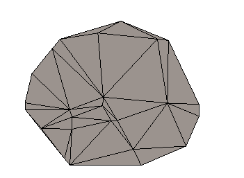
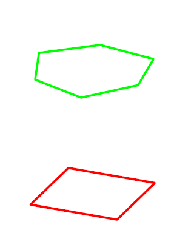
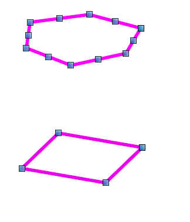
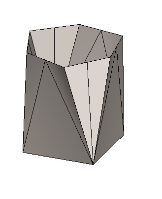
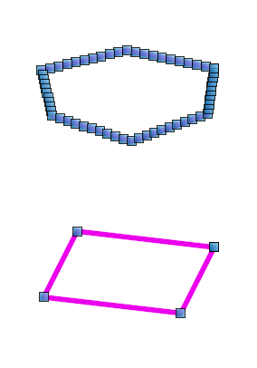
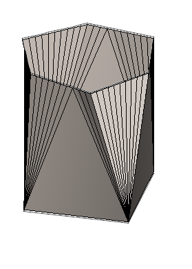

# Examples of Triangulation

## Delauney triangulation of many points in xy plane

|  |  |
|---|---|
| 25 points |  |
| compute convex hull of `points: Point3d[]` | `const hull: Point3d[] = [];`  `const interior: Point3d[] = [];`  `Point3dArray.computeConvexHullXY(points, hull, interior, true);` |
| |  |
| One step `points: Point3d[]` to Polyface | `const polyface = PolyfaceBuilder.pointsToTriangulatedPolyface(points);`|
| IndexedPolyface with all the points triangulated. |  |

Unit Test

- source: core\geometry\src\test\topology\InsertAndRetriangulateContext.test.ts
- test name: "TriangulateInHull"
- output: core\geometry\src\test\output\InsertAndRetriangulateContext\TriangulateInHull.imjs

## Triangulate points "between linestrings"

|  |  |
|---|---|
| 4 and 6 sided polygons |  |
| Same polygons displayed with ` `handles to indicate the two linestrings have edge subdivision mismatch ` ` in addition to the different cornering angles |  |
| triangles constructed "between" the polygons |  |
| Same polygons, another mix of points along edges |  |
| triangles constructed "between" the polygons |  |

Unit Test

- source: core\geometry\src\test\Polyface\GreedyTriangulationBetweenLineStrings.test.ts
- test set: `describe("GreedyTriangulationBetweenLineStrings"`
- test name: `quadStar`
- output: core\geometry\src\test\output\GreedyTriangulationBetweenLineStrings\quadStar.imjs
