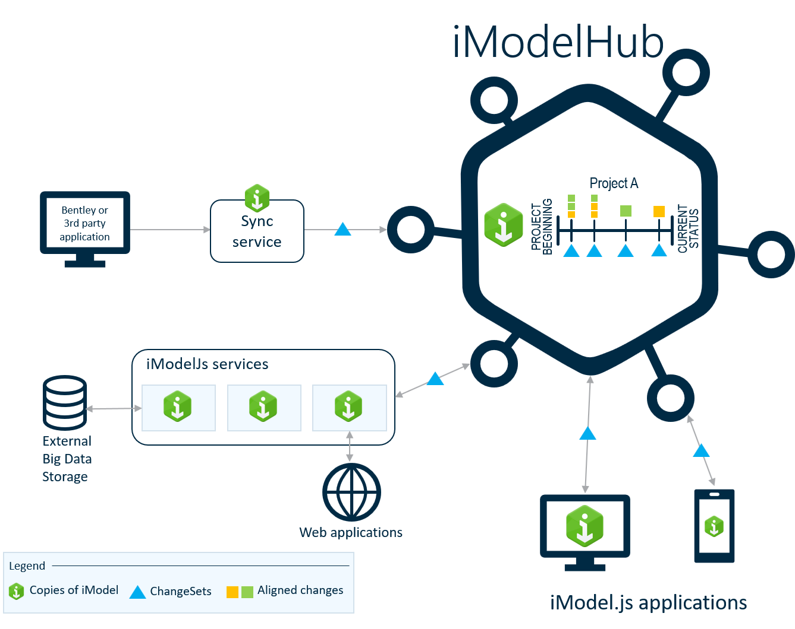

# iModelHub - The Backbone for iTwin.js Applications

iModelHub is the control center for iModels. It is responsible for coordinating concurrent access to [iModels](./iModels/index.md) as well as changes made to them in a form of [ChangeSets](../Glossary.md#changeset).

Like [Git](https://git-scm.com/) repositories for source code, in the iModel ecosystem copies of iModels are distributed widely in [Briefcases](../Glossary.md#briefcase). In fact, iModelHub's primary purpose is *not* to hold or process copies of iModels (it does so only to facilitate Briefcase checkout). Rather, iModelHub's main role is to maintain the sequence of [ChangeSets](../Glossary.md#changeset) that forms an iModel's [Timeline](#the-timeline-of-changes-to-an-imodel). Like an accounting system does for financial transactions, iModelHub holds a ledger of all changes to an iModel.

iModelHub accepts ChangeSets from iTwin.js [backends](../backend/index.md) through a process called [*push*](../Glossary.md#push), and sends them to other validated users when requested through a process called [*pull*](../Glossary.md#pull). iTwin.js applications determine when and how to push and pull changes.

> See [Working with iModelHub](./WorkingWith.md) for a list of related learning topics.

## The Connection between iTwin.js and iModelHub

1. Every iModel has an [identity](../iModels#every-imodel-has-a-guid) registered in iModelHub.
2. Users [authenticate](../common/AccessToken.md) with iModelHub.
3. iTwin.js backends have an identity, registered with iModelHub.
4. iModel owners decide, which users and which applications have [access](./Permissions.md) to their iModels.

When an iTwin.js backend opens an iModel, it first verifies with iModelHub that the iModel's owner has granted the right for the specified user and application to access the briefcase. In this manner owners can maintain control over who-does-what with their iModels.

> See [Accessing iModels](../backend/AccessingIModels.md) for further details.

## Creating a new iModel in iModelHub

When an iModel is first created, it is uploaded to iModelHub, assigned a Guid, associated with an iTwin, and its timeline is initialized. iModelHub provides tools to configure access to the iModel by users and applications. As new users and agents connect to iModelHub to access the iModel, they are each assigned briefcases with a unique Id.

> See [Working with iModels](./iModels/index.md).

## The Timeline of Changes to an iModel

iModelHub holds an immutable ledger of all changes to an iModel. Similar to an accounting system for financial data, the ledger can provide a reliable record of what-happened-when and by whom. Since the ledger is reliable, immutable and append-only (i.e. it is not possible to *revise history*), it forms a timeline that can be referenced externally as an authoritative record of the state-of-the-iModel as of a given point in time. In this manner, iModelHub provides the means to *sign the timeline* rather than create external (and potentially forgeable) snapshots for archival or reference.

### Pushing and Pulling ChangeSets

A local [Briefcase](../Glossary.md#briefcase) holds the state of an iModel as of a given point in time, plus changes made locally, if any. To receive changes made by others, users *synchronize* their Briefcase from iModelHub. Any ChangeSets [pushed](../Glossary.md#push) to iModelHub by other users are [pulled](../Glossary.md#pull) and [merged](../Glossary.md#merge) into the local Briefcase.

To permanently save your changes, you push them in the form of a ChangeSet to iModelHub. You must always synchronize your Briefcase with iModelHub before you can upload changes. iModelHub enforces that ChangeSets it accepts must always be *based on* (i.e. synchronized with) the most recent ChangeSet. This is what establishes the linear timeline of changes.

> See [Working with Briefcase and ChangeSets](./Briefcases.md).

### Named Versions

Every ChangeSet on the timeline creates a *new version* of the iModel. However, some points on the timeline can represent important milestones or significant events to be saved (e.g. for a design review). iModelHub provides a way to mark a point on the timeline with a name. These time points are referred to as **Named Versions**. Since a specific action must be taken to create them, they are treated specially by iModelHub with caching to make them faster to access.

> See [Using Named Versions](./Versions.md).

## Locks and Codes

iModels are meant to be distributed widely in the form of Briefcases, and each Briefcase may be edited independently. However, certain actions among the distributed Briefcases are best coordinated to avoid conflicting changes. iModelHub provides services for acquiring Locks and [Codes](../Glossary.md#code) for this purpose.

> See [Working with locks and codes](../backend/ConcurrencyControl).

## iModelHub Events

Applications can register listeners for events from iModelHub. Events report on certain operations being performed on that iModel. It is possible therefore to create Agents that react to every ChangeSet, performing validation, tracking, synchronization with external systems, etc. Since each Agent works on a local Briefcase synchronized with ChangeSets, they can be deployed independently and the system is vastly scalable.

> See [Working with events](./Events).
