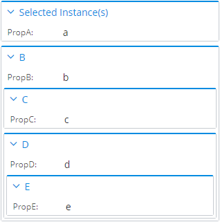
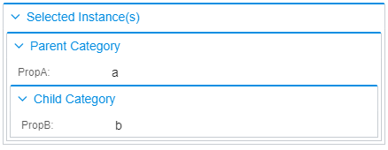

# Property Categorization

When creating content, properties are assigned categories that are shown together in a property grid:


There are multiple sources for a property's category and several ways to override them or control their nesting through presentation rules.

## Direct Property Categories

A property may or may not have a category and there are several sources it may be taken from (by priority):

1. A [property override specification](./PropertySpecification.md) with [property category overrides](./PropertyCategorySpecification.md).
2. An ECPropertyCategory assigned to the ECProperty in ECSchema.
3. If a property is related with a *SameInstance* relationship, and that related class contains the property.

If a property has no direct category, it is displayed as if it belonged to the parent category. See the [next section](#category-nesting) for more details on category nesting.

## Category Nesting

Categories group properties so they're easier for users to find and manage. However, it's often necessary to group already categorized properties into some other group, for example 'favorites'. This is where nested categorization comes into play.

Generally, since a property grid requests properties for the current selection, we put all properties into the default *Selected Item(s)* category:


The default category can be overriden using [DefaultPropertyCategoryOverride rule](./DefaultPropertyCategoryOverride.md).

If properties have [direct categories of their own](#direct-property-categories), their categories appear nested under this top-level category, e.g.:


Additionally, when presentation rules specify [related properties](./RelatedPropertiesSpecification.md), it is possible to create new top-level categories. See the [Controlling Category Nesting of Related Properties](#controlling-category-nesting-of-related-properties) for more details.

Finally, category nesting can be achieved using [property category overrides](./PropertyCategorySpecification.md) - see the [Controlling Category Nesting Through Property Category Overrides section](#controlling-category-nesting-through-property-category-overrides) for more details.

### Controlling Category Nesting of Related Properties

[RelatedPropertiesSpecification](./RelatedPropertiesSpecification.md) has an attribute `relationshipMeaning` which tells whether the related properties should be displayed as if they belong to the selected instance or a separate (related) instance. In the latter case, a new nested property category group is created based on the related class. Example:

**ECSchema:**

```xml
<ECEntityClass typeName="A">
  <ECProperty propertyName="PropA" typeName="string" />
</ECEntityClass>
<ECEntityClass typeName="B">
  <ECProperty propertyName="PropB" typeName="string" />
</ECEntityClass>
<ECEntityClass typeName="C">
  <ECProperty propertyName="PropC" typeName="string" />
</ECEntityClass>
<ECRelationshipClass typeName="A_To_B" strength="referencing" strengthDirection="forward">
  <Source multiplicity="(0..1)" roleLabel="A to B" polymorphic="True">
    <Class class="A" />
  </Source>
  <Target multiplicity="(0..1)" roleLabel="B from A" polymorphic="True">
    <Class class="B" />
  </Target>
</ECRelationshipClass>
<ECRelationshipClass typeName="A_To_C" strength="referencing" strengthDirection="forward">
  <Source multiplicity="(0..1)" roleLabel="A to C" polymorphic="True">
    <Class class="A" />
  </Source>
  <Target multiplicity="(0..1)" roleLabel="C from A" polymorphic="True">
    <Class class="C" />
  </Target>
</ECRelationshipClass>
```

[ContentModifier](./ContentModifier.md) used in **Presentation Rules** for ECClass `A`:

```json
{
  "ruleType": "ContentModifier",
  "class": { "schemaName": "MySchema", "className": "A" },
  "propertyCategories": [{
    "id": "my_custom_category",
    "label": "My Custom Category"
  }],
  "relatedProperties": [{
    "propertiesSource": {
      "relationship": {"schemaName": "MySchema", "className": "A_To_B"},
      "direction": "Forward"
    },
    "relationshipMeaning": "SameInstance",
    "properties": [{
      "name": "PropB",
      "categoryId": "my_custom_category"
    }]
  }, {
    "propertiesSource": {
      "relationship": {"schemaName": "MySchema", "className": "A_To_C"},
      "direction": "Forward"
    },
    "relationshipMeaning": "RelatedInstance",
    "properties": [{
      "name": "PropC",
      "categoryId": "my_custom_category"
    }]
  }]
}
```

**Result:**


In the above example both `PropB` and `PropC` have a custom property category assigned through presentation rules and they're both specified as related properties for class `A`. Because `PropB` is set to be related with a `SameInstance` relationship, it will be shown as nested under the other properties of class `A`. `PropC`, on the other hand, is nested under another top-level category created from class `C`, because it's related with a `RelatedInstance` relationship.

Here is a more complex example with *nested* related properties:

**ECSchema:**

```xml
<ECEntityClass typeName="A">
  <ECProperty propertyName="PropA" typeName="string" />
</ECEntityClass>
<ECEntityClass typeName="B">
  <ECProperty propertyName="PropB" typeName="string" />
</ECEntityClass>
<ECEntityClass typeName="C">
  <ECProperty propertyName="PropC" typeName="string" />
</ECEntityClass>
<ECEntityClass typeName="D">
  <ECProperty propertyName="PropD" typeName="string" />
</ECEntityClass>
<ECEntityClass typeName="E">
  <ECProperty propertyName="PropE" typeName="string" />
</ECEntityClass>
<ECRelationshipClass typeName="A_To_B" strength="referencing" strengthDirection="forward">
  <Source multiplicity="(0..1)" roleLabel="A to B" polymorphic="True">
    <Class class="A" />
  </Source>
  <Target multiplicity="(0..1)" roleLabel="B from A" polymorphic="True">
    <Class class="B" />
  </Target>
</ECRelationshipClass>
<ECRelationshipClass typeName="B_To_C" strength="referencing" strengthDirection="forward">
  <Source multiplicity="(0..1)" roleLabel="B to C" polymorphic="True">
    <Class class="B" />
  </Source>
  <Target multiplicity="(0..1)" roleLabel="C from B" polymorphic="True">
    <Class class="C" />
  </Target>
</ECRelationshipClass>
<ECRelationshipClass typeName="B_To_D" strength="referencing" strengthDirection="forward">
  <Source multiplicity="(0..1)" roleLabel="B to D" polymorphic="True">
    <Class class="B" />
  </Source>
  <Target multiplicity="(0..1)" roleLabel="D from B" polymorphic="True">
    <Class class="D" />
  </Target>
</ECRelationshipClass>
<ECRelationshipClass typeName="D_To_E" strength="referencing" strengthDirection="forward">
  <Source multiplicity="(0..1)" roleLabel="D to E" polymorphic="True">
    <Class class="D" />
  </Source>
  <Target multiplicity="(0..1)" roleLabel="E from D" polymorphic="True">
    <Class class="E" />
  </Target>
</ECRelationshipClass>
```

[ContentModifier](./ContentModifier.md) used in **Presentation Rules** for ECClass `A`:

```json
{
  "ruleType": "ContentModifier",
  "class": { "schemaName": "MySchema", "className": "A" },
  "relatedProperties": [{
    "propertiesSource": {
      "relationship": {"schemaName": "MySchema", "className": "A_To_B"},
      "direction": "Forward"
    },
    "relationshipMeaning": "RelatedInstance",
    "nestedRelatedProperties": [{
      "propertiesSource": {
        "relationship": {"schemaName": "MySchema", "className": "B_To_C"},
        "direction": "Forward"
      },
      "relationshipMeaning": "RelatedInstance"
    }, {
      "propertiesSource": {
        "relationship": {"schemaName": "MySchema", "className": "B_To_D"},
        "direction": "Forward"
      },
      "relationshipMeaning": "RelatedInstance",
      "nestedRelatedProperties": [{
        "propertiesSource": {
          "relationship": {"schemaName": "MySchema", "className": "D_To_E"},
          "direction": "Forward"
        },
        "relationshipMeaning": "RelatedInstance"
      }]
    }]
  }]
}
```

**Result:**



### Controlling Category Nesting Through Property Category Overrides

[PropertyCategorySpecification](./PropertyCategorySpecification.md) has an attribute `parentId` which can point to another custom category to become nested inside it:

**ECSchema:**

```xml
<ECEntityClass typeName="A">
  <ECProperty propertyName="PropA" typeName="string" />
  <ECProperty propertyName="PropB" typeName="string" />
</ECEntityClass>
```

[ContentModifier](./ContentModifier.md) used in **Presentation Rules** for ECClass `A`:

```json
{
  "ruleType": "ContentModifier",
  "class": { "schemaName": "MySchema", "className": "A" },
  "propertyCategories": [{
    "id": "parent_category",
    "label": "Parent Category"
  }, {
    "id": "child_category",
    "parentId": "parent_category",
    "label": "Child Category"
  }],
  "propertyOverrides": [{
    "name": "PropA",
    "categoryId": "parent_category"
  }, {
    "name": "PropB",
    "categoryId": "child_category"
  }]
}
```

**Result:**


