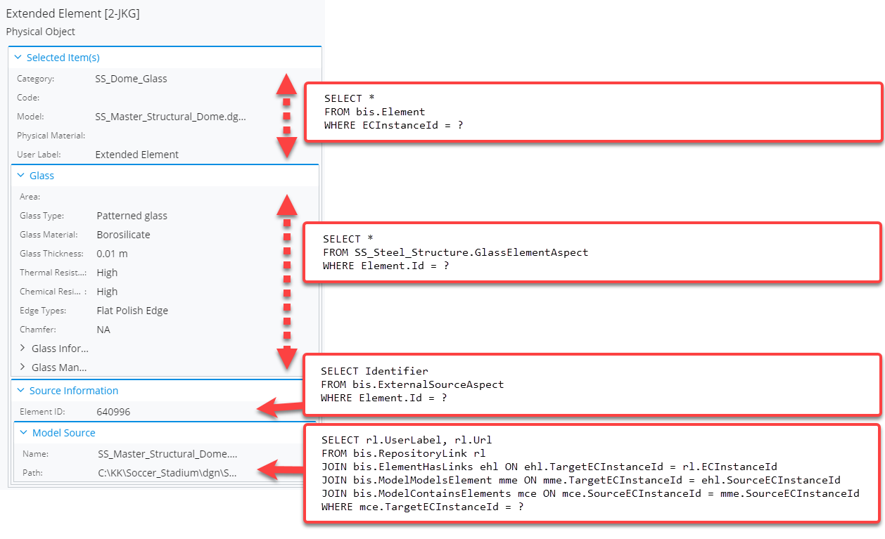
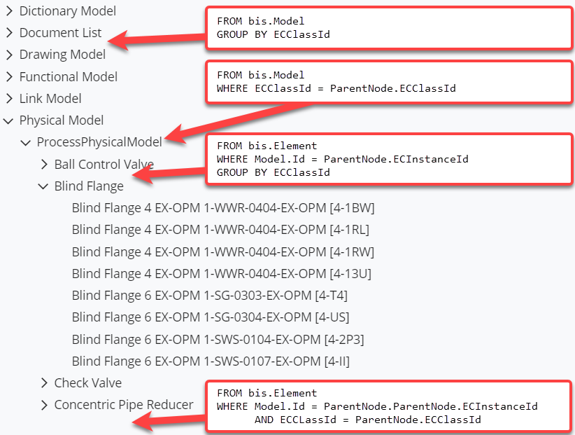
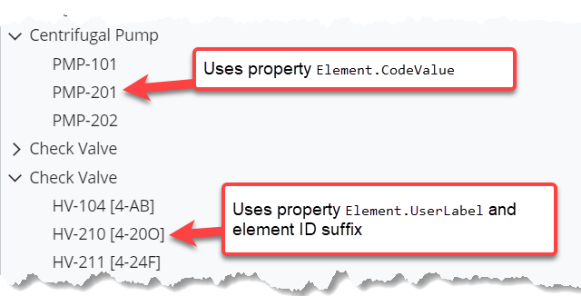
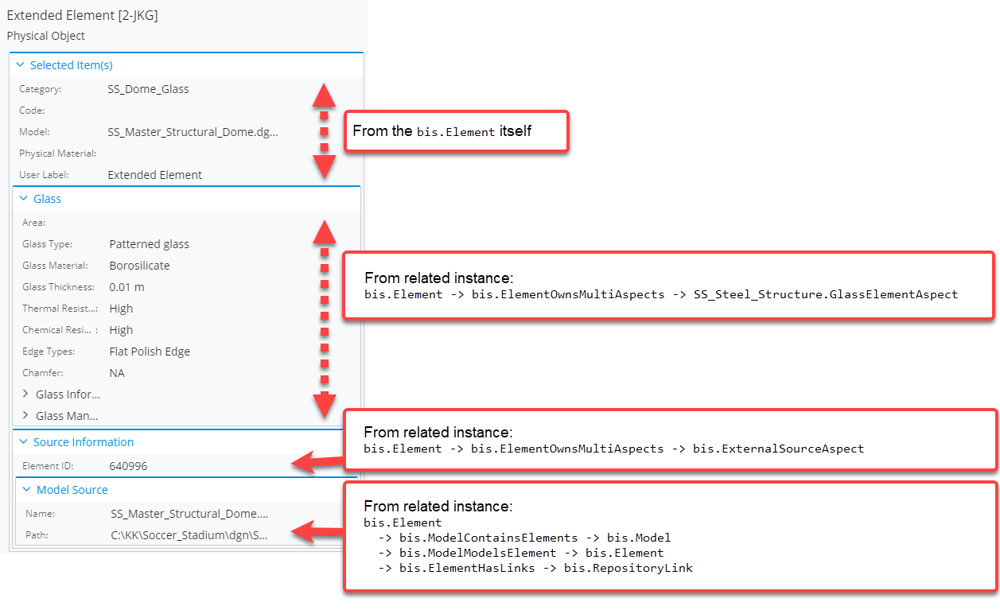
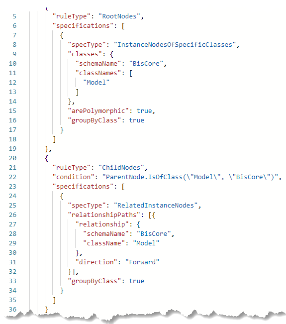

# Motivation of the Presentation Library

## The Problems

As explained in the [ECSQL](../../ECSQL.md) overview page, data from iModels can be queried using the language just like querying from any relational database using SQL. That's often the most straightforward way to get raw data from the iModels.

> Try it yourself:
>
> <iframe class="embedded-console" src="/console/?imodel=Metrostation%20Sample&query=SELECT%20UserLabel,Category,StructuralQuantities__x002F____x0040__AreaSurfaceNetModeled,StructuralQuantities__x002F____x0040__Length%20FROM%20BuildingDataGroup:Concrete__x0020__Pile%20WHERE%20ECInstanceId=0x20000028e6b"></iframe>

However, raw data is not something that should be presented to end users - it needs to be formatted according to user's preferences (language, locale, units, etc.) before feeding it to UI components. The below image shows content for an element whose properties were selected in the above query - notice how the values get formatted before loading them into the component:

In addition, because the data in iModels is normalized, the pieces of data need to be "glued" together before displaying. It's not trivial to determine what needs to be selected from where and what relationships to use - the person writing queries must be familiar not only with the [BIS](../../../bis/index.md) schema, but also [domains](../../../bis/intro/schemas-domains.md) that are used in the iModel. And they need to be updated as those domains evolve... Here's an example that demonstrates this:

Lastly, having a constantly evolving domains' layer that needs to used as basis for all ECSQL queries makes creating hierarchies an even more difficult task than it already is. Each type of parent node needs to have a unique ECSQL query to load its children and each of the queries need to involve relationships, target classes, navigation properties, handle polymorphism, grouping, sorting, paging and everything else. That is all doable, but wouldn't it be great if it was doable in declarative way by defining rules for the hierarchy in JSON and [**only a few lines of code**](https://www.itwinjs.org/sample-showcase/?group=UI+Trees&sample=presetation-tree-sample&imodel=Metrostation+Sample)?

## The Solution

All the issues defined in previous topic are solved by the Presentation Library. It's built on top of ECSQL to help developers easily get data from iModels in a format that's ready to be displayed to end users.

- The library handles formatting according to domain settings and given request parameters. The same values may be retrieved in different unit systems - metric or imperial.

  

- The library takes care of dynamically computing element labels according to rules defined by domain developers - people who know best how the labels should be determined. And provides a way to override them if necessary.

  

- When creating content for a given element, the library dynamically determines its related elements and additionally loads their content. The rules on what gets loaded are defined by domain developers, but may be overriden, customized and extended based on the needs of application.

  

- The library allows creating hierarchies in a declarative way by defining what the root nodes should be and what the children should be for each type of node. All the complexity of writing ECSQL queries is taken away.

  

All customizations to what is returned are made in a declarative way - by specifying [Presentation Rules](#presentation-rules). This is an abstraction layer that helps us not only simplify how relationships, classes and polymorphism are handled, but also provides a way for [customization](../Customization/index.md).
