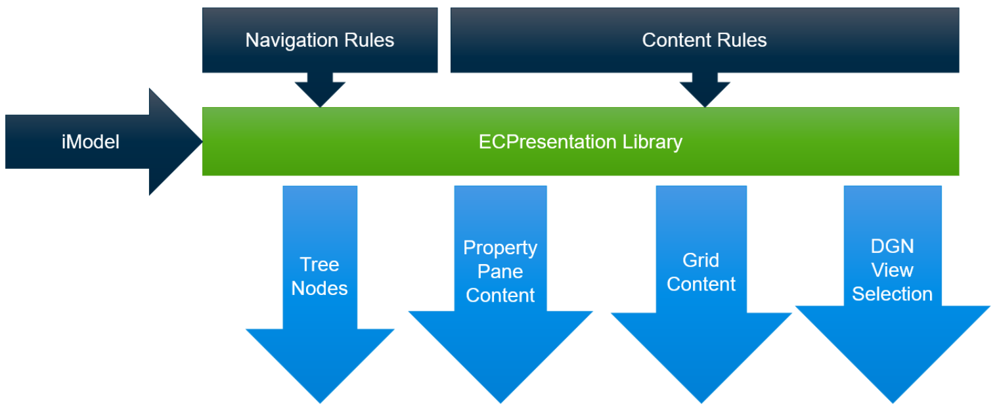

# iTwin.js Presentation Library

## Purpose

iTwin.js Presentation library helps retrieve presentation data from iModels and
takes care of unified selection. What data to retrieve from an iModel is
defined by consumers in a declarative way, using presentation rules - that's
why the library is commonly called "presentation rules engine".

[Getting started with iTwin.js Presentation](./Setup.md)

## Library Contents

- Content
  - [Rules](./Content/index.md)
  - [Property Categorization](./Content/PropertyCategorization.md)
  - [ECExpressions](./Content/ECExpressions.md)
  - [Terminology](./Content/Terminology.md)
- Hierarchies
  - [Rules](./Hierarchies/index.md)
  - [ECExpressions](./Hierarchies/ECExpressions.md)
  - [Terminology](./Hierarchies/Terminology.md)
- Customization
  - [Rules](./Customization/index.md)
  - [ECExpressions](./Customization/ECExpressions.md)
  - [Property value renderers](./Customization/PropertyValueRenderers.md)
  - [Property category renderers](./Customization/PropertyCategoryRenderers.md)
- [Default BIS Presentation Rules](./DefaultBisRules.md)
- [Unified Selection](./Unified-Selection/index.md)
- [ECExpressions](./ECExpressions.md)
- [Localization](./Localization.md)
- [Ruleset Variables](./RulesetVariables.md)
- [Ruleset Supplementation](./RulesetSupplementation.md)
- [Performance Tips](./Performance.md)
- [Testing](./Testing.md)
