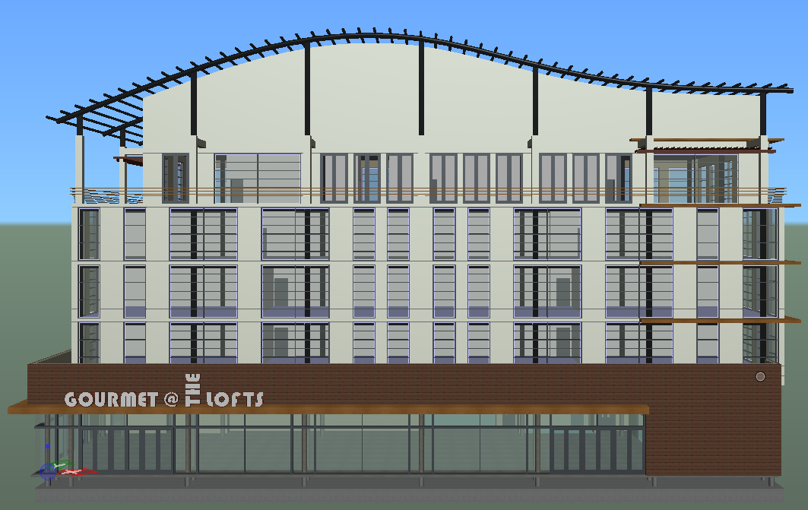
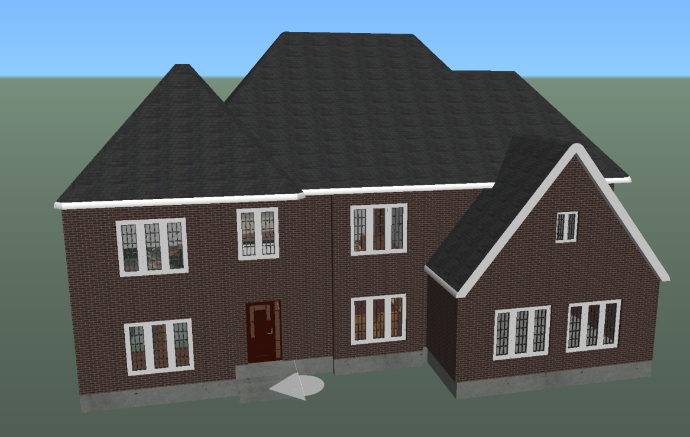

# Create a test iModel from a Bentley provided sample

The quickest way to get access to an iTwin Platform hosted iModel is by creating an iModel seeded with Bentley provided sample data.

- Go to "[My iTwins - Create iTwin](https://developer.bentley.com/my-itwins/new/)"
- Give your Test iTwin a name
- The Test iTwin will be created and will contain no iModels
- Select the "New" button to create a new iModel
- Give your iModel a name
- Select "Bentley Sample" in the "Create iModel from" section
- Select a template from the dropdown
- Click Save

### Metrostation Sample

A metrostation located in Philadelphia. Contains platform, rails, and subway cars.

### Stadium

Soccer stadium in Singapore. Features landscape details and a metro station. This is the largest sample iModel.

### Retail Building Sample

Cafe and apartments.

### Bay Town Process Plant

Simple processing plant. This is the smallest sample iModel.

### House Sample

Features several 2D drawings and sheets.

