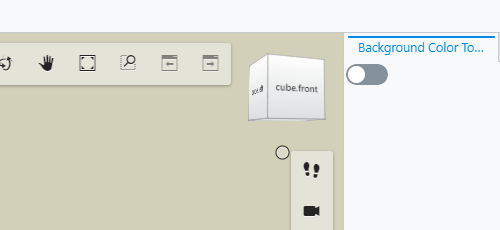
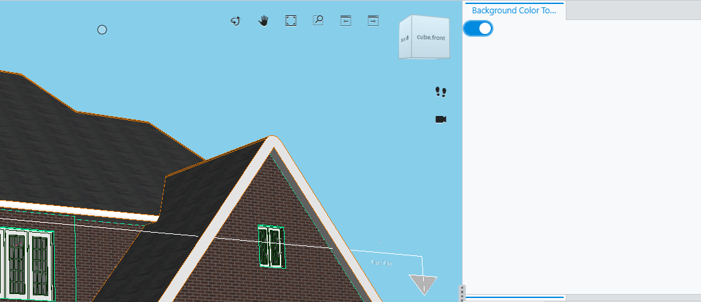
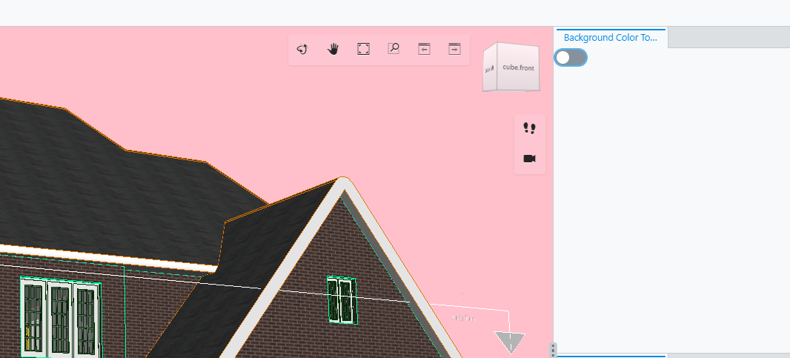

# iTwin Viewer - "Hello World"

## Customizing the iTwin Viewer - "The Basics"

### Prerequisites

This tutorial assumes that you already have:

- Your own local source for the iTwin Web Viewer based on the template @bentley/itwin-viewer
- Configured your local source to open the "House Model" sample iModel.
  - Instructions to use this sample iModel can be found [here](https://www.itwinjs.org/learning/tutorials/create-test-imodel-sample/).

### Goal

This tutorial will take you through the first steps of customizing your iTwin Web Viewer.  First you will learn how to add a new user interface component.  Later you will customize that component to change the background color of your viewer.

### Hello World

The iTwin Web Viewer viewer template generates several files. To start with, let's take a look at the ```App.tsx``` file.  This is where you should start in customizing your iTwin Viewer.

To start with ```App.tsx``` contains a single react functional component fittingly called ```App```.  The ```App``` component is responsible for:

1. Authenticating the user
2. Rendering the ```Viewer``` component

At the bottom of ```App.tsx``` you can see the ```return``` statement where the ```Viewer``` component is configured.  Let's focus on that for the now:

``` typescript
  return (
    <div className="viewer-container">
      <Header
        handleLogin={onLoginClick}
        loggedIn={isAuthorized}
        handleLogout={onLogoutClick}
      />
      {isLoggingIn ? (
        <span>"Logging in...."</span>
      ) : (
        isAuthorized && (
          <Viewer
            contextId={process.env.IMJS_CONTEXT_ID ?? ""}
            iModelId={process.env.IMJS_IMODEL_ID ?? ""}
            authConfig={{ oidcClient: AuthorizationClient.oidcClient }}
          />
        )
      )}
    </div>
  );
```

```App``` is just a react component. Like any react component, it returns JSX to tell react how to create HTML for the browser to render.  Let's start off by adding some custom code to our JSX.  We can render a "Hello World" ```span```  above the viewer by simply creating the element above the component. Note that this needs to be surrounded in a ```div```  per the single parent rule for react:

``` HTML
    <div style={{height: "100%"}}>
      <span>"Hello World"</span>
      <Viewer
        contextId={process.env.IMJS_CONTEXT_ID ?? ""}
        iModelId={process.env.IMJS_IMODEL_ID ?? ""}
        authConfig={{ oidcClient: AuthorizationClient.oidcClient }}
      />
    </div>
```

Result:


### Your first UI Widget

So far, we haven't done anything to change the way the viewer works.  We've only just added a new ```span``` element *above* the viewer. To add our "Hello World" ```span``` into the viewer, we need to pass the ```uiProvider``` prop to the ```Viewer```  component, like this:

``` HTML
      <Viewer
        contextId={process.env.IMJS_CONTEXT_ID ?? ""}
        iModelId={process.env.IMJS_IMODEL_ID ?? ""}
        authConfig={{ oidcClient: AuthorizationClient.oidcClient }}
        uiProvider={[new HelloWorldUiProvider()]}
      />
  );
```

The ```uiProvider``` prop is typed to require an object that implements the [UIItemsProvider](https://www.itwinjs.org/reference/ui-abstract/uiitemsprovider/uiitemsprovider/) interface.  Passing in this object will allow us to extend the ```Viewer``` with custom UI components. To do that, we need to define our ```HelloWorldUiProvider``` class so that it implements the ```UiItemsProvider``` interface.  Our new provider will tell the ```Viewer``` to include our "Hello world" ```span``` within the view.

Create a new file called ```HelloWorldUiProvider.tsx``` with the following contents:

``` typescript
import { AbstractWidgetProps, StagePanelLocation, StagePanelSection, UiItemsProvider } from "@bentley/ui-abstract";

import * as React from "react";

export class HelloWorldUiProvider implements UiItemsProvider {
  public readonly id = "HelloWorldProvider";

  public provideWidgets(stageId: string, stageUsage: string, location: StagePanelLocation, section?: StagePanelSection) : ReadonlyArray<AbstractWidgetProps> {
    const widgets: AbstractWidgetProps[] = [];

    if (location === StagePanelLocation.Right) {
      const helloWidget: AbstractWidgetProps = {
        id: "HelloWidget",
        label: "Hello",
        getWidgetContent() {
          return <span>"Hello World"</span>;
        }
      }

      widgets.push(helloWidget);
    }

    return widgets;
  }
}
```

Let's review that code.  We've defined our new ```HelloWorldUiProvider``` class.  In the new class we've defined ``` public readonly id ``` which is required to distinguish between different providers.  Then notice that we've defined just one function called ``` provideWidgets ```.  This function will be called several times as the ```Viewer``` is building up the user interface.  We will return an empty array except for when the ```location``` is equal to ```StagePanelLocation.Right```.  In that case, we will return a single widget that will supply our "Hello World" ```span```.

Our ```helloWidget``` consists of three attributes:

1. ``` id ``` - used to uniquely identify the widget
2. ``` label ``` - description label for our widget
3. ``` getWidgetContent() ``` - returns our custom UI component

At this point we need to import ```HelloWorldUiProvider``` at the top of file ```App.tsx```:

``` Typescript
import { HelloWorldUiProvider } from "./HelloWorldUiProvider";
```

Finally, let's clean up the ```span``` and ```div``` that we added directly into the App component earlier.  Now the ``` return ``` statement in ```App.tsx``` should look like this:

``` typescript
  return (
    <div className="viewer-container">
      <Header
        handleLogin={onLoginClick}
        loggedIn={isAuthorized}
        handleLogout={onLogoutClick}
      />
      {isLoggingIn ? (
        <span>"Logging in...."</span>
      ) : (
        isAuthorized && (
          <Viewer
            contextId={process.env.IMJS_CONTEXT_ID ?? ""}
            iModelId={process.env.IMJS_IMODEL_ID ?? ""}
            authConfig={{ oidcClient: AuthorizationClient.oidcClient }}
            uiProviders={[new HelloWorldUiProvider()]}
          />
        )
      )}
    </div>
  );
```

Now we have our "Hello World" ```span``` displaying in a panel within the ```Viewer``` component.  It should look like this:


### Beyond Hello World

Saying hello to the world can be fun but we need to get past that.  For this next step we'll swap out our trivial ```helloWidget``` with something a little more interactive: a [Toggle](https://www.itwinjs.org/reference/ui-core/toggle/toggle/).  Eventually this toggle will control the background color, so we'll name our new widget ```backgroundColorWidget```.  Instead of returning a ```span``` we'll return a ```Toggle```.  The new widget should look like this:

``` typescript
    if (location === StagePanelLocation.Right) {
      const backgroundColorWidget: AbstractWidgetProps = {
        id: "BackgroundColorWidget",
        label: "Background Color Toggle",
        getWidgetContent() {
          return <Toggle></Toggle>
        }
      }

      widgets.push(backgroundColorWidget);
    }
```

Result:



### Changing the background color

```Toggle``` has prop ```onChange``` where we can catch the "on" and "off" state. If the toggle is on, we'll override the background color to "skyblue". If we toggle it again to off, we'll change the background color to "pink":

``` typescript
          return <Toggle onChange={(toggle) => {
            if (toggle) {
              IModelApp.viewManager.selectedView!.overrideDisplayStyle({backgroundColor: ColorDef.computeTbgrFromString("skyblue")})
            } else {
              IModelApp.viewManager.selectedView!.overrideDisplayStyle({backgroundColor: ColorDef.computeTbgrFromString("pink")})
            }
          }}></Toggle>
```

We can get change the background color using function [overrideDisplayStyle()](https://www.itwinjs.org/reference/imodeljs-frontend/views/viewport/overridedisplaystyle/) through global singleton [IModelApp](https://www.itwinjs.org/reference/imodeljs-frontend/imodelapp/imodelapp/) in property [viewManager](https://www.itwinjs.org/reference/imodeljs-frontend/views/viewmanager/).

Our completed ```HelloWorldUiProvider.tsx``` file should look similar to this:

``` typescript
import { ColorDef } from "@bentley/imodeljs-common";
import { IModelApp } from "@bentley/imodeljs-frontend";
import { AbstractWidgetProps, StagePanelLocation, StagePanelSection, UiItemsProvider } from "@bentley/ui-abstract";
import { Toggle } from "@bentley/ui-core";

import * as React from "react";

export class HelloWorldUiProvider implements UiItemsProvider {
  public readonly id = "HelloWorldProvider";

  public provideWidgets(stageId: string, stageUsage: string, location: StagePanelLocation, section?: StagePanelSection) : ReadonlyArray<AbstractWidgetProps> {
    const widgets: AbstractWidgetProps[] = [];

    if (location === StagePanelLocation.Right) {
      const backgroundColorWidget: AbstractWidgetProps = {
        id: "BackgroundColorWidget",
        label: "Background Color Toggle",
        getWidgetContent() {
          return <Toggle onChange={(toggle) => {
            if (toggle) {
              IModelApp.viewManager.selectedView!.overrideDisplayStyle({backgroundColor: ColorDef.computeTbgrFromString("skyblue")})
            } else {
              IModelApp.viewManager.selectedView!.overrideDisplayStyle({backgroundColor: ColorDef.computeTbgrFromString("pink")})
            }
          }}></Toggle>
        }
      }

      widgets.push(backgroundColorWidget);
    }

    return widgets;
  }
}
```

Result when the button is toggled on:



Result when the button is toggled off:



This is one of infinitely many possible widgets we can create in the iTwin Viewer. Feel free to explore sample widgets on our [sample showcase](https://www.itwinjs.org/sample-showcase/).

In the next tutorial, we will take widgets from the sample showcase and use them in our iTwin Viewer.

## Useful Links

- [UI Provider](https://www.itwinjs.org/reference/ui-abstract/uiitemsprovider/uiitemsprovider/)
- [iTwin Sample Showcase](https://www.itwinjs.org/sample-showcase/)

## Next Steps

- [Using the Sample Showcase](https://www.itwinjs.org/sample-showcase/)
