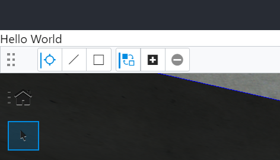
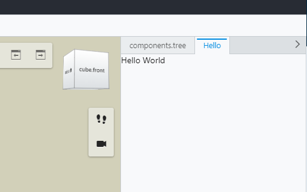
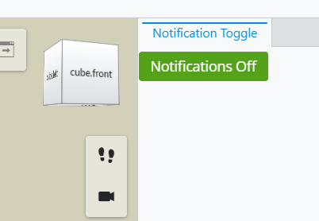
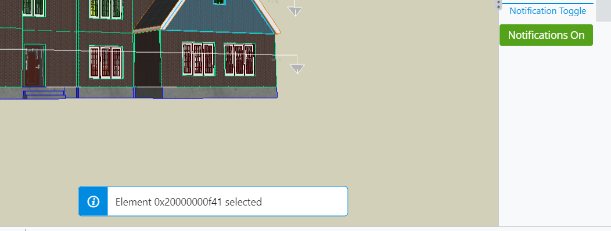

# iTwin Viewer - "Hello World"

## Customizing the iTwin Viewer - "The Basics"

### Prerequisites

This tutorial assumes that you already have:

- Your own local source for the iTwin Web Viewer based on the template @bentley/itwin-viewer
- Configured your local source to open the "NEEDSWORK" sample iModel.

### Goal

This tutorial will take you through the first steps of customizing your iTwin Web Viewer.  First you will learn how to add a new user interface component.  Later you will customize that component to listen for user actions and display the id of the element the user has selected.

### Hello World

On creation, the iTwin Viewer generates several files. The ```App.tsx``` file should be the start in customizing our iTwin Viewer.

```App.tsx``` has two responsibilities on initialization:

1. Authentication
2. Render ``` Viewer ```  Component

The ``` Viewer ``` component will contain most of our modifications. ```Viewer``` is returned in the ``` return ```  function at the bottom of file ```App.tsx```:

``` typescript
  return (
    <div className="viewer-container">
      <Header
        handleLogin={onLoginClick}
        loggedIn={isAuthorized}
        handleLogout={onLogoutClick}
      />
      {isLoggingIn ? (
        <span>"Logging in...."</span>
      ) : (
        isAuthorized && (
          <Viewer
            contextId={process.env.IMJS_CONTEXT_ID ?? ""}
            iModelId={process.env.IMJS_IMODEL_ID ?? ""}
            authConfig={{ oidcClient: AuthorizationClient.oidcClient }}
          />
        )
      )}
    </div>
  );
```

``` App ```  is just a react component. Like any react component, we can start adding HTML elements in the ``` render ```  function.
We can render a "Hello World" ``` span ```  above the viewer by simply creating the element above the component. Note that this needs to be surrounded in a ``` div ```  per the single parent rule for react:

``` HTML
    <div style={{height: "100%"}}>
      <span>"Hello World!"</span>
      <Viewer
        contextId={process.env.IMJS_CONTEXT_ID ?? ""}
        iModelId={process.env.IMJS_IMODEL_ID ?? ""}
        authConfig={{ oidcClient: AuthorizationClient.oidcClient }}
      />
    </div>
```

Result:



### Your first UI Widget

We're not influencing any elements inside the viewer yet. We've just added a ``` span ```  above the viewer. To add our "Hello World" ``` span ``` into the viewer, we need to pass ``` uiProvider ``` as a prop to the ``` Viewer ```  component to let it register our "Hello World" element.

``` HTML
      <Viewer
        contextId={process.env.IMJS_CONTEXT_ID ?? ""}
        iModelId={process.env.IMJS_IMODEL_ID ?? ""}
        authConfig={{ oidcClient: AuthorizationClient.oidcClient }}
        uiProvider={[new HelloWorldUiProvider()]}
      />
  );
```

A [UI Provider](https://www.itwinjs.org/reference/ui-abstract/uiitemsprovider/uiitemsprovider/) is an interface we can implement that extends the ```Viewer``` with custom UI components. To add a component that contains our "Hello World" string, we need to define our ```HelloWorldUiProvider``` class and implement the ```UiItemsProvider``` interface.

Create a new file called ```HelloWorldUiProvider.tsx``` with the following contents:

``` typescript
import { AbstractWidgetProps, StagePanelLocation, StagePanelSection, UiItemsProvider } from "@bentley/ui-abstract";

export class HelloWorldUiProvider implements UiItemsProvider {
  public readonly id = "HelloWorldProvider";

  public provideWidgets(stageId: string, stageUsage: string, location: StagePanelLocation, section?: StagePanelSection) : ReadonlyArray<AbstractWidgetProps> {
    const widgets: AbstractWidgetProps[] = [];

    if (location === StagePanelLocation.Right) {
      const helloWidget: AbstractWidgetProps = {
        id: "HelloWidget",
        label: "Hello",
        getWidgetContent() {
          return "Hello World";
        }
      }

      widgets.push(helloWidget);
    }

    return widgets;
  }
}
```

The only function defined in the provider is ``` provideWidgets ``` that returns a single widget containing string "Hello World" at ``` StagePanelLocation.Right ```. All providers require ``` public readonly id ``` to distinguish between different providers.

Three attributes are passed into the ```helloWidget```:

1. ``` id ``` - used to uniquely identify the widget
2. ``` label ``` - description label for our widget
3. ``` getWidgetContent() ``` - our custom UI component

The component is sufficient for our "Hello World" widget for now. We need to import ```HelloWorldUiProvider``` at the top of file ```App.tsx```:

``` Typescript
import { HelloWorldUiProvider } from "./HelloWorldUiProvider";
```

We'll also remove our old ```span``` and ```div```, so our final code for the ``` return ``` function in ```App.tsx``` should look similar to:

``` typescript
  return (
    <div className="viewer-container">
      <Header
        handleLogin={onLoginClick}
        loggedIn={isAuthorized}
        handleLogout={onLogoutClick}
      />
      {isLoggingIn ? (
        <span>"Logging in...."</span>
      ) : (
        isAuthorized && (
          <Viewer
            contextId={process.env.IMJS_CONTEXT_ID ?? ""}
            iModelId={process.env.IMJS_IMODEL_ID ?? ""}
            authConfig={{ oidcClient: AuthorizationClient.oidcClient }}
            uiProviders={[new HelloWorldUiProvider()]}
          />
        )
      )}
    </div>
  );
```

Result:



### Improving your widget

Instead of a "Hello World" string in our ```getWidgetContent()```, we can return react components in our widget to improve functionality. We will use component [Button](https://www.itwinjs.org/reference/ui-core/button/) in place of our "Hello World" string to toggle notifications:

``` typescript
    if (location === StagePanelLocation.Right) {
      const notificationsWidget: AbstractWidgetProps = {
        id: "NotificationWidget",
        label: "Notification Toggle",
        getWidgetContent() {
          return <Button id="NotificationsToggle">Notifications Off</Button>
        }
      }

      widgets.push(notificationsWidget);
    }
```

Result:



To track our toggle state, create a ```static toggle``` variable to class HelloWorldUiProvider:

``` typescript
export class HelloWorldUiProvider implements UiItemsProvider {
  public readonly id = "HelloWorldProvider";
  static toggle: boolean = false;
  ...
```

We need to bind an onClick event to our Button and call ```toggleNotifications``` to toggle our variable:

``` typescript
        getWidgetContent() {
          return <Button id="NotificationsToggle" onClick={toggleNotifications}>Notifications Off</Button>
        }
```

Define ```toggleNotifications``` under the ```provideWidgets``` function to toggle the static variable and swap the innerText of button id ```NotificationsToggle```

``` typescript
    public provideWidgets(...) {
    ...

    const toggleNotifications = () => {
      HelloWorldUiProvider.toggle = !HelloWorldUiProvider.toggle;
      if (HelloWorldUiProvider.toggle) {
        document.getElementById("NotificationsToggle")!.innerText = "Notifications On"
      } else {
        document.getElementById("NotificationsToggle")!.innerText = "Notifications Off"
      }
    }

    ...
    }
```

### Listening for user activity

The button message will swap to "Notifications On" on click now. Along with changing the innerText of our button, we will add a listener to notify the selected element ID on element selection by using the [Presentation](https://www.itwinjs.org/reference/presentation-frontend/core/presentation) class:

``` typescript
    const toggleNotifications = () => {
      HelloWorldUiProvider.toggle = !HelloWorldUiProvider.toggle;
      if (HelloWorldUiProvider.toggle) {
        Presentation.selection.selectionChange.addListener(onSelectionChanged);
        document.getElementById("NotificationsToggle")!.innerText = "Notifications On"
      } else {
        Presentation.selection.selectionChange.removeListener(onSelectionChanged);
        document.getElementById("NotificationsToggle")!.innerText = "Notifications Off"
      }
    }

```

Define ```onSelectionChanged``` listener above ```toggleNotifications``` as:

``` typescript
    const onSelectionChanged = async (evt: SelectionChangeEventArgs, selectionProvider: ISelectionProvider) => {
      const selection = selectionProvider.getSelection(evt.imodel, evt.level);
      const keys = new KeySet(selection);

      keys.forEach((key) => {
        if (Key.isInstanceKey(key))
          IModelApp.notifications.outputMessage(new NotifyMessageDetails(OutputMessagePriority.Info, "Element " + key.id + " selected"));
      })
    };
```

The [ISelectionProvider](https://www.itwinjs.org/reference/presentation-frontend/unifiedselection/iselectionprovider/) is in charge of tracing selections in the viewer.

We use class [IModelApp](https://www.itwinjs.org/reference/imodeljs-frontend/imodelapp/imodelapp/)'s built-in static function [outputMessage()](https://www.itwinjs.org/reference/imodeljs-frontend/imodelapp/imodelapp/) to display a toast message of the selected element ID.

Our completed ```HelloWorldUiProvider.tsx``` file should look similar to this:

``` typescript
import { IModelApp, NotifyMessageDetails, OutputMessagePriority } from "@bentley/imodeljs-frontend";
import { Key, KeySet } from "@bentley/presentation-common";
import { ISelectionProvider, Presentation, SelectionChangeEventArgs } from "@bentley/presentation-frontend";
import { AbstractWidgetProps, StagePanelLocation, StagePanelSection, UiItemsProvider } from "@bentley/ui-abstract";
import { Button } from "@bentley/ui-core";

import * as React from "react";

export class HelloWorldUiProvider implements UiItemsProvider {
  public readonly id = "HelloWorldProvider";
  static toggle: boolean = false;

  public provideWidgets(stageId: string, stageUsage: string, location: StagePanelLocation, section?: StagePanelSection) : ReadonlyArray<AbstractWidgetProps> {
    const widgets: AbstractWidgetProps[] = [];

    // This method is called when the user selects an element
    const onSelectionChanged = async (evt: SelectionChangeEventArgs, selectionProvider: ISelectionProvider) => {
      const selection = selectionProvider.getSelection(evt.imodel, evt.level);
      const keys = new KeySet(selection);

      keys.forEach((key) => {
        if (Key.isInstanceKey(key))
          IModelApp.notifications.outputMessage(new NotifyMessageDetails(OutputMessagePriority.Info, "Element " + key.id + " selected"));
      })
    };

    const toggleNotifications = () => {
      HelloWorldUiProvider.toggle = !HelloWorldUiProvider.toggle;
      if (HelloWorldUiProvider.toggle) {
        Presentation.selection.selectionChange.addListener(onSelectionChanged);
        document.getElementById("NotificationsToggle")!.innerText = "Notifications On"
      } else {
        Presentation.selection.selectionChange.removeListener(onSelectionChanged);
        document.getElementById("NotificationsToggle")!.innerText = "Notifications Off"
      }
    }

    if (location === StagePanelLocation.Right) {
      const notificationsWidget: AbstractWidgetProps = {
        id: "NotificationWidget",
        label: "Notification Toggle",
        getWidgetContent() {
          return <Button id="NotificationsToggle" onClick={toggleNotifications}>Notifications Off</Button>
        }
      }

      widgets.push(notificationsWidget);
    }

    return widgets;
  }
}
```

Result when notification is toggled and selecting an element:



This is one of infinitely many possible widgets we can create in the iTwin Viewer. Feel free to explore sample widgets on our [sample showcase](https://www.itwinjs.org/sample-showcase/).

In the next tutorial, we will take widgets from the sample showcase and use them in our iTwin Viewer.

## Useful Links

- [UI Provider](https://www.itwinjs.org/reference/ui-abstract/uiitemsprovider/uiitemsprovider/)
- [ISelectionProvider](https://www.itwinjs.org/reference/presentation-frontend/unifiedselection/iselectionprovider/)
- [outputMessage()](https://www.itwinjs.org/reference/imodeljs-frontend/imodelapp/imodelapp/)
- [iTwin Sample Showcase](https://www.itwinjs.org/sample-showcase/)

## Next Steps

- [Using the Sample Showcase](https://www.itwinjs.org/sample-showcase/)
