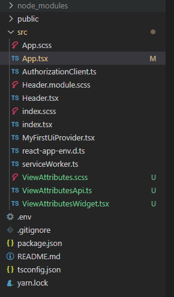

# Adding showcase widgets to your iTwin Viewer

### Prerequisites

This tutorial assumes that you already have:

- Explored the [sample showcase](https://www.itwinjs.org/sample-showcase).
- Your own local source for the iTwin Web Viewer based on the template @bentley/itwin-viewer
- Configured your local source to open the "House Model" sample iModel.
  - Instructions to use this sample iModel can be found [here](https://www.itwinjs.org/learning/tutorials/create-test-imodel-sample/).
- Understand the concept of a [UI Provider](https://www.itwinjs.org/learning/ui/abstract/uiitemsprovider) and adding [widgets](https://www.itwinjs.org/reference/ui-abstract/uiitemsprovider/uiitemsprovider/#providewidgets).

### Goal

This tutorial will take widgets from the sample showcase and add them into your iTwin Viewer using the ```uiProvider``` prop.

### Understanding the Sample Showcase

We hope you have given the [sample showcase](https://www.itwinjs.org/sample-showcase) a tour and enjoyed the many samples we provide. You may want to use some of these samples in your own iTwin Viewer, and to do so you'll first need to understand how the showcase works.

If we take a closer look at the files involved in each sample, you'll notice they all follow the same pattern containing at a minimum 4 files:

1. ```[SampleName]App.tsx``` - Corresponds to ```App.tsx``` in the itwin viewer template and provides the main ```Viewer``` component.
2. ```[SampleName]Widget.tsx``` - Defines the ```UiItemsProvider``` that will be passed into prop ```uiProviders``` for our sample widget component. This widget is the controller for our samples.
3. ```[SampleName]Api.ts``` - Defines widget functionality that uses the itwin.js API being showcased.
4. ```[SampleName].scss``` - Defines the styles in our css classes used inside the widget.

Given this pattern, it's simple to identify the parts required to bring our sample showcase to your iTwin Viewer. The component revolves around the ```[SampleName]Widget.tsx``` file so we need to copy all the files associated with our custom widget's ```UiItemsProvider``` and pass it in the ```Viewer``` component.

### Example using a sample

For this tutorial, we'll be taking the widget from sample [View Attributes](https://www.itwinjs.org/sample-showcase/?group=Viewer&sample=view-attributes-sample&imodel=House+Sample) and adding it into our iTwin Viewer.

Starting with our entry file ```ViewAttributesApp.tsx```, the ```Viewer``` component is defined as follows:

``` HTML
        <Viewer
          contextId={sampleIModelInfo.contextId}
          iModelId={sampleIModelInfo.iModelId}
          authConfig={{ oidcClient: AuthorizationClient.oidcClient }}
          viewportOptions={viewportOptions}
          onIModelConnected={_oniModelReady}
          defaultUiConfig={default3DSandboxUi}
          theme="dark"
          uiProviders={uiProviders}
        />
```

Prop ```uiProviders``` is passed in an array that contains the ```ViewAttributesWidgetProvider```, imported and defined at the top of the file:

``` typescript
import { ViewAttributesWidgetProvider } from "./ViewAttributesWidget";
...
const uiProviders = [new ViewAttributesWidgetProvider()];
```

To sum it up, these three lines are the only lines you'll need to add in your iTwin Viewer in ```App.tsx```:

``` typescript
... // Import the widget provider
import { ViewAttributesWidgetProvider } from "./ViewAttributesWidget";
... // Construct the widget provider
const uiProviders = [new ViewAttributesWidgetProvider()];
... // Passed into the viewer component
      uiProviders={uiProviders}
```

We now have made all the necessary coding modifications to our iTwin Viewer. We'll just need to copy the remaining three files to bring our widget over.

- ```ViewAttributesApi.ts```
- ```ViewAttributesWidget.tsx```
- ```ViewAttributes.scss```

For this tutorial, these files will be placed directly in our src directory so your file structure should look similar to this:



Unless you're also using the ```dark``` theme in your ```Viewer``` like the sample showcase, we'll also need to modify css class ```.sample-options``` to use color ```black``` instead of ```white``` in file ```ViewAttributes.scss```:

``` css
.sample-options {
  color: black;
  padding: 8px;
}

```

Running our iTwin Viewer now, you'll notice the exact same widget from the sample showcase in your iTwin Viewer that is also fully functional:


Feel free to customize these widgets to your liking.

## Useful Links

- [UI Provider](https://www.itwinjs.org/reference/ui-abstract/uiitemsprovider/uiitemsprovider/)
- [View Attributes Sample](https://www.itwinjs.org/sample-showcase/?group=Viewer&sample=view-attributes-sample&imodel=House+Sample)

## Next Steps

- [Using the Sample Showcase](https://www.itwinjs.org/sample-showcase/)
