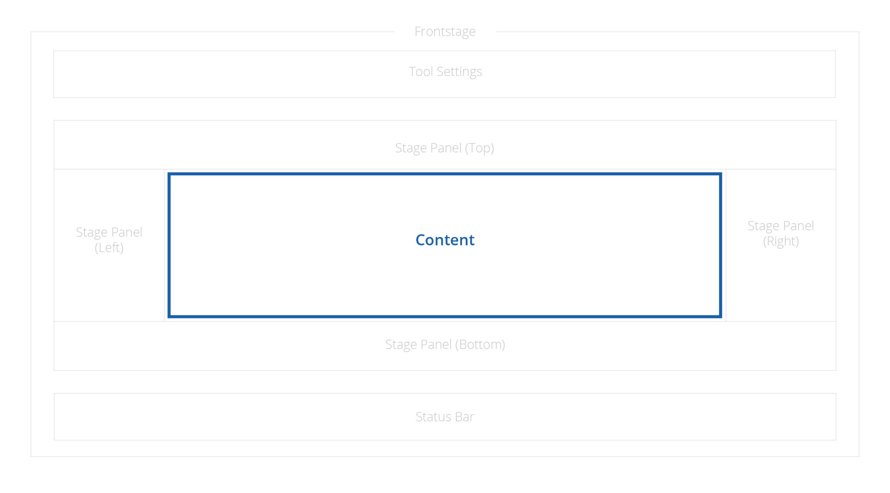
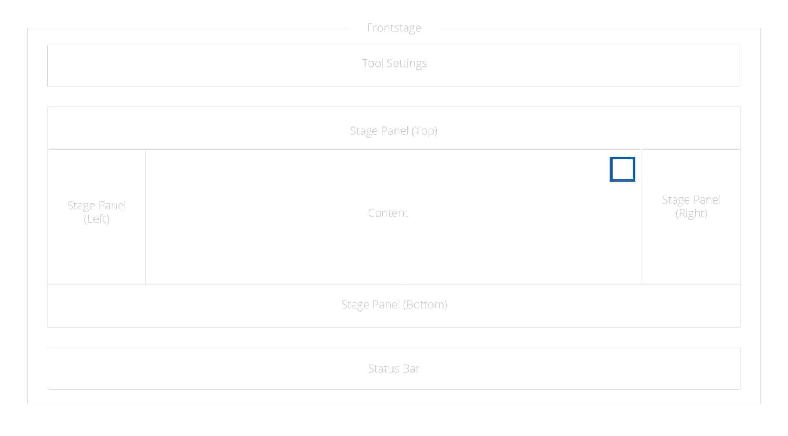
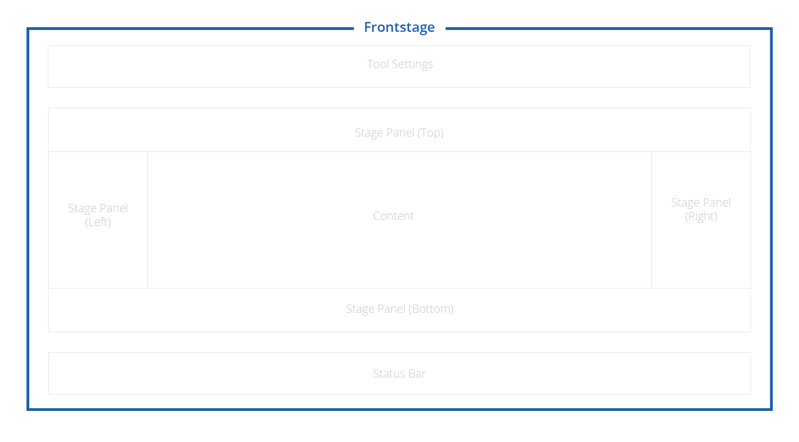
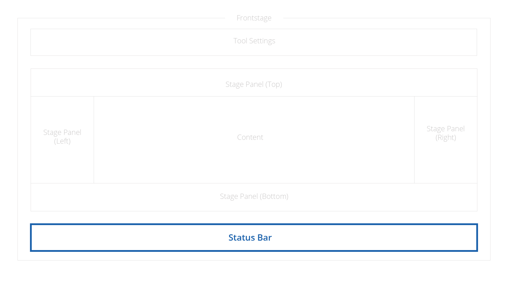
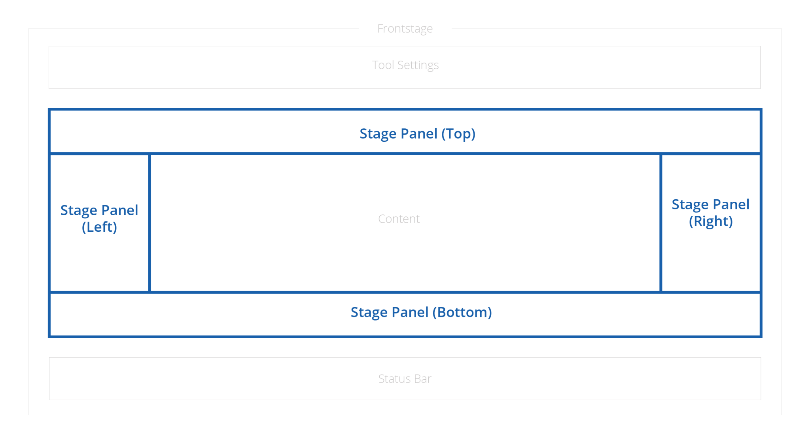
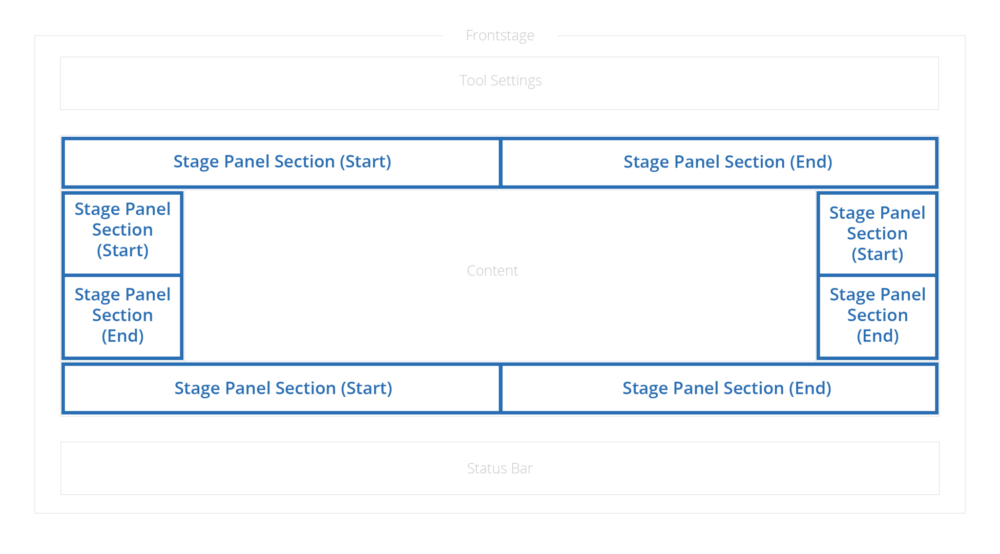
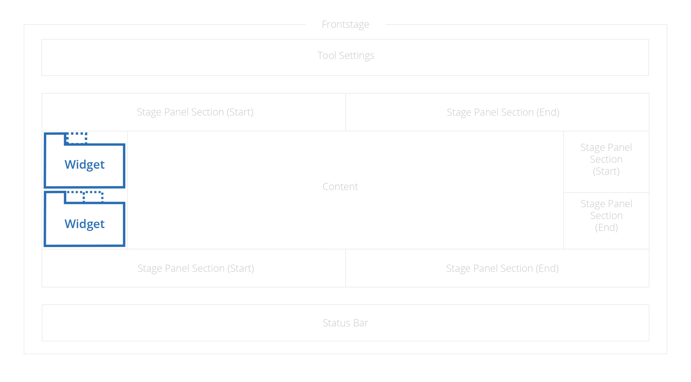

# Glossary of terms in iTwin.js UI

<<<<<<< HEAD
## Backstage

The main navigation menu of the application used to switch between frontstages, open overlays, or launch custom commands. You can use [BackstageComposer]($appui-react) to set up a backstage that displays an overlay menu along the left edge of the application.

## Content

The main area of the application display. Typically, the content is a visual rendering of the iModel but it can be any React component. The content can use multiple areas organized in grid to display more than one aspect of the content at the same time.

## Dialog

A temporary interruptive UI element that overlays the application until a required action is taken by the user. You can use [Dialog](https://itwinui.bentley.com/docs/dialog) to display a custom dialog.

## Navigation&nbsp;Aid

An interactive UI element that facilitates the navigation of [Viewport]($core-frontend) content. You can use [NavigationAidControl]($appui-react) to display a custom component.

## Frontstage

Layout configuration that defines a page tailored to a specific task in an application. You can register a [FrontstageProvider]($appui-react) to define a custom frontstage.

## Status&nbsp;Bar

A dedicated area in the user interface that displays information about the current state of the application. You can use [StatusBarComposer]($appui-react) to display a status bar as a footer at the bottom of the application.

## Stage&nbsp;Panel

An interactive UI element that contains up to two panel sections and is displayed on one of the sides of the application.

## Stage&nbsp;Panel&nbsp;Section

A dedicated area within a stage panel that can contain multiple widgets.

## Tool&nbsp;Settings

A dedicated area in the user interface that displays properties or information related to the active tool.

## UI&nbsp;Items&nbsp;Provider

A mechanism for providing UI elements such as widgets, backstage, toolbar or status bar items to the application. You can register a [UiItemsProvider]($appui-react) to provide additional items.

## Widget

An interactive UI element for a custom content of an application that allows the user to view and/or modify data relevant to their current context. The content of the [Widget]($appui-react) is just a React component, but additional metadata such as label or icon can be provided to customize or initialize the widget. Multiple widgets can be grouped and displayed in one of the widget containers.

**Docked** - when a widget is docked to a stage panel sections on the side of the page.

**Floating** - when a widget is displayed in a dialog-like component of the page.

**Popout** - when a widget is displayed in a separate popup window.

=======
|Term | Definition
|------------|------------|
|**Backstage**|A menu used to open Frontstages and launch commands. It is opened by clicking or pressing the App button. It can open a full-screen overlay presenting application settings and data management to the user.
|**Content&nbsp;Control**|A class that specifies the React component to display for a Content View.
|**Content&nbsp;Group**|A collection of Content Controls.
|**Content&nbsp;Layout**|A layout configuration of Content Views.
|**Content&nbsp;Manipulation&nbsp;Tools**|These tools are located in the left side of the content area. These tools are used to Select, Create, Update, and Delete data.
|**Content&nbsp;View**|A representation of an iModel's data.
|**Dialog**|A small temporary window of options presented to the user.
|**Frontstage**|A full-screen configuration designed to enable the user to accomplish a task. There are three types: Primary, Nested and Modal.
|**Keyboard&nbsp;Shortcut**|A keystroke or combination of keystrokes used to launch a command or tool.
|**Navigation&nbsp;Aid**|A user interface control that moves the user's perspective around within a specific Content View.
|**Panel&nbsp;Section**|An area of within a Stage Panel that can contain a collection of Widgets. There are two designated sections in each panels: Start and End.
|**Stage&nbsp;Panel**|A panel defined as part of a Frontstage that displays to the left, right, above or below the content area.
|**Status&nbsp;Bar**|The Footer area of the application window that gives the user feedback about the state of an application.
|**Status&nbsp;Field**|An area of the Status Bar assigned to display specific feedback about the active application. Also referred to as **Status&nbsp;Item**
|**Tool&nbsp;Settings**|Properties that modify the behavior and outcome of the active tool. Typically docked as a bar at the top of the application window.
|**View&nbsp;Navigation&nbsp;Tools**|These tools are located in the right side of the content area. These tools are used to navigate and modify the view parameter such as rotation and zoom level.
|**Widget**|A collection of UI components tied to a particular section that allows the user to view and/or modify data relevant to their current context.
>>>>>>> cda74d7646 (Update various outdated AppUI docs (#6120))
