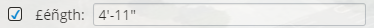

# DialogItem

The [DialogItem]($appui-abstract:Dialog) interface is used to specify user interface components in a technology-agnostic way. The [UiLayoutDataProvider]($appui-abstract:Dialog) uses DialogItem specifications to create React components in our App UI system.

For example, this code:

```ts
// ------------- boolean based toggle button ---------------
private static _lockToggleName = "lockToggle";
private static _getLockToggleDescription = (): PropertyDescription => {
  return {
    name: SampleTool._lockToggleName,
    displayLabel: SampleTool.i18n.translate("sampleNameSpace:tools.SampleTool.Prompts.Lock"),
    typename: "boolean",
    editor: { name: "toggle" },
  };
}

private _lockValue: DialogItemValue = { value: true };

public get lock(): boolean {
  return this._lockValue.value as boolean;
}

public set lock(option: boolean) {
  this._lockValue.value = option;
}

{ value: this._lockValue, property: SampleTool._getLockToggleDescription(), editorPosition: { rowPriority: 5, columnIndex: 2 } }
```

Results in this React component:


The [UiLayoutDataProvider]($appui-abstract:Dialog) has limitations. It only supports a subset of primitive data types, as defined in [DialogItemValue]($appui-abstract:Dialog) and the components are laid out in a simple grid format. A component's position in the grid is specified by the [EditorPosition]($appui-abstract:Dialog) interface with the rowPriority and columnIndex allowing components to be grouped on rows together.When components overflow the Tool Settings bar in the App UI interface, rows are wrapped together so that a row is never broken apart upon overflow wrapping.

The final member of DialogItem is an optional lockProperty. If set, this automatically generates a check-box to enable or disable the component on the dialog. This is useful when the component is part of the Tool Settings for an app's interactive tool.
For example, this DialogItem

```ts
const lengthLock = { value: this._useLengthValue, property: SampleTool._getUseLengthDescription()}
{ value: this._lengthValue, property: this._lengthDescription, editorPosition: { rowPriority: 20, columnIndex: 2 }, isDisabled: false, lockProperty: lengthLock }
```

Will result in this group of React components:



## Alternate approach

The [PropertyDescriptionHelper]($appui-abstract) provides helper functions that will create [DialogProperty]($appui-abstract) objects that help with producing `DialogItems`. The example below is an excerpt from a class that defines a length and a useLength property.

```tsx
  private _useLengthProperty: DialogProperty<boolean> | undefined;
  public get useLengthProperty() {
    if (!this._useLengthProperty)
      this._useLengthProperty = new DialogProperty<boolean>(
        PropertyDescriptionHelper.buildLockPropertyDescription("useLength"), false);
    return this._useLengthProperty;
  }
  public get useLength(): boolean { return this.useLengthProperty.value; }
  public set useLength(value: boolean) { this.useLengthProperty.value = value; }

  private _lengthProperty: DialogProperty<number> | undefined;
  public get lengthProperty() {
    if (!this._lengthProperty)
      this._lengthProperty = new DialogProperty<number>(new LengthDescription("length", "Length")),
        0.1, undefined, !this.useLength);
    return this._lengthProperty;
  }
  public get length(): number { return this.lengthProperty.value; }
  public set length(value: number) { this.lengthProperty.value = value; }
  ```

The code fragment below shows how to return a DialogItem that can be passed to UI for display.

```tsx
  // ensure controls are enabled/disabled base on current lock property state
  this.lengthProperty.isDisabled = !this.useLength;

  // get dialog item with nested "lock" item
  this.lengthProperty.toDialogItem({ rowPriority: 2, columnIndex: 1 }, this.useLengthProperty.toDialogItem({ rowPriority: 2, columnIndex: 0 }));
```

## API Reference

- [DialogItem]($appui-abstract:Dialog)
