# UiAdmin

The [UiAdmin]($appui-abstract) class contains an API used to display the following:

- Context Menu
- Toolbar
- Menu Buttons
- Calculator
- Input editors
- Card at Cursor
- Tool Settings popup
- Keyin Palette
- Dialog
- HTML element

The UiAdmin methods are callable from `IModelApp.uiAdmin` in the `@itwin/core-frontend` package.

## API Functions

### showContextMenu

The `showContextMenu` function shows a context menu at a particular location.
The menu items are an array of [AbstractMenuItemProps]($appui-abstract).

The following example shows abstract menu item definitions. Both items and sub-menus are shown.

```ts
private static _exampleMenuItems: AbstractMenuItemProps[] = [
  {
    id: "Mode", label: "~Mode", icon: "icon-placeholder", badgeType: BadgeType.New,
    submenu: [
      { id: "0", item: { label: "Mode 1", icon: "icon-placeholder", badgeType: BadgeType.New, execute: () => { } } },
      { id: "1", item: { label: "Mode 2", icon: "icon-placeholder", badgeType: BadgeType.TechnicalPreview, execute: () => { } } },
    ],
  },
  {
    id: "Rotate", label: "~Rotate", icon: "icon-placeholder",
    submenu: [
      { id: "0", item: { label: "Rotate 1", icon: "icon-placeholder", execute: () => { } } },
      { id: "1", item: { label: "Rotate 2", icon: "icon-placeholder", execute: () => { } } },
    ],
  },
  {
    id: "LockToAxis", item: { label: "~Lock to Axis", icon: "icon-placeholder", badgeType: BadgeType.TechnicalPreview, execute: () => { } },
  },
  {
    id: "MoveOrigin", item: { label: "Move ~Origin", icon: "icon-placeholder", execute: () => { } },
  },
  {
    id: "Hide", item: { label: "~Hide", icon: "icon-placeholder", execute: () => { } },
  },
  {
    id: "Settings", label: "~Settings", icon: "icon-placeholder",
    submenu: [
      { id: "0", item: { label: "Settings 1", icon: "icon-placeholder", execute: () => { } } },
      { id: "1", item: { label: "Settings 2", icon: "icon-placeholder", execute: () => { } } },
    ],
  },
];
```

This function call example uses the `_exampleMenuItems` above and displays those menu items at the current cursor position.

```ts
IModelApp.uiAdmin.showContextMenu(this._exampleMenuItems, IModelApp.uiAdmin.cursorPosition);
```

The menu items are displayed at the cursor.

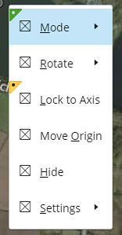

### showMenuButton

The `showMenuButton` function shows a menu button at a particular location. A menu button opens a context menu.
Multiple menu buttons may be displayed and each button is given an id.
This function call example uses the `_exampleMenuItems` above and displays the menu button at a particular location on the selected viewport.

```ts
const viewport = IModelApp.viewManager.selectedView;
if (viewport) {
  IModelApp.uiAdmin.showMenuButton("test1", this._exampleMenuItems, IModelApp.uiAdmin.createXAndY(150, 150), viewport.toolTipDiv);
}
```

The `hideMenuButton` function hides a menu button with a given id.

```ts
IModelApp.uiAdmin.hideMenuButton("test1");
```

#### Closed Menu Button

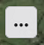

#### Open Menu Button

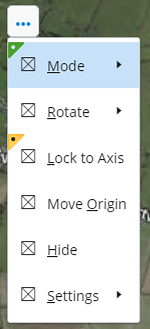

### showToolbar

The `showToolbar` function shows a Toolbar at a particular location.
The toolbar items are an array of [AbstractToolbarProps]($appui-abstract).

The following example shows an array of abstract toolbar items with item priorities that establish their order.

```ts
private static _exampleToolbar = (): AbstractToolbarProps => {
  return {
    toolbarId: "example-toolbar",
    items: [
      {
        id: SelectionTool.toolId,
        itemPriority: 10,
        icon: SelectionTool.iconSpec,
        label: SelectionTool.flyover, description: SelectionTool.description,
        execute: () => IModelApp.tools.run(SelectionTool.toolId),
      },
      {
        id: FitViewTool.toolId,
        itemPriority: 20,
        icon: FitViewTool.iconSpec,
        label: FitViewTool.flyover, description: FitViewTool.description,
        execute: () => IModelApp.tools.run(FitViewTool.toolId, IModelApp.viewManager.selectedView, true),
      },
      {
        id: WindowAreaTool.toolId,
        itemPriority: 30,
        icon: WindowAreaTool.iconSpec,
        label: WindowAreaTool.flyover, description: WindowAreaTool.description,
        execute: () => IModelApp.tools.run(WindowAreaTool.toolId, IModelApp.viewManager.selectedView),
      },
      {
        id: ZoomViewTool.toolId,
        itemPriority: 40,
        icon: ZoomViewTool.iconSpec,
        label: ZoomViewTool.flyover, description: ZoomViewTool.description,
        execute: () => IModelApp.tools.run(ZoomViewTool.toolId, IModelApp.viewManager.selectedView),
      },
      {
        id: PanViewTool.toolId,
        itemPriority: 50,
        icon: PanViewTool.iconSpec,
        label: PanViewTool.flyover, description: PanViewTool.description,
        execute: () => IModelApp.tools.run(PanViewTool.toolId, IModelApp.viewManager.selectedView),
      },
      {
        id: RotateViewTool.toolId,
        itemPriority: 60,
        icon: RotateViewTool.iconSpec,
        label: RotateViewTool.flyover, description: RotateViewTool.description,
        execute: () => IModelApp.tools.run(RotateViewTool.toolId, IModelApp.viewManager.selectedView),
      },
      { id: "example-mode-1", itemPriority: 70, label: "Mode 1", icon: "icon-placeholder",
        badgeType: BadgeType.New, execute: () => { } },
      { id: "example-mode-2", itemPriority: 80, label: "Mode 2", icon: "icon-placeholder",
        badgeType: BadgeType.TechnicalPreview, execute: () => { } },
    ],
  };
}
```

The following are handler functions. The `_closeToolbar` function closes the toolbar by calling `UiAdmin.hideToolbar`.

```ts
private static _toolbarItemExecuted = (_item: ActionButtonItemDef) => {
  ExamplePopupTools._closeToolbar();
}

private static _toolbarCancel = () => {
  ExamplePopupTools._closeToolbar();
}

private static _closeToolbar() {
  IModelApp.uiAdmin.hideToolbar();
}
```

This function call example uses the `_exampleToolbar` above and displays the toolbar at the current cursor position.
The relative position defaults to the top-right. This can be overridden using the optional 6th param.

```ts
IModelApp.uiAdmin.showToolbar(
  this._exampleToolbar(), IModelApp.uiAdmin.cursorPosition, IModelApp.uiAdmin.createXAndY(8, 8),
  this._toolbarItemExecuted, this._toolbarCancel);
```

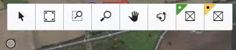

### showCalculator

The `showCalculator` function shows a calculator at a particular location.

The following are handler functions. The `_closeCalculator` function closes the toolbar by calling `UiAdmin.hideCalculator`.

```ts
private static _calculatorOnOk = (value: number) => {
  IModelApp.notifications.outputMessage(
    new NotifyMessageDetails(OutputMessagePriority.Info, `Calculated value is ${value}`));
  ExamplePopupTools._closeCalculator();
}

private static _calculatorOnCancel = () => {
  ExamplePopupTools._closeCalculator();
}

private static _closeCalculator() {
  IModelApp.uiAdmin.hideCalculator();
}
```

This function call example displays the calculator at the current cursor position.
A default value and an icon specification are supplied.

```ts
IModelApp.uiAdmin.showCalculator(100, "icon-placeholder", IModelApp.uiAdmin.cursorPosition,
  this._calculatorOnOk, this._calculatorOnCancel);
```

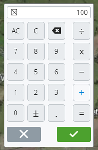

### Input Editors

There are several functions to display input editors for specific types of values, including
`showAngleEditor`,
`showLengthEditor`, and
`showHeightEditor`.
The `showInputEditor` function can be used to display the input editor appropriate for a given [PropertyDescription]($appui-abstract).

The following are handler functions. The `_closeInputEditor` function closes the editor by calling `UiAdmin.hideInputEditor`.

```ts
private static _numberInputCommit = (value: number) => {
  IModelApp.notifications.outputMessage(
    new NotifyMessageDetails(OutputMessagePriority.Info, `Updated value is ${value}`));
  ExamplePopupTools._closeInputEditor();
}

private static _inputCommit = (value: Primitives.Value) => {
  IModelApp.notifications.outputMessage(
    new NotifyMessageDetails(OutputMessagePriority.Info, `Updated value is ${value}`));
  ExamplePopupTools._closeInputEditor();
}

private static _inputCancel = () => {
  ExamplePopupTools._closeInputEditor();
}

private static _closeInputEditor() {
  IModelApp.uiAdmin.hideInputEditor();
}
```

#### showAngleEditor

This function call example displays an angle editor at the current cursor position.

```ts
IModelApp.uiAdmin.showAngleEditor(90, IModelApp.uiAdmin.cursorPosition, this._numberInputCommit, this._inputCancel);
```

#### showLengthEditor

This function call example displays a length editor at the current cursor position.

```ts
IModelApp.uiAdmin.showLengthEditor(90, IModelApp.uiAdmin.cursorPosition, this._numberInputCommit, this._inputCancel);
```

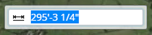

#### showHeightEditor

This function call example displays a height editor at the current cursor position.

```ts
IModelApp.uiAdmin.showHeightEditor(30, IModelApp.uiAdmin.cursorPosition, this._numberInputCommit, this._inputCancel);
```

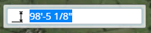

#### showInputEditor

This function call example displays a generic number editor at the current cursor position.

```ts
const propertyDescription: PropertyDescription = { name: "test", displayLabel: "Test", typename: "number" };
IModelApp.uiAdmin.showInputEditor(30, propertyDescription, IModelApp.uiAdmin.cursorPosition, this._inputCommit, this._inputCancel);
```

### showCard

```tsx
private _showCard() {
  const contentContainer = document.createElement("div");

  // Add HTMLElements as child elements of contentContainer

  ElementTooltip.isTooltipHalted = true;

  IModelApp.uiAdmin.showCard(contentContainer, "Title", myToolbar,
    IModelApp.uiAdmin.cursorPosition, IModelApp.uiAdmin.createXAndY(8, 8),
    toolbarItemExecuted, toolbarCancel, RelativePosition.Right);
}
```

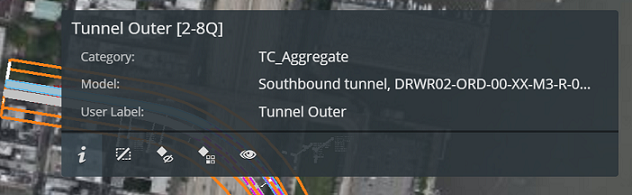

#### showReactCard

The `showCard` function is useful for displaying non-interactive data as the content.
Elements with event handlers may not be used in the content.
The `FrameworkUiAdmin.showReactCard` function may be used instead of `UiAdmin.showCard`
when React components with event handlers need to be used.

```tsx
private _showReactCard() {
  let content: React.ReactNode;

  // Set content to React elements

  ElementTooltip.isTooltipHalted = true;

  (IModelApp.uiAdmin as FrameworkUiAdmin).showReactCard(content, "Title", myToolbar,
    IModelApp.uiAdmin.cursorPosition, IModelApp.uiAdmin.createXAndY(8, 8),
    toolbarItemExecuted, toolbarCancel, RelativePosition.Right);
}
```

#### hideCard

The `hideCard` function hides the Card.

```tsx
private _closeCard() {
  IModelApp.uiAdmin.hideCard();
  ElementTooltip.isTooltipHalted = false;
}
```

### openToolSettingsPopup

The `openToolSettingsPopup` function opens a popup containing Tool Settings.
These tool settings are in addition to the tool settings that may be displayed
in the main Tool Settings widget.

The following example shows different tool settings popups being
opened on the first and second data points for the tool.

```ts
class PointOnePopupSettingsProvider extends DialogLayoutDataProvider {
  // ------------- Weight ---------------
  public weightProperty = new DialogProperty<number>(PropertyDescriptionHelper.buildWeightPickerDescription("weight", IModelApp.i18n.translate("SampleApp:tools.ToolWithSettings.Prompts.Weight")), 3);

  /** Called by UI to inform data provider of changes.  */
  public applyUiPropertyChange = (updatedValue: DialogPropertySyncItem): void => {
    if (updatedValue.propertyName === this.weightProperty.name) {
      this.weightProperty.value = updatedValue.value.value! as number;
      const msg = `Set Weight = ${this.weightProperty.value}`;
      IModelApp.notifications.outputMessage(new NotifyMessageDetails(OutputMessagePriority.Info, msg));
    }
  };

  /** Called by UI to request available properties when UI is manually created. */
  public supplyDialogItems(): DialogItem[] | undefined {
    return [
      this.weightProperty.toDialogItem({ rowPriority: 1, columnIndex: 1 }),
    ];
  }

  /** Get Sync UI Control Properties Event */
  public onSyncPropertiesChangeEvent = new SyncPropertiesChangeEvent();

  /** Called by UI to validate a property value */
  public validateProperty(_item: DialogPropertyItem): PropertyChangeResult {
    return { status: PropertyChangeStatus.Success };
  }

  /** Called to sync properties synchronously if a UiDataProvider is active for the UI */
  public syncProperties(_syncProperties: DialogPropertySyncItem[]) {
    return;
  }
}

class PointTwoPopupSettingsProvider extends DialogLayoutDataProvider {
  // ------------- text based edit field ---------------
  public sourceProperty = new DialogProperty<string>(
    PropertyDescriptionHelper.buildTextEditorDescription("source", IModelApp.i18n.translate("SampleApp:tools.ToolWithSettings.Prompts.Source")),
    "unknown", undefined);

  /** Called by UI to inform data provider of changes.  */
  public applyUiPropertyChange = (prop: DialogPropertySyncItem): void => {
    if (prop.propertyName === this.sourceProperty.name) {
      this.sourceProperty.value = prop.value.value ? prop.value.value as string : "";
      const msg = `Set Source = ${this.sourceProperty.value}`;
      IModelApp.notifications.outputMessage(new NotifyMessageDetails(OutputMessagePriority.Info, msg));
    }
  };

  /** Called by UI to request available properties when UI is manually created. */
  public supplyDialogItems(): DialogItem[] | undefined {
    return [
      this.sourceProperty.toDialogItem({ rowPriority: 1, columnIndex: 1 }),
    ];
  }

  /** Get Sync UI Control Properties Event */
  public onSyncPropertiesChangeEvent = new SyncPropertiesChangeEvent();

  /** Called by UI to validate a property value */
  public validateProperty(_item: DialogPropertyItem): PropertyChangeResult {
    return { status: PropertyChangeStatus.Success };
  }

  /** Called to sync properties synchronously if a UiDataProvider is active for the UI */
  public syncProperties(_syncProperties: DialogPropertySyncItem[]) {
    return;
  }
}
```

```ts
export class MyToolWithSettings extends PrimitiveTool {
  private _pointOnePopupSettingsProvider = new PointOnePopupSettingsProvider();
  private _pointTwoPopupSettingsProvider = new PointTwoPopupSettingsProvider();

  // . . .

  protected setupAndPromptForNextAction(): void {
    const offset = IModelApp.uiAdmin.createXAndY(8, 0);

    if (1 === this.points.length)
      IModelApp.uiAdmin.openToolSettingsPopup(this._pointOnePopupSettingsProvider,
      IModelApp.uiAdmin.cursorPosition, offset,
      this._handleToolSettingsPopupCancel,
      RelativePosition.Right);
    else if (2 === this.points.length) {
      IModelApp.uiAdmin.openToolSettingsPopup(this._pointTwoPopupSettingsProvider,
      IModelApp.uiAdmin.cursorPosition, offset,
      this._handleToolSettingsPopupCancel,
      RelativePosition.Right);
    }
  }
```

#### closeToolSettingsPopup

The `closeToolSettingsPopup` function closes the popup.

```ts
private _handleToolSettingsPopupCancel = () => {
  IModelApp.uiAdmin.closeToolSettingsPopup();
};
```

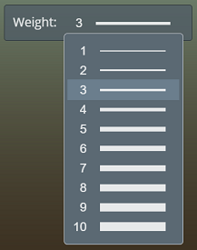

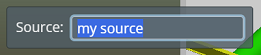

### showKeyinPalette

The `showKeyinPalette` function shows a Keyin Palette, centered and in the top part of the screen.

```ts
IModelApp.uiAdmin.showKeyinPalette();
```

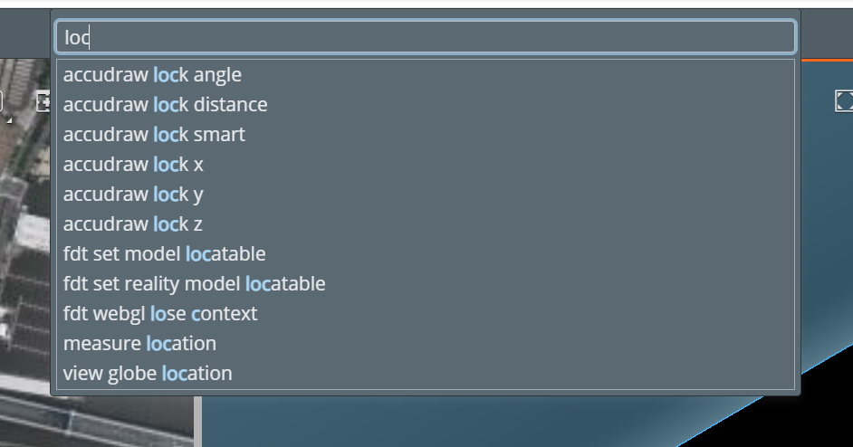

### openDialog

The `openDialog` function opens a Dialog and automatically populates it
using the properties defined by the DialogLayoutDataProvider,
which is a subclass of UiDataProvider that includes the buttons
at the bottom of the dialog.

```ts
class DynamicModalUiDataProvider extends DialogLayoutDataProvider {
  public currentPageIndex = 0;
  public numberOfPages = 2;
  public static userPropertyName = "username";
  private static _getUserDescription = (): PropertyDescription => {
    return {
      name: DynamicModalUiDataProvider.userPropertyName,
      displayLabel: "User",
      typename: StandardTypeNames.String,
    };
  };

  private _userValue: DialogItemValue = { value: "unknown" };
  private get user(): string {
    return this._userValue.value as string;
  }
  private set user(option: string) {
    this._userValue.value = option;
  }

  public static cityPropertyName = "city";
  private static _getCityDescription = (): PropertyDescription => {
    return {
      name: DynamicModalUiDataProvider.cityPropertyName,
      displayLabel: "City",
      typename: StandardTypeNames.String,
    };
  };

  private _cityValue: DialogItemValue = { value: "unknown" };
  private get city(): string {
    return this._cityValue.value as string;
  }
  private set city(option: string) {
    this._cityValue.value = option;
  }

  // called to apply a single property value change.
  public applyUiPropertyChange = (updatedValue: DialogPropertySyncItem): void => {
    this.processChangesInUi([updatedValue]);
  };

  /** Called by UI to inform data provider of changes.  */
  public processChangesInUi(properties: DialogPropertyItem[]): PropertyChangeResult {
    if (properties.length > 0) {
      for (const prop of properties) {
        if (prop.propertyName === DynamicModalUiDataProvider.userPropertyName) {
          this.user = prop.value.value ? prop.value.value as string : "";
          continue;
        } else if (prop.propertyName === DynamicModalUiDataProvider.cityPropertyName) {
          this.city = prop.value.value ? prop.value.value as string : "";
          continue;
        }
      }
    }

    this.fireDialogButtonsReloadEvent();
    return { status: PropertyChangeStatus.Success };
  }

  /** Used Called by UI to request available properties when UI is manually created. */
  public supplyDialogItems(): DialogItem[] | undefined {
    const items: DialogItem[] = [];

    items.push({ value: this._userValue, property: DynamicModalUiDataProvider._getUserDescription(), editorPosition: { rowPriority: 1, columnIndex: 1 } });
    if (this.currentPageIndex > 0) {
      items.push({ value: this._cityValue, property: DynamicModalUiDataProvider._getCityDescription(), editorPosition: { rowPriority: 2, columnIndex: 1 } });
    }
    return items;
  }

  public handleNext = () => {
    if (this.currentPageIndex < this.numberOfPages) {
      this.currentPageIndex++;
      this.reloadDialogItems();
    }
  };

  public handlePrevious = () => {
    if (this.currentPageIndex > 0) {
      this.currentPageIndex--;
      this.reloadDialogItems();
    }
  };

  public supplyButtonData(): DialogButtonDef[] | undefined {
    const buttons: DialogButtonDef[] = [];

    if (this.currentPageIndex > 0 && this.currentPageIndex < this.numberOfPages)
      buttons.push({ type: DialogButtonType.Previous, onClick: this.handlePrevious });

    if (this.currentPageIndex < this.numberOfPages - 1)
      buttons.push({ type: DialogButtonType.Next, onClick: this.handleNext });

    if (this.currentPageIndex === this.numberOfPages - 1) {
      buttons.push({ type: DialogButtonType.OK, onClick: () => { }, disabled: (this.user === "unknown" || this.city === "unknown") });
    }

    buttons.push({ type: DialogButtonType.Cancel, onClick: () => { } });
    return buttons;
  }
}
```

```ts
  private handleOpenDynamicModal = () => {
    IModelApp.uiAdmin.openDialog(
      new DynamicModalUiDataProvider(),
      "Dynamic Model",
      true,
      "SampleApp:DynamicModal",
      {movable: true, width: 280, minWidth: 280});
  };
```

#### closeDialog

The `closeDialog` function closes a Dialog with a given Id.

```ts
IModelApp.uiAdmin.closeDialog("SampleApp:DynamicModal");
```

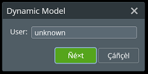

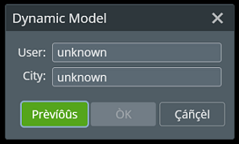

## API Reference

- [UiAdmin]($appui-abstract)
