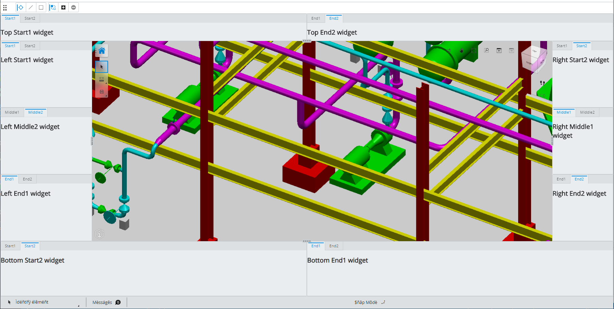

# Frontstages

A **Frontstage** is a full-screen configuration designed to enable the user to accomplish a task. There are three types of frontstages:

|Type|Description
|-----|-----
|**Primary** | may use all zones and stage panels and the Tool Widget contains the App button that opens the App menu
|**Nested** | is accessed from a primary frontstage. It may use all zones and panels, but instead of the App button, the Tool Widget contains a Back button to return to the primary frontstage.
|**Modal** | is accessed from another frontstage or the Backstage. It may contain any content along with a Back button. It does not use zones or stage panels. It is useful for application settings and data management user interfaces.

## Frontstages in App UI

With the release of the `iTwin.js 2.0`, new UI components are available that provide a new look and feel for iTwin Apps. The new look and feel was initially referred to as `UI 2.0` and now has the more formal name of a `App UI`. The two primary goals of `App UI` are to limit the amount of UI components that obscure the iModel content and to ensure that Extensions can augment the UI provided by the host IModelApp.

Below is an example frontstage that shows the different areas/zones.



A frontstage can be configured in a class subclassing the [FrontstageProvider]($appui-react) abstract class, but the recommended way is to build it using UiProviders, as in the example below.

### Example Frontstage definition

The definition that produces the sample frontstage is shown below.

```tsx
export class FrontstageUi2 {
  private static _contentGroupProvider = new FrontstageUi2ContentGroupProvider();
  private static showCornerButtons = true;

  public static supplyAppData(_id: string, _applicationData?: any) {
    return {
      viewState: UiFramework.getDefaultViewState,
      iModelConnection: UiFramework.getIModelConnection,
    };
  }

  public static register() {
    // set up custom corner button where we specify icon, label, and action
    const cornerButton = FrontstageUi2.showCornerButtons ?
      <BackstageAppButton key="ui2-backstage" label="Toggle Ui2 Backstage" icon={"icon-bentley-systems"}
        execute={() => BackstageManager.getBackstageToggleCommand().execute()} /> : undefined;
    const hideNavigationAid = !FrontstageUi2.showCornerButtons;
    const setUpCustomToolGroups = true;
    const applicationData = setUpCustomToolGroups ? {
      defaultContentTools: {
        vertical: {
          selectElementGroupPriority: 100,
          measureGroupPriority: 200,
          selectionGroupPriority: 300,
        },
        horizontal: {
          clearSelectionGroupPriority: 100,
          overridesGroupPriority: 200,
        },
      },
    } : undefined;

    const ui2StageProps: StandardFrontstageProps = {
      id: "Ui2",
      version: 1.1,
      contentGroupProps: FrontstageUi2._contentGroupProvider,
      hideNavigationAid,
      cornerButton,
      usage: StageUsage.General,
      applicationData,
    };

    ConfigurableUiManager.addFrontstageProvider(new StandardFrontstageProvider(ui2StageProps));
    this.registerToolProviders();
  }

  private static registerToolProviders() {

    // Provides standard tools for ToolWidget in ui2.0 stage
    StandardContentToolsProvider.register("ui2-standardContentTools", {
      horizontal: {
        clearSelection: true,
        clearDisplayOverrides: true,
        hide: "group",
        isolate: "group",
        emphasize: "element",
      },
    }, (stageId: string, _stageUsage: string, _applicationData: any) => {
      return stageId === "Ui2";
    });

    // Provides standard tools for NavigationWidget in ui2.0 stage
    StandardNavigationToolsProvider.register("ui2-standardNavigationTools", undefined, (stageId: string, _stageUsage: string, _applicationData: any) => {
      return stageId === "Ui2";
    });

    // Provides standard status fields for ui2.0 stage
    StandardStatusbarItemsProvider.register("ui2-standardStatusItems", undefined, (stageId: string, _stageUsage: string, _applicationData: any) => {
      return stageId === "Ui2";
    });

    // Provides example widgets ui2.0 stage
    AppUi2StageItemsProvider.register(FrontstageUi2.showCornerButtons);
  }
}

export function MyCustomViewOverlay() {
  const [syncIdsOfInterest] = React.useState([SampleAppUiActionId.setTestProperty]);
  const [showOverlay, setShowOverlay] = React.useState(SampleAppIModelApp.getTestProperty() !== "HIDE");

  React.useEffect(() => {
    const handleSyncUiEvent = (args: SyncUiEventArgs) => {
      if (0 === syncIdsOfInterest.length)
        return;

      // istanbul ignore else
      if (syncIdsOfInterest.some((value: string): boolean => args.eventIds.has(value))) {
        const show = SampleAppIModelApp.getTestProperty() !== "HIDE";
        if (show !== showOverlay)
          setShowOverlay(show);
      }
    };

    // Note: that items with conditions have condition run when loaded into the items manager
    SyncUiEventDispatcher.onSyncUiEvent.addListener(handleSyncUiEvent);
    return () => {
      SyncUiEventDispatcher.onSyncUiEvent.removeListener(handleSyncUiEvent);
    };
  }, [setShowOverlay, showOverlay, syncIdsOfInterest]);

  return showOverlay ?
    <div className="uifw-view-overlay">
      <div className="my-custom-control" style={{
        display: "flex",
        flexDirection: "column",
        justifyContent: "center",
        alignItems: "center",
        height: "100%",
        backgroundColor: "rgba(0, 0, 0, 0.5)",
      }}>
        <div>Hello World</div>
        <div>(turn off using Hide/Show items tool in horizontal toolbar at top-left)</div>
      </div>
    </div> : null;
}

export class AppUi2StageItemsProvider implements UiItemsProvider {
  public static providerId = "sampleApp:ui2-stage-widget-provider";
  public readonly id = AppUi2StageItemsProvider.providerId;

  constructor(private toolWidgetDisplayCornerButton: boolean) { }

  public static register(toolWidgetDisplayCornerButton: boolean) {
    UiItemsManager.register(new AppUi2StageItemsProvider(toolWidgetDisplayCornerButton));
  }

  public static unregister() {
    UiItemsManager.unregister(AppUi2StageItemsProvider.providerId);
  }

  private getLeftPanelWidgets(section?: StagePanelSection | undefined) {
    const widgets: AbstractWidgetProps[] = [];

    if (section === StagePanelSection.Start) {
      widgets.push(
        {
          id: "LeftStart1",
          label: "Start1",
          canPopout: true,
          defaultState: WidgetState.Open,
          getWidgetContent: () => <h2>Left Start1 widget</h2>,
          isFloatingStateSupported: true,
        });
      widgets.push(
        {
          id: "LeftStart2",
          label: "Start2",
          canPopout: true,
          defaultState: WidgetState.Open,
          getWidgetContent: () => <h2>Left Start2 widget</h2>,
          isFloatingStateSupported: true,
        }
      );
    } else if (section === StagePanelSection.Middle) {
      widgets.push(
        {
          id: "LeftMiddle1",
          label: "Middle1",
          canPopout: false,
          getWidgetContent: () => <h2>Left Middle1 widget</h2>,
          isFloatingStateSupported: true,
        });
      widgets.push(
        {
          id: "LeftMiddle2",
          label: "Middle2",
          defaultState: WidgetState.Open,
          canPopout: true,
          getWidgetContent: () => <h2>Left Middle2 widget</h2>,
          isFloatingStateSupported: true,
        }
      );
    } else if (section === StagePanelSection.End) {
      widgets.push(
        {
          id: "LeftEnd1",
          label: "End1",
          canPopout: true,
          getWidgetContent: () => <h2>Left  End1 widget</h2>,
          isFloatingStateSupported: true,
        });
      widgets.push(
        {
          id: "LeftEnd2",
          label: "End2",
          canPopout: true,
          defaultState: WidgetState.Open,
          getWidgetContent: () => <h2>Left End2 widget</h2>,
          isFloatingStateSupported: true,
        }
      );
    }
    return widgets;
  }

  private getRightPanelWidgets(section?: StagePanelSection | undefined) {
    const widgets: AbstractWidgetProps[] = [];

    if (section === StagePanelSection.Start) {
      widgets.push(
        {
          id: "RightStart1",
          label: "Start1",
          canPopout: true,
          defaultState: WidgetState.Open,
          getWidgetContent: () => <h2>Right Start1 widget</h2>,
          isFloatingStateSupported: true,
        });
      widgets.push(
        {
          id: "RightStart2",
          label: "Start2",
          canPopout: true,
          defaultState: WidgetState.Hidden,
          getWidgetContent: () => <h2>Right Start2 widget</h2>,
          isFloatingStateSupported: true,
        }
      );
    } else if (section === StagePanelSection.Middle) {
      widgets.push(
        {
          id: "RightMiddle1",
          label: "Middle1",
          canPopout: false,
          getWidgetContent: () => <h2>Right Middle1 widget</h2>,
          isFloatingStateSupported: true,
        });
      widgets.push(
        {
          id: "RightMiddle2",
          label: "Middle2",
          defaultState: WidgetState.Open,
          canPopout: true,
          getWidgetContent: () => <h2>Right Middle2 widget</h2>,
          isFloatingStateSupported: true,
        }
      );
    } else if (section === StagePanelSection.End) {
      widgets.push(
        {
          id: "RightEnd1",
          label: "End1",
          canPopout: true,
          getWidgetContent: () => <h2>Right  End1 widget</h2>,
          isFloatingStateSupported: true,
        });
      widgets.push(
        {
          id: "RightEnd2",
          label: "End2",
          canPopout: true,
          defaultState: WidgetState.Open,
          getWidgetContent: () => <h2>Right End2 widget</h2>,
          isFloatingStateSupported: true,
        }
      );
    }
    return widgets;
  }

  private getTopPanelWidgets(section?: StagePanelSection | undefined) {
    const widgets: AbstractWidgetProps[] = [];

    if (section === StagePanelSection.Start) {
      widgets.push(
        {
          id: "TopStart1",
          label: "Start1",
          canPopout: true,
          defaultState: WidgetState.Open,
          getWidgetContent: () => <h2>Top Start1 widget</h2>,
          isFloatingStateSupported: true,
        });
      widgets.push(
        {
          id: "TopStart2",
          label: "Start2",
          canPopout: true,
          getWidgetContent: () => <h2>Top Start2 widget</h2>,
          isFloatingStateSupported: true,
        }
      );
    } else if (section === StagePanelSection.End) {
      widgets.push(
        {
          id: "TopEnd1",
          label: "End1",
          canPopout: true,
          getWidgetContent: () => <h2>Top  End1 widget</h2>,
          isFloatingStateSupported: true,
        });
      widgets.push(
        {
          id: "TopEnd2",
          label: "End2",
          canPopout: true,
          defaultState: WidgetState.Open,
          getWidgetContent: () => <h2>Top End2 widget</h2>,
          isFloatingStateSupported: true,
        }
      );
    }
    return widgets;
  }

  private getBottomPanelWidgets(section?: StagePanelSection | undefined) {
    const widgets: AbstractWidgetProps[] = [];

    if (section === StagePanelSection.Start) {
      widgets.push(
        {
          id: "BottomStart1",
          label: "Floating Info",
          canPopout: true,
          defaultState: WidgetState.Open,
          getWidgetContent: () => <FloatingLayoutInfo />,
          isFloatingStateSupported: true,
        });
      widgets.push(
        {
          id: "BottomStart2",
          label: "Layout Info",
          canPopout: true,
          getWidgetContent: () => <LayoutInfo />,
          isFloatingStateSupported: true,
        }
      );
    } else if (section === StagePanelSection.End) {
      widgets.push(
        {
          id: "BottomEnd1",
          label: "End1",
          canPopout: true,
          getWidgetContent: () => <h2>Bottom  End1 widget</h2>,
          isFloatingStateSupported: true,
        });
      widgets.push(
        {
          id: "BottomEnd2",
          label: "Layout Controls",
          canPopout: true,
          defaultState: WidgetState.Open,
          getWidgetContent: () => <LayoutControls />,
          isFloatingStateSupported: true,
        }
      );
    }
    return widgets;
  }

  public provideWidgets(stageId: string, _stageUsage: string, location: StagePanelLocation, section?: StagePanelSection | undefined): ReadonlyArray<AbstractWidgetProps> {
    const allowedStages = ["Ui2"];
    if (allowedStages.includes(stageId)) {
      switch (location) {
        case StagePanelLocation.Left:
          return this.getLeftPanelWidgets(section);
        case StagePanelLocation.Right:
          return this.getRightPanelWidgets(section);
        case StagePanelLocation.Top:
          return this.getTopPanelWidgets(section);
        case StagePanelLocation.Bottom:
          return this.getBottomPanelWidgets(section);
      }
    }

    return [];
  }

  public provideToolbarButtonItems(stageId: string, _stageUsage: string, toolbarUsage: ToolbarUsage, toolbarOrientation: ToolbarOrientation): CommonToolbarItem[] {
    const allowedStages = ["Ui2"];
    if (allowedStages.includes(stageId)) {
      if (toolbarUsage === ToolbarUsage.ContentManipulation && toolbarOrientation === ToolbarOrientation.Horizontal) {
        const items: CommonToolbarItem[] = [];
        items.push(ToolbarHelper.createToolbarItemFromItemDef(10, AppTools.toggleHideShowItemsCommand, { groupPriority: 3000 }));
        items.push(ToolbarHelper.createToolbarItemFromItemDef(15, AppTools.splitSingleViewportCommandDef, { groupPriority: 3000 }));
        if (!this.toolWidgetDisplayCornerButton)
          items.push(ToolbarHelper.createToolbarItemFromItemDef(20, BackstageManager.getBackstageToggleCommand("icon-bentley-systems"), { groupPriority: 3000 }));
        return items;
      } else if (toolbarUsage === ToolbarUsage.ViewNavigation && toolbarOrientation === ToolbarOrientation.Vertical) {
        const items: CommonToolbarItem[] = [];
        items.push(ToolbarHelper.createToolbarItemFromItemDef(10, AppTools.saveContentLayout, { groupPriority: 3000 }));
        items.push(ToolbarHelper.createToolbarItemFromItemDef(15, AppTools.restoreSavedContentLayout, { groupPriority: 3000 }));
        return items;
      }
    }
    return [];
  }

}

```

Note `contentGroup` can reference a ContentGroup or a ContentGroupProvider See [Content Views and Layouts](./ContentViews.md) for more details.

### Usage

The Stage usage prop is a way to designate the type of tasks that will be performed in the stage and can be used by UiItemsProviders to
determine if it should supply items such as tool button, widgets, or status bar items, to populate the stage. See [StageUsage]($appui-abstract) for a default set of usages.

## Defining an 'empty' frontstage

It may be desirable for an application to set up an "empty" stage that is populated only by multiple [UiItemsProvider]($appui-abstract) instances. The

```tsx
    const ui2StageProps: StandardFrontstageProps = {
      id: "unique-stage-id",
      version: 1.1,
      contentGroupProps: myContentGroupProvider,
      hideNavigationAid,
      cornerButton,
      usage: StageUsage.General,
      applicationData,
    };

    ConfigurableUiManager.addFrontstageProvider(new StandardFrontstageProvider(ui2StageProps));

    // Use standard provider to provide basic tool and statusbar items
    StandardContentToolsProvider.register("ui2-standardContentTools");
    StandardNavigationToolsProvider.register("ui2-standardNavigationTools");
    StandardStatusbarItemsProvider.register("ui2-standardStatusbarItems");

```

## Setting a Frontstage active

```tsx
// Create a Frontstage.
const frontstageProvider = new SampleFrontstage();
// Add the provider to FrontstageManager
FrontstageManager.addFrontstageProvider(frontstageProvider);

// Set the Frontstage active
FrontstageManager.setActiveFrontstage(frontstageProvider.frontstage.props.id).then(() => {
  // Frontstage is ready
});
```

## Related Learning Topics

- [Content Views and Layouts](./ContentViews.md)
- [Widgets](./Widgets.md)
- [Status Bar and Fields](./StatusBar.md)
- [Tool Settings](./ToolSettings.md)

## API Reference

- [Frontstage]($appui-react:Frontstage)
