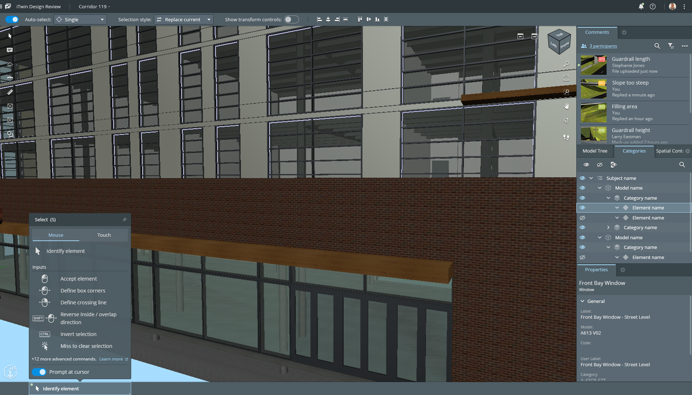
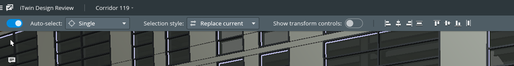
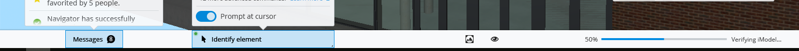
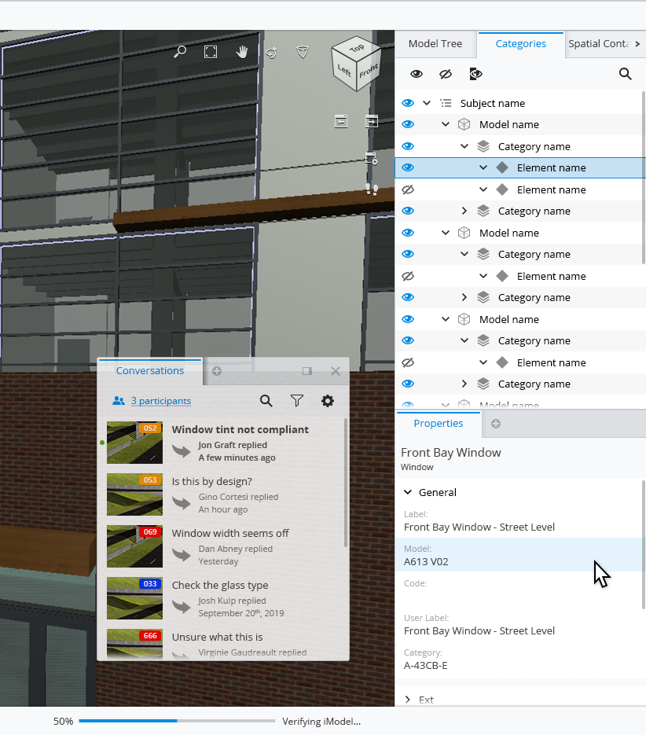

# AppUi

## Overview

AppUi refers to an API and a set of components that enable iTwin.js apps to implement iTwin UI's App UI design. This design organizes the [iModel](../../iModels) data into various components on the screen. Graphical data is usually displayed in a [Viewport](../imodel&#8209;components/Viewport), while information such as element properties and data hierarchies are displayed in [Widgets](./appui&#8209;react/Widgets). An app using the App UI design will have a look similar to this:

The layout of an AppUi app has the following features:

[Tool Settings](./appui&#8209;react/ToolSettings): a container for any components that change the operational settings of the currently executing [Tool](../../frontend/Tools). These settings are, by default, displayed in a bar at the top of the window:

[Status Bar](./appui&#8209;react/StatusBar): a container that displays notifications, messages from the app, and any feedback from the currently executing Tool. The Status Bar displays as a footer at the bottom of the window:

[Widgets](./appui&#8209;react/Widgets) are containers of relevant feedback and content for the app's user. They can float or be docked into one of the panels surrounding the content area. Here, we see a "Conversations" widget floating, while "Properties," "Categories" and others are docked into the right-hand panel:

There are two special Widgets that float on top of the Content Area in the upper right and left corners. The [Tool Widget](./appui&#8209;react/Widgets.md##ToolWidget) in the upper left contains buttons used to launch [iTwin.js Tools](../../frontend/Tools) or functions. The [View Navigation Widget](./appui&#8209;react/Widgets.md##NavigationWidget) contains buttons to launch tools that manipulate the active graphic view, such as zoom, pan, and rotate.

## AppUi Components

Details about the components used to implement AppUi apps:

The React components that make up the AppUi interface are in the [appui-react package](./appui&#8209;react/index).

The [imodel-components-react package](../imodel&#8209;components/index) includes components that work with iModel data, but may be used either inside or outside an AppUi.

React components in the [components-react package](../components/index) are complex components used to display and edit properties are hierarchies. They have no direct dependencies on iTwin.js frontend classes and can be used inside or outside AppUi apps.

The [core-react package](../core/index) is made up of simple React components that can be used anywhere you would use React. Components in the Bentley project [iTwin Ui React](https://github.com/iTwin/iTwinUI&#8209;react) are also used in AppUi and can be used anywhere you can use React components.
