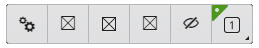

# Toolbar

The [Toolbar]($ui-components:Toolbar) category in the `@bentley/ui-components` package includes
components that provide a toolbar that supports an overflow button.

|Component|Description
|-----|-----
|[ToolbarWithOverflow]($ui-components)|Toolbar that can be oriented horizontal or vertical.
|[PopupItem]($ui-components)|Toolbar button that display a popup panel

## ToolbarWithOverflow

[ToolbarWithOverflow]($ui-components) is a toolbar component that can be oriented horizontal or vertical. It will automatically show an overflow button if the all buttons cannot be displayed due to the size of the toolbar.

### ToolbarWithOverflow Sample

The following sample shows the definition of a toolbar.

``` tsx
// First create toolbar item definitions
const toolbarItems = [
  ToolbarHelper.createToolbarItemFromItemDef(0, CoreTools.keyinBrowserButtonItemDef),
  ToolbarHelper.createToolbarItemFromItemDef(10, CoreTools.clearSelectionItemDef),
  ToolbarHelper.createToolbarItemFromItemDef(20, SelectionContextToolDefinitions.hideElementsItemDef),
  ToolbarHelper.createToolbarItemFromItemDef(30, SelectionContextToolDefinitions.isolateElementsItemDef),
  ToolbarHelper.createToolbarItemFromItemDef(40, SelectionContextToolDefinitions.emphasizeElementsItemDef),
]

// Next create toolbar component and provide the item definitions with will create the buttons.
<ToolbarWithOverflow
    expandsTo={Direction.Bottom}
    panelAlignment={ToolbarPanelAlignment.Start}
    direction={OrthogonalDirection.Horizontal}
    items={toolbarItems}
    useDragInteraction={false}
    useProximityOpacity={true}
  />;
```

The props defined above are all defaults, so the above definition could be shortened to the following.

``` tsx
<ToolbarWithOverflow items={toolbarItems} />;
```



### Toolbar Popup Buttons

Toolbar support two basic Popup buttons, one that is created for a [GroupButton]($ui-abstract) definition that show a panel of tools to execute and one that shows custom contents in a popup panel using [CustomToolbarItem]($ui-components) definition.

#### Custom Popup Panel

A [CustomToolbarItem]($ui-components) definition can be used to define a button with a custom pop-up panel. The `panelContentNode` property is used to define the React component to display in the popup panel.

```tsx
const buttonDefWithPopupPanel = {
    id: "MyPopupPanelButton",
    itemPriority: 10,
    icon: "icon-placeholder",
    label: "Show Hello World",
    isCustom: true,
    panelContentNode: <div data-testid="popup-panel">HelloWorld!</div>,
  } as CustomToolbarItem;
```

#### Group Popup Panel

Below is an example of setting up a [GroupButton]($ui-abstract) definition that shows a pop-up panel of actions.

```tsx
const childItems: ActionButton[] = [
  ToolbarItemUtilities.createActionButton("Child1", 10, "icon-app-1", "Child1 Tool", (): void => {/* start tool or open a dialog */ }),
  ToolbarItemUtilities.createActionButton("Child2", 20, "icon-app-2", "Child2 Tool", (): void => {/* start tool or open a dialog */}),
];

const toolbarItemsWithGroup: CommonToolbarItem[] = [
  ToolbarItemUtilities.createGroupButton("GroupButton", 10, "icon-developer", "Tool Group", childItems),
];
```

## API Reference

- [Abstract Toolbar definitions]($ui-abstract:Toolbar)
- [Toolbar]($ui-components:Toolbar)
