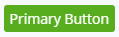
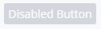
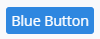
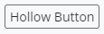
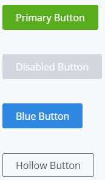
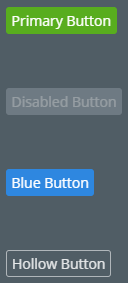
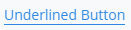
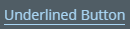

# Button

The [Button]($core-react:Button) category in the `@itwin/core-react` package includes various Button components.

## Button

The [Button]($core-react) component is a wrapper for the `<button>` HTML element and has support for the Light and Dark themes.

### Properties

All props for the Button are optional.
The `size` prop determines whether the Button is the default size or a large size.
The `buttonType` prop determines the color properties of the Button.
The `onClick` event handler is run when the Button is clicked or touched.

### Examples

#### Primary Button

The default button has the default `buttonType` of `ButtonType.Primary` and has a green background.

```tsx
<Button>Primary Button</Button>
```



#### Disabled Button

The `disabled` prop is used to disable a Button.

```tsx
<Button disabled>Disabled Button</Button>
```



#### Blue Button

A `buttonType` prop of `ButtonType.Blue` results in a blue background.

```tsx
<Button buttonType={ButtonType.Blue}>Blue Button</Button>
```



#### Hollow Button

A `buttonType` prop of `ButtonType.Hollow` results in a transparent background.

```tsx
<Button buttonType={ButtonType.Hollow}>Hollow Button</Button>
```



#### Large Buttons

When using a `size` prop of `ButtonSize.Large`, the Button has a larger size.

```tsx
<Button size={ButtonSize.Large}>Primary Button</Button>
```



#### Dark Theme



## UnderlinedButton

The [UnderlinedButton]($core-react) component makes text clickable and underlined.

### Properties

The `children` prop is the string that will be rendered by the button. This prop is mandatory.
The `title` prop is the tooltip string.
The `onClick` event handler is run when the Button is clicked or touched.

### Example

```tsx
<UnderlinedButton>Underlined Button</UnderlinedButton>
```

#### Light Theme



#### Dark Theme



## API Reference

- [Button]($core-react:Button)
