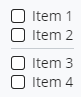
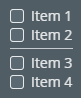

# CheckListBox

The [CheckListBox]($ui-core) React component shows a list of Checkbox items.
The [CheckListBoxItem]($ui-core) component is the item with a Checkbox added to a CheckListBox.
The [CheckListBoxSeparator]($ui-core) component is the separator item for the CheckListBox.

## Properties

The [CheckListBoxItemProps]($ui-core) interface contains the properties for the CheckListBoxItem component.
The `label` prop is mandatory and is the label shown for the Checkbox.
The `checked` props indicates whether the item is checked.
The `disabled` prop indicates whether the item is disabled.
The `onClick` prop is the function called when the item is clicked.

## Examples

CheckListBoxItem components are the children of the CheckListBox component.
The CheckListBoxSeparator component is used for a separator item.

```tsx
<CheckListBox>
  <CheckListBoxItem label="Item 1" />
  <CheckListBoxItem label="Item 2" />
  <CheckListBoxSeparator />
  <CheckListBoxItem label="Item 3" />
  <CheckListBoxItem label="Item 4" />
</CheckListBox>)
```





## API Reference

- [CheckListBox]($ui-core:CheckListBox)
