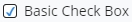
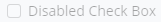

# Checkbox

The  [Checkbox]($core-react) React component is a wrapper for the `<input type="checkbox">` HTML element.
The Checkbox component has support for the Light and Dark themes.

Checkboxes are generally accompanied with a label to communicate what happens when they are checked. They can be used either for selecting one or more options in a list, or to enable, disable, show, or hide a feature in the UI. It should, however, not be confused with a Toggle switch, which can fulfill the same role but is more appropriate in certain settings.

In addition to showing an 'on' or 'off' state, the `indeterminate` prop indicates the checkbox is in an Indeterminate or Partial state, regardless of the `checked` state.

```tsx
<Checkbox label="Basic Check Box" />
```



## Disabled

```tsx
<Checkbox label="Disabled Check Box" disabled />
```



## API Reference

- [Checkbox]($core-react:Checkbox)
