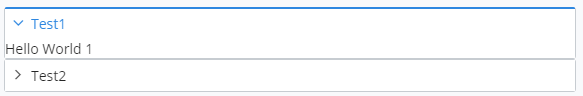
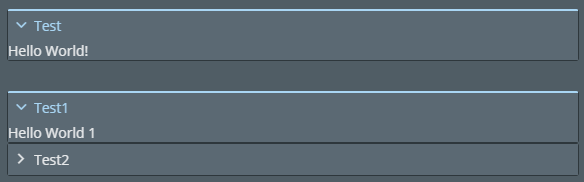

# Expandable

The [ExpandableList]($core-react) React component is a container for one or more ExpandableBlock components.
The [ExpandableBlock]($core-react) React component is a container that shows and hides child content.

## Examples

### SampleExpandableBlock

The following React function component maintains the expanded state for an ExpandableBlock.
It will be used in the examples below.

```tsx
import * as React from "react";
import { ExpandableBlock, ExpandableBlockProps } from "@itwin/core-react";

/** Sample component using ExpandableBlock with an expanded state  */
export const SampleExpandableBlock: React.FC<ExpandableBlockProps> = (props: ExpandableBlockProps) => {
  const [expanded, setExpanded] = React.useState(true);

  const _handleClick = (event: React.MouseEvent<HTMLDivElement, MouseEvent>): void => {
    setExpanded(!expanded);

    props.onClick && props.onClick(event);
  };

  return (
    <ExpandableBlock {...props} isExpanded={expanded} onClick={_handleClick} />
  );
};
```

### Single ExpandableBlock

This example shows an ExpandableList component with a single ExpandableBlock that starts in the expanded state. The SampleExpandableBlock maintains the expanded state and allows the block to hide and show.

```tsx
<ExpandableList>
  <SampleExpandableBlock title="Test" isExpanded={true} onClick={() => { }}>
    Hello World!
  </SampleExpandableBlock>
</ExpandableList>
```


### Multiple ExpandableBlocks

This example shows an ExpandableList component with two ExpandableBlocks.
The `singleExpandOnly` prop for ExpandableList indicates whether to allow only one expanded block,
and that prop is used in this example.

```tsx
<ExpandableList singleExpandOnly={true} defaultActiveBlock={0}>
  <ExpandableBlock title="Test1" isExpanded={false} onClick={() => { }}>
    Hello World 1
  </ExpandableBlock>
  <ExpandableBlock title="Test2" isExpanded={false} onClick={() => { }}>
    Hello World 2
  </ExpandableBlock>
</ExpandableList>
```



### Dark Theme



## API Reference

- [Expandable]($core-react:Expandable)
