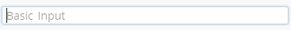
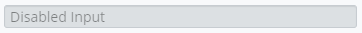
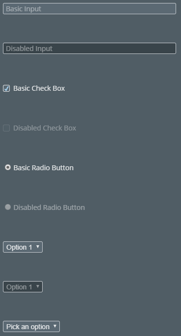
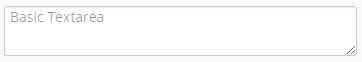
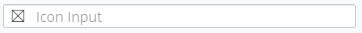
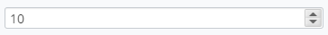
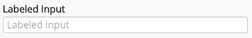
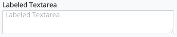
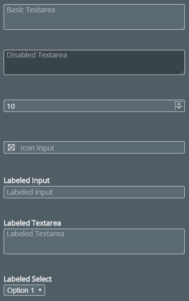

# Inputs

The [Inputs]($core-react:Inputs) category in the `@itwin/core-react` package includes
components for working with input controls, such as Input, IconInput, NumberInput TextArea.

## Input

The [Input]($core-react) React component is a wrapper for the `<input type="text">` HTML element.
It is meant to receive text input from the user. You can display hint text within the field itself. This hint text is replaced by the actual text input by the user.

The hint text is specified using the `placeholder` prop.

```tsx
<Input placeholder="Basic Input" />
```



### Disabled

```tsx
<Input placeholder="Disabled Input" disabled />
```



## Inputs in Dark Mode



## Textarea

The [Textarea]($core-react) React component is a wrapper for the `<textarea>` HTML element.
It is an input field that supports multiple rows.

```tsx
<Textarea placeholder="Basic Textarea" />
```



## IconInput

The [IconInput]($core-react) React component is an Input component
with an icon displayed to the left of the input field.

```tsx
<IconInput placeholder="Icon Input" icon={<Icon iconSpec="icon-placeholder" />} />
```



## NumberInput

The [NumberInput]($core-react) React component is an input component that accepts numeric input.
It contains up and down arrows to the right that increment and decrement the value.

```tsx
<NumberInput placeholder="Number Input" min={1} max={100} />
```



## Labeled Components

The Input and Textarea components have a labeled version.

### LabeledInput

```tsx
<LabeledInput label="Labeled Input" placeholder="Labeled Input" />
```



### LabeledTextarea

```tsx
<LabeledTextarea label="Labeled Textarea" placeholder="Labeled Textarea" />
```



## Additional Inputs in Dark Mode



## API Reference

- [Inputs]($core-react:Inputs)
