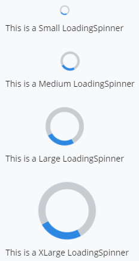
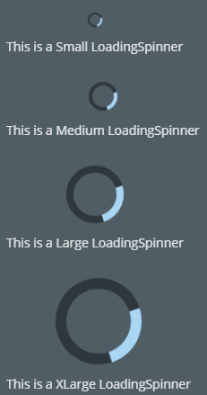
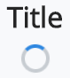
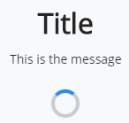
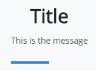
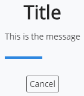
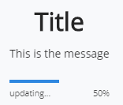
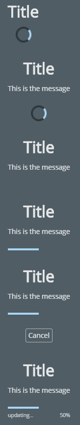

# Loading

The [Loading]($ui-core:Loading) category in the `@bentley/ui-core` package includes components for displaying determinate and indeterminate status indicators, such as spinners and progress bars. These include:

- [Spinner]($ui-core) - indeterminate spinner component that supports multiple sizes
- [LoadingBar]($ui-core) - determinate loading bar with optional percentage text
- [LoadingPrompt]($ui-core) - component to display during loading that optionally shows percentage, status text and a cancel button
- [LoadingSpinner]($ui-core) - loading spinner component that optionally shows a text message
- [ProgressBar]($ui-core) - horizontal progress bar that supports determinate and indeterminate modes
- [ProgressSpinner]($ui-core) - circular progress indicator that supports determinate and indeterminate modes

## Spinner Examples

The following examples show the Spinner component at different sizes.

```tsx
<Spinner size={SpinnerSize.Small} />
<Spinner size={SpinnerSize.Medium} />
<Spinner size={SpinnerSize.Large} />
<Spinner size={SpinnerSize.XLarge} />
```


## LoadingSpinner Examples

The following examples show the LoadingSpinner component at different sizes.

```tsx
<LoadingSpinner size={SpinnerSize.Small} message="This is a Small LoadingSpinner" />
<LoadingSpinner size={SpinnerSize.Medium} message="This is a Medium LoadingSpinner" />
<LoadingSpinner size={SpinnerSize.Large} message="This is a Large LoadingSpinner" />
<LoadingSpinner size={SpinnerSize.XLarge} message="This is a XLarge LoadingSpinner" />
```



### Dark Theme



## LoadingPrompt Examples

The following examples show the LoadingPrompt component with different props.

### Title Shown

```tsx
<LoadingPrompt title="Title" />
```



### Message Shown

```tsx
<LoadingPrompt title="Title" message="This is the message" />
```



### Determinate and Percent Shown

```tsx
<LoadingPrompt title="Title" message="This is the message" isDeterminate={true} percent={50} />
```



### Cancel Button Shown

```tsx
<LoadingPrompt title="Title" message="This is the message" isDeterminate={true} percent={50} showCancel={true} />
```



### Status Text Shown

```tsx
<LoadingPrompt title="Title" message="This is the message" isDeterminate={true} showStatus={true} percent={50} status="Updating..." />
```



### Dark Theme



## API Reference

- [Loading]($ui-core:Loading) - An indeterminate spinner component
