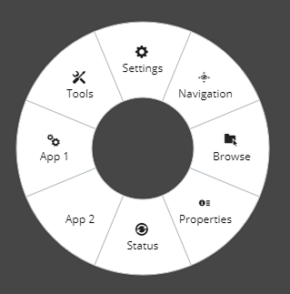

# RadialMenu

The [RadialMenu]($ui-core) React component is a context menu arranged in a radial layout.
The [RadialButton]($ui-core) React component is the button for use within a RadialMenu.

## Example

The following example demonstrates how to construct a RadialMenu with 8 RadialButtons.
The menu is displayed by calling ModalDialogManager.openDialog
and closed by calling ModalDialogManager.closeDialog.

```tsx
  private radialMenu(): React.ReactNode {
    return (
      <TestRadialMenu opened={true} onClose={this._closeModal} />
    );
  }

  private _closeModal = () => {
    ModalDialogManager.closeDialog();
  }

. . .

  // React to user event to open the radial menu
  { ModalDialogManager.openDialog(this.radialMenu()); }
```

```tsx
import * as React from "react";

import { RadialMenu, RadialButton } from "@bentley/ui-core";

export interface TestRadialMenuProps {
  opened: boolean;
}

export interface TestRadialMenuState {
  opened: boolean;
  data: any;
}

export class TestRadialMenu extends React.Component<TestRadialMenuProps, TestRadialMenuState> {
  public readonly state: Readonly<TestRadialMenuState>;

  constructor(props: TestRadialMenuProps) {
    super(props);
    const data = [
      { label: "Browse", icon: "icon-browse-2" },
      { label: "Properties", icon: "icon-properties-list" },
      { label: "Status", icon: "icon-status-update" },
      { label: "App 2", icon: "icon-fill" },
      { label: "App 1", icon: "icon-process" },
      { label: "Tools", icon: "icon-tools" },
      { label: "Settings", icon: "icon-settings" },
      { label: "Navigation", icon: "icon-view-navigation" },
    ];
    this.state = {
      opened: this.props.opened,
      data,
    };
  }

  public render(): JSX.Element {
    return (
      <RadialMenu
        left={"50%"}
        top={"50%"}
        opened={this.state.opened}
        onBlur={this._close}
        onEsc={this._close}
        innerRadius={55} outerRadius={140}>
        {this.state.data.map((obj: any, index: any) => {
          return (
            <RadialButton
              key={index}
              icon={obj.icon}
              onSelect={this._close}>{obj.label}</RadialButton>
          );
        })}
      </RadialMenu>
    );
  }

  private _close = () => {
    this.setState({ opened: false }, () => {
      if (this.props.onClose)
        this.props.onClose();
    });
  }

  public componentDidUpdate(prevProps: TestRadialMenuProps) {
    if (prevProps.opened !== this.props.opened) {
      this.setState((_, props) => ({ opened: props.opened }));
    }
  }
}
```



## API Reference

- [RadialMenu]($ui-core:RadialMenu)
