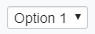
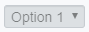
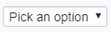
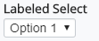

# Select

The [Select]($core-react:Select) category in the `@itwin/core-react` package includes the
[Select]($core-react), [LabeledSelect]($core-react) and [ThemedSelect]($core-react) components.

## Select

The [Select]($core-react) React component is a wrapper for the `<select>` HTML element.
The Select component is meant to allow the user to select an option from a list.
The list of options popup below the component, or above if there isn't enough room below.

```tsx
<Select options={["Option 1", "Option 2", "Option 3", "Option 4"]} />
```



### Disabled

```tsx
<Select options={["Option 1", "Option 2", "Option 3", "Option 4"]} disabled />
```



### Placeholder

```tsx
<Select options={["Option 1", "Option 2", "Option 3", "Option 4"]} placeholder="Pick an option" />
```



## LabeledSelect

```tsx
<LabeledSelect label="Labeled Select" options={["Option 1", "Option 2", "Option 3", "Option 4"]} />
```



## ThemedSelect

ThemedSelect is a wrapper for [react-select](https://www.npmjs.com/package/react-select) with iTwin.js UI theming applied.

## API Reference

- [Select]($core-react:Select)
