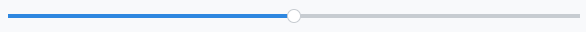
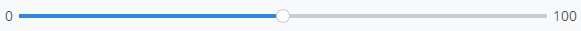
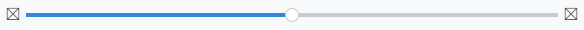
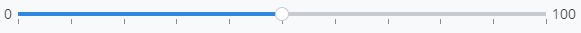
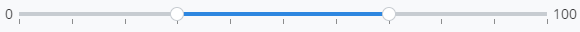
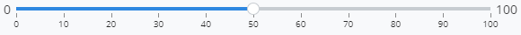
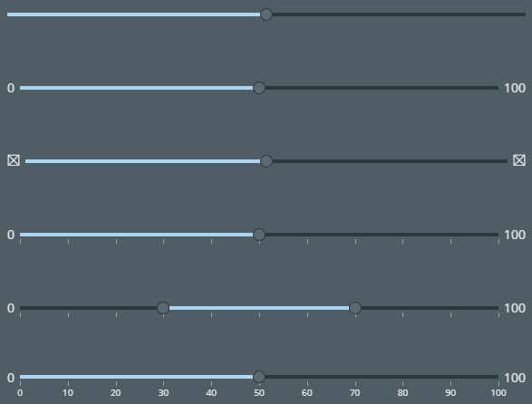

# Slider

The [Slider]($core-react) React component displays a range slider with thumbs for changing the value.
The Slider component also support multiple values.
The following items may optionally be shown:

- Minimum and maximum labels
- Minimum and maximum icons
- Tick marks
- Tick labels

**Note**: The Slider component uses various components from the [react-compound-slider](https://www.npmjs.com/package/react-compound-slider) package internally. This slider is Deprecated and the Slider from [iTwinUI-react](https://www.npmjs.com/package/@itwin/itwinui-react) package should be used.

## Properties

The Slider component has numerous properties, as defined in the [SliderProps]($core-react) interface.
There are 3 required props:

- min - Minimum value
- max - Maximum value
- values - Array of values to set the Slider to initially

### Controlling Interaction

The `step` prop specifies the step value. The default is 0.1.

The `mode` prop specifies the interaction mode. The default is 1. Possible values:

- 1 - allows handles to cross each other.
- 2 - keeps the sliders from crossing and separated by a step.

The `reversed` prop indicates whether the display of the Slider values is reversed.

The `disabled` prop indicates whether the Slider is disabled.

The `includeTicksInWidth` prop indicates whether to compensate for the tick marks when determining the width.

### Tooltip

A tooltip may optionally be shown above or below the Slider.
The `showTooltip` prop indicates whether to show a tooltip with the value. The tooltip will be above the Slider, by default.
To show the tooltip below the Slider, set the `tooltipBelow` prop.
The `formatTooltip` prop specifies a function to format a value for the tooltip.

### Min/Max Labels and Icons

Labels or icons may optionally be shown for the minimum and maximum values.
The minimum label/icon is shown to the left of the Slider; the maximum label/icon is shown to the right of the Slider.
The `showMinMax` prop indicates whether to show min & max values to the left & right of the Slider.
The `minImage` prop specifies an image to show instead of the min value.
The `maxImage` prop specifies an image to show instead of the max value.

### Tick Marks and Labels

Tick marks and tick labels may optionally be shown below the Slider.
The `showTicks` prop indicates whether to show tick marks under the Slider.
The `showTickLabels` prop indicates whether to show tick labels under the tick marks.

The `formatTick` prop specifies a function to format a tick mark value.
The `getTickCount` prop specifies a function to get the tick count.

The `getTickValues` prop specifies a function to get the tick values.
This overrides the tick count from getTickCount.
Use this prop if you want to specify your own tick values instead of ticks generated by the slider.

### Event Handlers

The `onChange` prop specifies a handler for value changes.
It is triggered when the value of the slider has changed. This will receive changes at
the end of a slide as well as changes from clicks on rails and tracks.

The `onUpdate` prop specifies a handler for value updates.
It is called with the values at each update (caution: high-volume updates when dragging).

## Examples

A basic Slider shows a bar with a single thumb.
A tooltip may optionally be shown above the thumb and is included in this example.

```tsx
<Slider min={0} max={100} values={[50]} step={1} showTooltip />
```



### Min/Max Labels

Labels may optionally be shown for the minimum and maximum values.
The minimum label is shown to the left; the maximum label is shown to the right.
The `showMinMax` prop is added in this example.

```tsx
<Slider min={0} max={100} values={[50]} step={1} showTooltip showMinMax />
```



### Min/Max Images

Icons may optionally be shown for the minimum and maximum values instead of labels. The `minImage` and `maxImage` props are added in this example.

```tsx
<Slider min={0} max={100} values={[50]} step={1} showTooltip showMinMax
  minImage={<Icon iconSpec="icon-placeholder" />} maxImage={<Icon iconSpec="icon-placeholder" />} />
```



### Tick Marks

Tick marks may optionally be shown below the Slider.
The `showTicks` prop is added in this example.
Additionally, the `getTickCount` prop specifies a function that returns the
number of tick marks.

```tsx
<Slider min={0} max={100} values={[50]} step={1} showTooltip showMinMax
  showTicks getTickCount={() => 10} />
```



### Multiple Values

Multiple values are supported by the Slider.
The `values` prop is an array that can hold the values.

```tsx
<Slider min={0} max={100} values={[30, 70]} step={5} mode={2} showTooltip showMinMax
  showTicks getTickCount={() => 10} />
```



### Tick Labels

Tick labels may optionally be shown below the tick marks.
The `showTickLabels` prop is added in this example.

```tsx
<Slider min={0} max={100} values={[50]} step={1} showTooltip showMinMax showTickLabels
  showTicks getTickCount={() => 10} />
```



### Dark Theme



## API Reference

- [Slider]($core-react:Slider)
