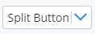

# SplitButton

The [SplitButton]($ui-core) React component displays a button with two parts:
an action button on the left and an arrow button on the right that opens a context menu.

## Properties

The SplitButton properties are defined in the [SplitButtonProps]($ui-core) interface.
The `label` prop specifies a label to display in the action area.
The `icon` prop specifies an icon for the action area,
and the `drawBorder` prop indicates whether to draw a border around the button.

## Examples

```tsx
<SplitButton label="Split Button" onClick={() => { }}>
  {this.splitButtonMenuItems.map((node) => node)}
</SplitButton>

. . .

  private static get splitButtonMenuItems(): React.ReactNode[] {
    return [
      <ContextMenuItem key="item1" icon="icon-placeholder">Item 1</ContextMenuItem>,
      <ContextMenuItem key="item2" icon="icon-placeholder">Item 2</ContextMenuItem>,
      <ContextMenuItem key="item3" icon="icon-placeholder">Item 3</ContextMenuItem>,
    ];
  }
```


```tsx
<SplitButton label="Split Button" drawBorder>
  {this.splitButtonMenuItems.map((node) => node)}
</SplitButton>
```



### Dark Theme


## API Reference

- [SplitButton]($ui-core:SplitButton)
