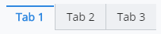
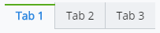
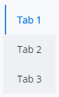
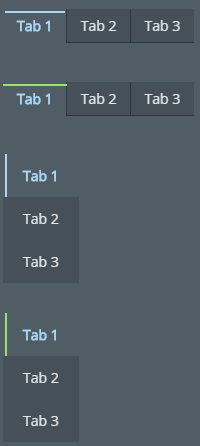

# Tabs

The [Tabs]($ui-core:Tabs) category in the `@bentley/ui-core` package includes
the [HorizontalTabs]($ui-core) and [VerticalTabs]($ui-core) components.

## Properties

The [TabsProps]($ui-core) interface specifies the properties for both the
HorizontalTabs and VerticalTabs components.

The `labels` prop is required and specifies the text shown for each tab.

The `onClickLabel` prop specifies the handler to be called when clicking on a label.

The `activeIndex` prop specifies the index of the initial active tab.

The `green` prop indicates whether the bar on the active tab is green instead of the default blue.

## Examples

### Horizontal Tabs

```tsx
<HorizontalTabs labels={["Tab 1", "Tab 2", "Tab 3"]} activeIndex={0} />
```



### Green Active Bar

```tsx
<HorizontalTabs labels={["Tab 1", "Tab 2", "Tab 3"]} activeIndex={0} green />
```



### Vertical Tabs

```tsx
<VerticalTabs labels={["Tab 1", "Tab 2", "Tab 3"]} activeIndex={0} />
```



### Dark Theme



## API Reference

- [Tabs]($ui-core:Tabs)
