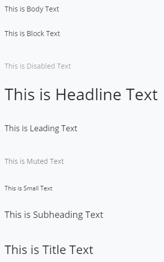
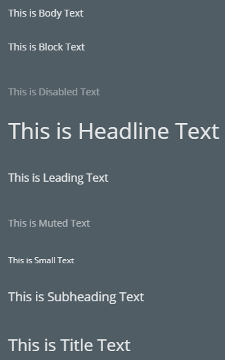

# Text

The [Text]($core-react:Text) category in the `@itwin/core-react` package includes
CSS classes and React components for working with styled text.

|Component|Description
|-----|-----
|[StyledText]($core-react)|base component for other text components that pass a main CSS class name
|[BodyText]($core-react)|uses the `uicore-text-body` CSS class, which has a 14px font-size
|[BlockText]($core-react)|uses the `uicore-text-block` CSS class, which has a 14px font-size and block spacing
|[DisabledText]($core-react)|uses the `uicore-text-disabled` CSS class, which has the `$buic-foreground-disabled` color
|[MutedText]($core-react)|uses the `uicore-text-muted` CSS class, which has the `$buic-foreground-muted` color

## Examples

```tsx
<BodyText>This is Body Text</BodyText>
<BlockText>This is Block Text</BlockText>
<DisabledText>This is Disabled Text</DisabledText>
<MutedText>This is Muted Text</MutedText>
```



### Dark Theme



## API Reference

- [Text]($core-react:Text)
