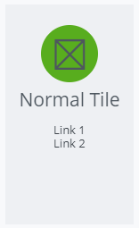
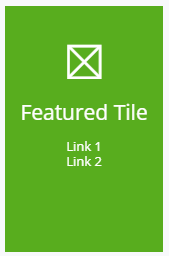
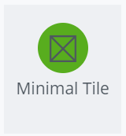
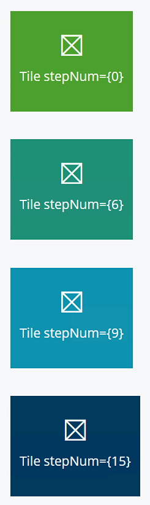

# Tiles

The [Tiles]($core-react:Tabs) category in the `@itwin/core-react` package includes
the [Tile]($core-react), [FeaturedTile]($core-react), [MinimalTile]($core-react) and [MinimalFeaturedTile]($core-react) components.
Tiles are components for a container rendering elements that can be grouped together.

The [TileProps]($core-react) interface specifies the properties for all of the
Tile components.

## Examples

### Normal Tile

A "normal" Tile has a light gray background.

```tsx
<Tile title="Normal Tile" icon="icon-placeholder">
  <a>Link 1</a>
  <a>Link 2</a>
</Tile>
```



### Featured Tile

A FeaturedTile has a green background.

```tsx
<FeaturedTile title="Featured Tile" icon="icon-placeholder">
  <a>Link 1</a>
  <a>Link 2</a>
</FeaturedTile>
```



### Minimal Tile

A MinimalTile has a reduced size.

```tsx
<MinimalTile title="Minimal Tile" icon="icon-placeholder" />
```



### Minimal Featured Tile

A MinimalFeaturedTile has both a green background and a reduced size.

```tsx
<MinimalFeaturedTile title="Minimal Featured Tile" icon="icon-placeholder" />
```


### Tiles with stepNum Prop

The `stepNum` prop circulates through 16 pre-defined background colors that are shades of green, teal and blue.

```tsx
<MinimalFeaturedTile stepNum={0} title="Tile stepNum={0}" icon="icon-placeholder" />
<MinimalFeaturedTile stepNum={6} title="Tile stepNum={6}" icon="icon-placeholder" />
<MinimalFeaturedTile stepNum={9} title="Tile stepNum={9}" icon="icon-placeholder" />
<MinimalFeaturedTile stepNum={15} title="Tile stepNum={15}" icon="icon-placeholder" />
```



## API Reference

- [Tiles]($core-react:Tiles)
