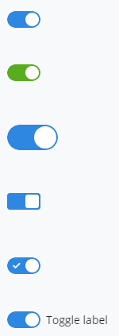
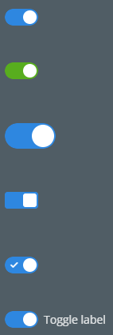

# Toggle

The [Toggle]($core-react:Toggle) category in the `@itwin/core-react` package includes
the [Toggle]($core-react) and [LabeledToggle]($core-react) components for working with a Toggle switch.

## Toggle Component

The [Toggle]($core-react) React component is used to toggle an option on and off with a single click or tap.
It should be used instead of a Checkbox for settings when the new value will be used immediately.
The Toggle component has support for the Light and Dark themes.

### Properties

There are a number of properties that determine the value, color, size and shape of the Toggle.

The `isOn` prop indicates whether the Toggle is "on" or "off". The default is false.

The `buttonType` prop specifies either a Blue button or Primary (green) button. The default is Blue.

The `large` prop indicates whether the Toggle should be larger.

The `rounded` prop indicates whether the Toggle should be rounded (default) or square.

The `showCheckmark` prop indicates whether to show a check mark icon when the toggle is "on".

The [LabeledToggle]($core-react) React component displays a label to the right of the Toggle.

### Examples

```tsx
<Toggle isOn={true} />
<Toggle isOn={true} buttonType={ToggleButtonType.Primary} />
<Toggle isOn={true} large={true} />
<Toggle isOn={true} rounded={false} />
<Toggle isOn={true} showCheckmark={true} />
<LabeledToggle isOn={true} label="Toggle label" />
```



### Dark Mode



## API Reference

- [Toggle]($core-react:Toggle)
