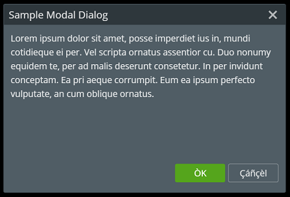
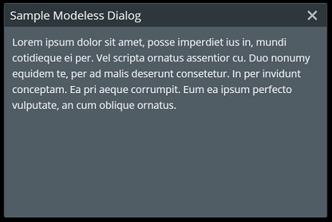

# Dialogs

A **Dialog** is a small temporary window of options presented to the user.
The `@itwin/appui-react` and `@itwin/core-react` packages contain several classes and components for displaying modal and modeless dialogs.

* [ModalDialogManager]($appui-react) - displays and manages multiple modal dialogs
* [ModelessDialogManager]($appui-react) - displays and manages multiple modeless dialogs
* [ModelessDialog]($appui-react) - Modeless Dialog React component uses the Dialog component with a modal={false} prop.
It controls the z-index to keep the focused dialog above others.
* [Dialog]($core-react) - Dialog React component with optional resizing and moving functionality.
Supports modal and modeless dialogs and supports a button cluster in the lower-right.

## Sample Modal Dialog

The following sample shows a modal dialog with OK/Cancel buttons.

### SampleModalDialog React component

This sample React component uses the [Dialog]($core-react) component and sets up the buttons and necessary handlers to
close the dialog properly.

```tsx
import * as React from "react";
import { IModelApp } from "@itwin/core-frontend";
import { Dialog, DialogButtonType } from "@itwin/core-react";

export interface SampleModalDialogProps {
  opened: boolean;
  onResult?: (result: DialogButtonType) => void;
}

export interface SampleModalDialogState {
  opened: boolean;
}

export class SampleModalDialog extends React.Component<SampleModalDialogProps, SampleModalDialogState> {
  public readonly state: Readonly<SampleModalDialogState>;
  private _title = IModelApp.i18n.translate("SampleApp:buttons.sampleModalDialog");

  constructor(props: SampleModalDialogProps) {
    super(props);
    this.state = {
      opened: this.props.opened,
    };
  }

  public render(): JSX.Element {
    return (
      <Dialog
        title={this._title}
        opened={this.state.opened}
        modal={true}
        width={450}
        height={300}
        onClose={this._handleCancel}
        onEscape={this._handleCancel}
        onOutsideClick={this._handleCancel}
        buttonCluster={[
          { type: DialogButtonType.OK, onClick: this._handleOK },
          { type: DialogButtonType.Cancel, onClick: this._handleCancel },
        ]}
      >
        Lorem ipsum dolor sit amet, posse imperdiet ius in, mundi cotidieque ei per.
        Vel scripta ornatus assentior cu. Duo nonumy equidem te, per ad malis deserunt consetetur.
        In per invidunt conceptam. Ea pri aeque corrumpit. Eum ea ipsum perfecto vulputate, an cum oblique ornatus.
      </Dialog >
    );
  }

  private _handleOK = () => {
    this._closeDialog(() => this.props.onResult && this.props.onResult(DialogButtonType.OK));
  };

  private _handleCancel = () => {
    this._closeDialog(() => this.props.onResult && this.props.onResult(DialogButtonType.Cancel));
  };

  private _closeDialog = (followUp: () => void) => {
    this.setState(
      { opened: false },
      () => followUp());
  };
}
```

### Opening a Modal Dialog

The `ModalDialogManager.openDialog` function is called to open a modal dialog.

```tsx
  ModalDialogManager.openDialog(
    <SampleModalDialog
      opened={true}
      onResult={(result) => this._handleModalResult(result)}
    />);
```

### Handling Modal Dialog Close

The `ModalDialogManager.closeDialog` function is called to close a modal dialog.

```tsx
  private _handleModalResult(result: DialogButtonType) {
    ModalDialogManager.closeDialog();
    IModelApp.notifications.outputMessage(
      new NotifyMessageDetails(OutputMessagePriority.Info, `Modal dialog result: ${result}`)
    );
  }
```



## Sample Modeless Dialog

This sample React component uses the [ModelessDialog]($appui-react) component and sets up the necessary handlers to
close the dialog properly.

```tsx
import * as React from "react";
import { IModelApp } from "@itwin/core-frontend";
import { ModelessDialog } from "@itwin/appui-react";

export interface SampleModelessDialogProps {
  opened: boolean;
  dialogId: string;
  onClose?: () => void;
}

export interface SampleModelessDialogState {
  opened: boolean;
}

export class SampleModelessDialog extends React.Component<SampleModelessDialogProps, SampleModelessDialogState> {
  public readonly state: Readonly<SampleModelessDialogState>;
  private _title = IModelApp.i18n.translate("SampleApp:buttons.sampleModelessDialog");

  constructor(props: SampleModelessDialogProps) {
    super(props);
    this.state = {
      opened: this.props.opened,
    };
  }

  public render(): JSX.Element {
    return (
      <ModelessDialog
        title={this._title}
        opened={this.state.opened}
        dialogId={this.props.dialogId}
        width={450}
        height={300}
        onClose={this._handleCancel}
        onEscape={this._handleCancel}
        onOutsideClick={this._handleCancel}
      >
        Lorem ipsum dolor sit amet, posse imperdiet ius in, mundi cotidieque ei per.
        Vel scripta ornatus assentior cu. Duo nonumy equidem te, per ad malis deserunt consetetur.
        In per invidunt conceptam. Ea pri aeque corrumpit. Eum ea ipsum perfecto vulputate, an cum oblique ornatus.
      </ModelessDialog >
    );
  }

  private _handleCancel = () => {
    this._closeDialog();
  };

  private _closeDialog = () => {
    this.setState(
      { opened: false },
      () => this.props.onClose && this.props.onClose()
    );
  };
}
```

### Opening a Modeless Dialog

The `ModelessDialogManager.openDialog` function is called to open a modeless dialog.

```tsx
  const dialogId = "sample";

  ModelessDialogManager.openDialog(
    <SampleModelessDialog
      opened={true}
      dialogId={dialogId}
      onClose={() => this._handleModelessClose(dialogId)}
    />, dialogId);
```

### Handling Modeless Dialog Close

The `ModelessDialogManager.closeDialog` function is called to close a modeless dialog.

```tsx
  private _handleModelessClose = (dialogId: string) => {
    ModelessDialogManager.closeDialog(dialogId);
    IModelApp.notifications.outputMessage(
      new NotifyMessageDetails(OutputMessagePriority.Info, `Closed modeless dialog: ${dialogId}`)
    );
  };
```



## API Reference

- [Dialog]($appui-react:Dialog)
