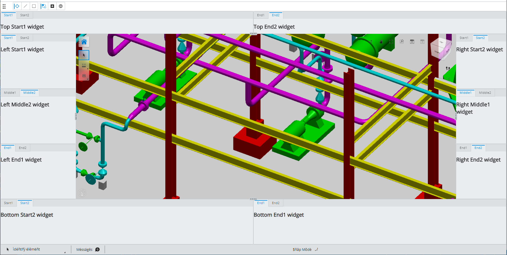

# Frontstages

A **Frontstage** is a full-screen configuration designed to enable the user to accomplish a task. There are three types of frontstages:

|Type|Description
|-----|-----
|**Primary** | may use all zones and stage panels and the Tool Widget contains the App button that opens the App menu
|**Nested** | is accessed from a primary frontstage. It may use all zones and panels, but instead of the App button, the Tool Widget contains a Back button to return to the primary frontstage.
|**Modal** | is accessed from another frontstage or the Backstage. It may contain any content along with a Back button. It does not use zones or stage panels. It is useful for application settings and data management user interfaces.

## Frontstages in UI 2.0/"App UI"

With the release of the `iTwin.js 2.0`, new UI components are available that provide a new look and feel for iTwin Apps. The new look and feel was initially referred to as `UI 2.0` and now has the more formal name of a `App UI`. The two primary goals of `App UI` are to limit the amount of UI components that obscure the iModel content and to ensure that Extensions can augment the UI provided by the host IModelApp.

Below is an example frontstage that shows the different areas/zones.



A frontstage is configured in a class subclassing the [FrontstageProvider]($appui-react) abstract class.
The FrontstageProvider contains an abstract [FrontstageProvider.frontstage]($appui-react) field containing a [Frontstage]($appui-react) React component.  The Frontstage React component has props for populating the different areas of the stage as well as values for the default tool, application data, and usage.

### Example Frontstage definition

The definition that produces the sample frontstage is shown below.

```tsx
  <Frontstage id="Ui2Sample"
    defaultTool={CoreTools.selectElementCommand}
    contentGroup={myContentGroup}
    defaultContentId="singleIModelView"
    isInFooterMode={true}
    usage={StageUsage.General}
    applicationData={{ key: "value" }}
    contentManipulationTools={
      <Zone
        widgets={[
          <Widget isFreeform={true} element={<BasicToolWidget />} />,
        ]}
      />
    }
    viewNavigationTools={
      <Zone
        widgets={[
          <Widget isFreeform={true} element={<BasicNavigationWidget />} />,
        ]}
      />
    }
    toolSettings={
      <Zone
        widgets={[
          <Widget isToolSettings={true} />,
        ]}
      />
    }
    statusBar={
      <Zone
        widgets={[
          <Widget isStatusBar={true} classId="SmallStatusBar" />,
        ]}
      />
    }

    leftPanel={
      <StagePanel
        size={300}
        defaultState={StagePanelState.Minimized}
        panelZones={{
          start: {
            widgets: [
              <Widget id="LeftStart1" label="Start1" defaultState={WidgetState.Open} element={<h2>Left Start1 widget</h2>} />,
              <Widget id="LeftStart2" label="Start2" element={<h2>Left Start2 widget</h2>} />,
            ],
          },
          middle: {
            widgets: [
              <Widget id="LeftMiddle1" label="Middle1" element={<h2>Left Middle1 widget</h2>} />,
              <Widget id="LeftMiddle2" label="Middle2" defaultState={WidgetState.Open} element={<h2>Left Middle2 widget</h2>} />,
            ],
          },
          end: {
            widgets: [
              <Widget id="LeftEnd1" label="End1" defaultState={WidgetState.Open} element={<h2>Left End1 widget</h2>} />,
              <Widget id="LeftEnd2" label="End2" element={<h2>Left End2 widget</h2>} />,
            ],
          },
        }}
      />
    }

    topPanel={
      <StagePanel
        size={90}
        defaultState={StagePanelState.Minimized}
        panelZones={{
          start: {
            widgets: [
              <Widget id="TopStart1" label="Start1" defaultState={WidgetState.Open} element={<h2>Top Start1 widget</h2>} />,
              <Widget id="TopStart2" label="Start2" element={<h2>Top Start2 widget</h2>} />,
            ],
          },
          end: {
            widgets: [
              <Widget id="TopEnd1" label="End1" element={<h2>Top End1 widget</h2>} />,
              <Widget id="TopEnd2" label="End2" defaultState={WidgetState.Open} element={<h2>Top End2 widget</h2>} />,
            ],
          },
        }}
      />
    }

    rightPanel={
      <StagePanel
        defaultState={StagePanelState.Open}
        panelZones={{
          start: {
            widgets: [
              <Widget id="RightStart1" label="Start1" element={<h2>Right Start1 widget</h2>} />,
              <Widget id="RightStart2" label="Start2" defaultState={WidgetState.Open} element={<h2>Right Start2 widget</h2>} />,
            ],
          },
          middle: {
            widgets: [
              <Widget id="RightMiddle1" label="Middle1" defaultState={WidgetState.Open} element={<h2>Right Middle1 widget</h2>} />,
              <Widget id="RightMiddle2" label="Middle2" element={<h2>Right Middle2 widget</h2>} />,
            ],
          },
          end: {
            widgets: [
              <Widget id="RightEnd1" label="End1" element={<h2>Right End1 widget</h2>} />,
              <Widget id="RightEnd2" label="End2" defaultState={WidgetState.Open} element={<h2>Right End2 widget</h2>} />,
            ],
          },
        }}
      />
    }

    bottomPanel={
       <StagePanel
        size={180}
        defaultState={StagePanelState.Minimized}
        panelZones={{
          start: {
            widgets: [
              <Widget id="BottomStart1" label="Start1" element={<h2>Bottom Start1 widget</h2>} />,
              <Widget id="BottomStart2" label="Start2" defaultState={WidgetState.Open} element={<h2>Bottom Start2 widget</h2>} />,
            ],
          },
          end: {
            widgets: [
              <Widget id="BottomEnd1" label="End1" defaultState={WidgetState.Open} element={<h2>Bottom End1 widget</h2>} />,
              <Widget id="BottomEnd2" label="End2" element={<h2>Bottom End2 widget</h2>} />,
            ],
          },
        }}
      />
    }
  />

```

Note `contentGroup` can reference a ContentGroup or a ContentGroupProvider See [Content Views and Layouts](./ContentViews.md) for more details.

### Usage

The Stage usage prop is a way to designate the type of tasks that will be performed in the stage and can be used by UiItemsProviders to
determine if it should supply items such as tool button, widgets, or status bar items, to populate the stage. See [StageUsage]($appui-abstract) for a default set of usages.

## Defining an 'empty' frontstage

It may be desirable for an application to set up an "empty" stage that is populated only by multiple [UiItemsProvider]($appui-abstract) instances. The

```tsx
    const ui2StageProps: StandardFrontstageProps = {
      id: "unique-stage-id",
      version: 1.1,
      contentGroupProps: myContentGroupProvider,
      hideNavigationAid,
      cornerButton,
      usage: StageUsage.General,
      applicationData,
    };

    ConfigurableUiManager.addFrontstageProvider(new StandardFrontstageProvider(ui2StageProps));

    // Use standard provider to provide basic tool and statusbar items
    StandardContentToolsProvider.register("ui2-standardContentTools");
    StandardNavigationToolsProvider.register("ui2-standardNavigationTools");
    StandardStatusbarItemsProvider.register("ui2-standardStatusbarItems");

```

## Configuring a Ninezone Frontstage (deprecated)

A frontstage is configured in a class subclassing the [FrontstageProvider]($appui-react) abstract class.
The FrontstageProvider contains an abstract [FrontstageProvider.frontstage]($appui-react) field containing a [Frontstage]($appui-react) React component.
The Frontstage React component has props for the default tool, Content Layout, Content Group, a Footer mode flag and application data.
It also has props for the Zones that are specified by their position in the 9-zone grid.

### Zone Descriptions

|Zone|Description
|-----|-----
|**topLeft** | contains the Tool Widget
|**topCenter** | contains the Tool Settings
|**topRight** | contains the Navigation Widget
|**centerLeft** | free zone for applications to use (App 1)
|**centerRight** | contains widgets for browsing; a Tree is typically used
|**bottomLeft** | free zone for applications to use (App 2)
|**bottomCenter** | reserved for the Status Bar, which shows messages and system state
|**bottomRight** | contains widgets showing Properties; A PropertyGrid is typically used

### Basic Sample

The following is a sample of a very basic FrontstageProvider definition with zones containing a Tool Widget, Tool Settings, Navigation Widget, Status Bar and Property Grid.

```tsx
export class SampleFrontstage extends FrontstageProvider {
    public static SampleContentGroup: ContentGroupProps = {
    id: "SampleFrontstageGroup",
    layout: StandardContentLayouts.singleView,
    contents: [
      {
        id: "primaryIModelView",
        classId: IModelViewportControl,
      },
    ],
  };

  public get frontstage(): React.ReactElement<FrontstageProps> {
    const contentGroup = new ContentGroup(SampleFrontstage.SampleContentGroup);
    return (
      <Frontstage id="Test1"
        defaultTool={CoreTools.selectElementCommand}
        contentGroup={contentGroup}
        isInFooterMode={true}
        applicationData={{ key: "value" }}
        topLeft={
          <Zone
            widgets={[
              <Widget isFreeform={true} element={<SampleToolWidget />} />,
            ]}
          />
        }
        topCenter={
          <Zone
            widgets={[
              <Widget isToolSettings={true} />,
            ]}
          />
        }
        topRight={
          <Zone
            widgets={[
              <Widget isFreeform={true} element={<SampleNavigationWidget />} />,
            ]}
          />
        }
        bottomCenter={
          <Zone defaultState={ZoneState.Open}
            widgets={[
              <Widget isStatusBar={true} iconSpec="icon-placeholder" labelKey="SampleApp:widgets.StatusBar"
                control={SampleAppStatusBarWidget} />,
            ]}
          />
        }
        bottomRight={
          <Zone defaultState={ZoneState.Open} allowsMerging={true}
            widgets={[
              <Widget defaultState={WidgetState.Open} iconSpec="icon-placeholder" labelKey="SampleApp:widgets.PropertyGrid"
                control={SamplePropertyGridWidget} fillZone={true} />,
            ]}
          />
        }
      />
    );
  }
}

```

The `defaultTool` prop specifies a tool or command and `contentGroup` specifies a registered Content Group.
A `isInFooterMode` prop with a value of true indicates the Status Bar will be in Footer mode across the bottom of the screen.
A value of false would indicate the Status Bar is open in the bottom center position in the grid.
The `applicationData` prop specifies JSON data attached to the Frontstage and FrontstageDef.

Each zone prop specifies a **Zone** React component.
A Zone component can host one or more **Widget** React components, which are listed in the `widgets` prop.
The `defaultState` prop specifies the default zone state, which controls how the Zone is initially displayed. The default is ZoneState.Open.
The `allowsMerging` prop indicates if other zones may be merged with this zone. The default is false.
Zones can be merged together by default using the `mergeWithZone` prop, which indicates another zone to merge with.
The `applicationData` prop specifies JSON data attached to the Zone and ZoneDef.

## Setting a Frontstage active

```tsx
// Create a Frontstage.
const frontstageProvider = new SampleFrontstage();
// Add the provider to FrontstageManager
FrontstageManager.addFrontstageProvider(frontstageProvider);

// Set the Frontstage active
FrontstageManager.setActiveFrontstage(frontstageProvider.frontstage.props.id).then(() => {
  // Frontstage is ready
});
```

## Related Learning Topics

- [Content Views and Layouts](./ContentViews.md)
- [Widgets](./Widgets.md)
- [Status Bar and Fields](./StatusBar.md)
- [Tool Settings](./ToolSettings.md)
- [Stage Panels](./StagePanels.md)

## API Reference

- [Frontstage]($appui-react:Frontstage)
- [Zone]($appui-react:Zone)
