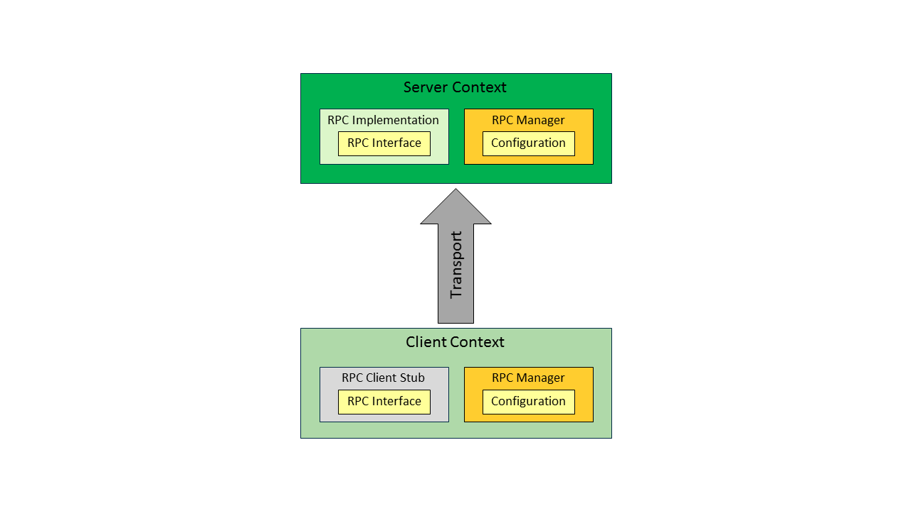

# RpcInterface

The functionality of an iModelJs app is typically implemented in many separate components, which run in different threads, processes, and/or machines. These components communicate through interfaces, which are called *RpcInterfaces* because they use remote procedure calls, or [RPC](./Glossary.md#RPC). This article uses the terms *client* and *server* to identify the two roles in an RpcInterface, as follows:

* *client* -- the code that uses an RpcInterface and calls its methods. A client could be the [frontend of an app](./App.md#app-frontend), the [backend of an app](./App.md#app-backend), a [service](./App.md#app-service), or an [agent](./App.md#imodel-agents). A client could be [frontend code](./Glossary.md#frontend) or [backend code](./Glossary.md#backend).

* *server* -- the code that implements and exposes an RpcInterface to clients. A server could the [backend of an app](./App.md#app-backend) or a [service](./App.md#imodel-services). A server is always [backend code](./Glossary.md#backend).

An RpcInterface is a normal TypeScript class. Clients request server operations by calling ordinary TypeScript methods and passing parameters and getting results as ordinary TypeScript objects. Servers implement and expose operations by writing normal TypeScript classes.

An RPC configuration is a transport mechanism to marshall calls between client and server. RPC Configurations are applied to RpcInterfaces at runtime. An app works with the *RpcManager* to appy the appropriate configuration to each interface that it uses. See [learning RpcInterfaces](../learning/RpcInterface.md) for information on how to configure RPCs.

Since the RPC transport mechanism is encapsulated in configurations, client and server code can focus entirely on the functionality of the interface. This design makes it possible to [configure an app for Web, desktop, and/or mobile](./App.md#configurations) without rewriting the code and to optimise client-server communcation for each configuration, all without changing the app's code.

RpcInterface method calls are always from a client to a server. Servers never send requests to clients.

RpcInterface methods must be "chunky" and not "chatty". In the case where a server or app backend is accessed over the Internet, both bandwidth and latency can vary widely. Therefore, care must be taken to limit number and size of round-trips between clients and servers.

See [learning RpcInterfaces](../learning/RpcInterface.md) for information on how to write and use RpcInterfaces.

### Web RPC configuration

The Web RPC configuration transforms client calls on an [RpcInterface](#RpcInterface) into HTTP requests. Provides endpoint-processing and call dispatching in the server process. The iModelJs cloud RPC configuration is highly parameterized and can be adapted for use in many environments. This configuration is designed to cooperate with routing and authentication infrastructure.

iModelJs comes with an implementation of a Web RPC configuration that works with the Bentley Cloud infrastructure. It is relatively straightforward for developers to write custom Web RPC configurations that works with other infrastructures.

### Desktop RPC configuration

The iModelJs desktop RPC configuration is specific to the Electron framework. It marshalls calls on an [RpcInterface](#RpcInterface) through high-bandwidth, low-latency pipes between cooperating processes on the same computer. It provides endpoint-processing and call dispatching in thebackend process.

### In-process RPC configuration

The in-process RPC configuration marshalls calls on an [RpcInterface](#RpcInterface) across threads within a single process. It also provides call dispatching in the backend thread.